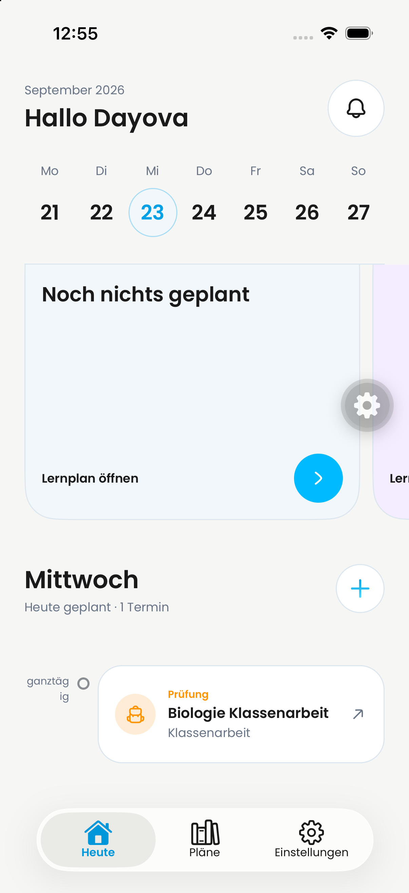
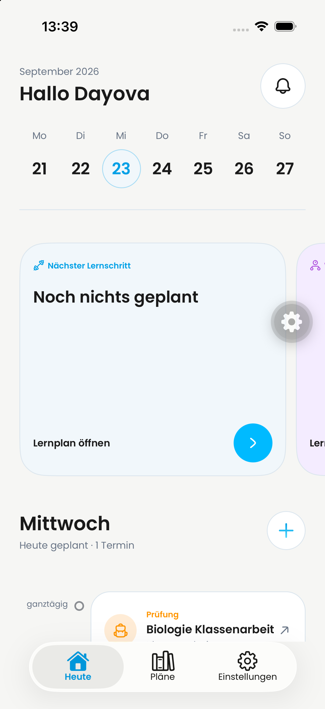

# Calendar all-day label: native regression evidence

Scope: the broken `ganztägig` label in the agenda below the calendar, not the
entire calendar/popup design acceptance. Follow-up to the combined QA PR #720.

## Reproduction and fix

On the QA iPhone, the actual Fabric text rectangle was **44 × 30 points**:
the 48-point time column minus 4-point right padding split `ganztägig` across
two lines. The Poppins body-5 text remained 10/15 as intended.

Changing only the shared time column from `w-12` to `w-16` gives it 60 points
of usable width. After rebuilding the local development bundle, the same
label measured **60 × 15 points** and appeared on one complete line.
No font shrinking, line limit, ellipsis, or text-scale cap was introduced.
All agenda rows retain the same time-column width so their timeline aligns.

| Before (12:55 CEST) | After (13:39 CEST) |
| --- | --- |
|  |  |

The before capture is from the earlier combined QA retest; the defect was
also measured on base `2d8e11727c22d713bd11371945a03db799170192` immediately
before this change. The after capture uses that base plus this one-line fix.
The scroll position differs following the bundle reload; the images do not
prove a change in vertical spacing or carousel clipping. Simulator gear
overlays are not app controls. Both images were inspected for personal data
and contain only the synthetic QA display name/content, no email or credentials.

## Validation

- Read-only native Fabric measurements: before 44 × 30 (fail), after 60 × 15
  (pass) at the tested default iPhone text size.
- `pnpm exec tsc --noEmit`: passed after the change.
- `pnpm exec biome check src/features/dashboard/dashboard-screen.tsx`: passed.
- `pnpm exec jest --runInBand src/features/dashboard`: 4 suites / 17 tests passed.
- Before this change, full QA base suites passed: Jest 82 suites / 370 tests;
  Vitest 144 files / 988 tests. These are base results, not native acceptance.
- Code self-review: scoped to the shared column; existing typography, content,
  interaction and accessibility scaling preserved. Timed rows lose 16 points
  of card width as the trade-off for keeping the timeline aligned.

There is no native text-measurement seam in the existing mocked Jest rendering
tests; a class-name assertion would not prove this wrapping defect fixed.
Native evidence is therefore required. Larger text sizes and this label on
iPad/Android remain unverified; the latter currently display days without
an all-day entry. This PR stays draft until that review/acceptance is complete.

No backend deployment, Clerk change, podcast integration, production OTA,
or account deletion is included. Existing remaining QA gates in
[the combined report](../jakob-qa-2026-09-23/README.md) remain open.
