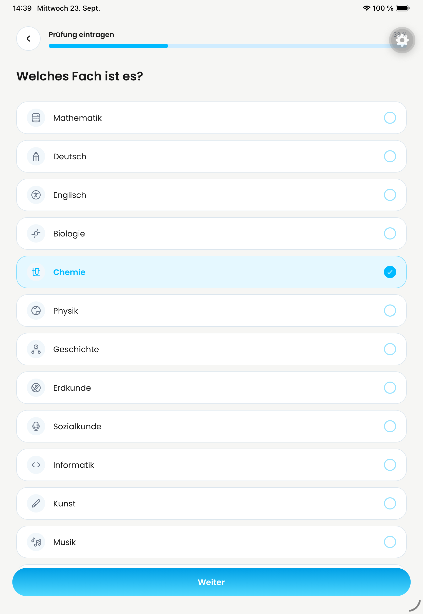
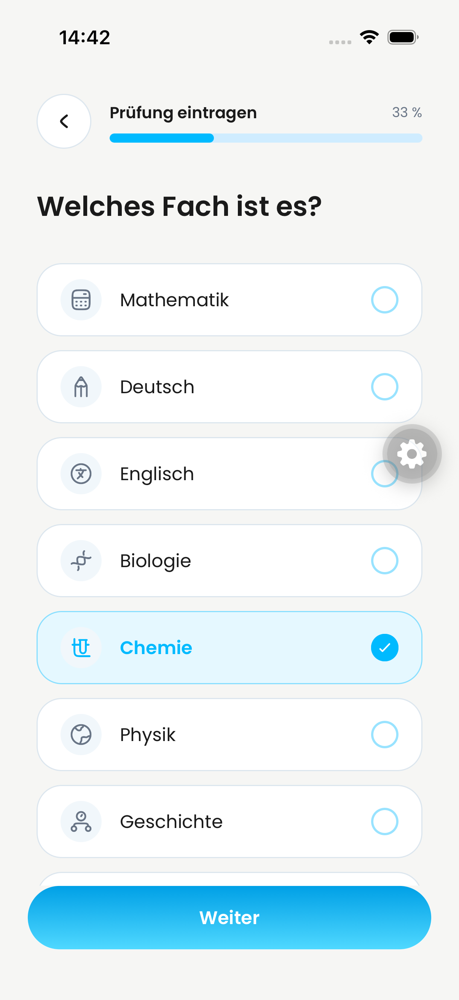
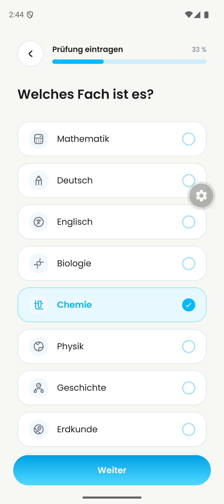

# Combined native QA retest — 23 September 2026

Code tested: `5362de1`, integrating #721, #722 and #723 into #720.
This is a development QA build, not a production OTA release.

## Passed

The checked-in Maestro flow passed on the dedicated iPad and iPhone simulators
and Android emulator, in that order, with distinct existing QA accounts.

- Home → create menu → exam type → subject → date.
- Native iOS edge-back / Android system Back returns to Subject.
- Selected Chemistry remains selected after native Back (screenshots below).
- Explicit Back works; returning from the first step reaches Home.
- On iOS a short edge swipe finishes on Subject without leaving it.
- Profile opens. Long email is single-line on iPad and iPhone; Android remains
  single-line and horizontally scrolled. No profile changes were saved.
- TypeScript passed; complete Jest run: **83 suites, 385 tests passed**.

## Evidence boundaries and remaining acceptance

Screenshots cover end states, not the intermediate gesture animation. OS-killed
cold-link behavior was not tested in this run. This smoke test neither creates
new saved exams nor repeats registration/deletion, uploads or AI generation.
It supplements earlier evidence rather than claiming every original PR passed.

All 35 new screenshots are retained locally in the user's QA evidence folder;
the three reviewed, account-free images above are the public subset. Profile
screenshots containing account identifiers remain local only.

Still open: Clerk deletion (handed to Jakob), intended QA Vertex configuration
and consequently successful AI-generation/downstream session evidence, separate
production R2 validation, cold-link/gesture-animation acceptance and completion
of the per-original-PR evidence mapping. Podcast remains excluded. No complete
Jakob-checklist acceptance, main merge or production release is claimed.
