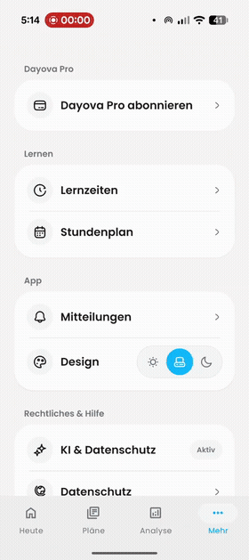
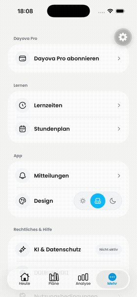

# Consistent native page transitions

Evidence for [PR #550](https://github.com/Dayova/dayova-mvp/pull/550).
The previews below are animated GIFs. The linked MP4s contain the same complete
recordings, resized to 480 px wide and encoded at 30 fps for GitHub delivery.
Neither recording contains audio. Playback speed and sequence are unchanged.

## Android: reported behavior before the fix

[Open or download the Android recording](android-before.mp4).

User-supplied recording: `signal-2026-09-08-17-27-47-860_002.mp4`.
Lernzeiten fades around 2 s, whereas Stundenplan slides horizontally around
3.5 s and 12 s. This demonstrates the reported inconsistency before the fix.
**It is not an Android after-fix recording.**

Coverage: 14.12-second video; 28 full-timeline frames sampled at 2 fps (0.5-second interval); 2 contact sheet(s); 18 additional frames from 00:00:01.800 to 00:00:03.900 at 10 fps; no audio stream.

## iOS: navigation verification with the fix

[Open or download the iOS recording](ios-verification.mp4).

Recorded on the iPhone 17 / iOS 26.5 simulator with the JavaScript change in
`bf85321`. Settings opens Lernzeiten (around 9 s), Stundenplan (around 15 s),
and Mitteilungen (around 25 s); each destination returns to Settings.
The development-tools gear is simulator tooling.

Coverage: 47.63-second video; 48 full-timeline frames sampled at 1 fps (1-second interval); 3 contact sheet(s); no audio stream.

These recordings were inspected across their full timelines. There is no audio
to transcribe. Sampling and compressed previews establish the visible page
sequence, not exact frame timing or animation performance. iOS equivalence of
`slide_from_right` and `default` was also checked in the pinned native
`react-native-screens/ios/RNSConvert.mm` implementation, which maps both to
`RNSScreenStackAnimationDefault`.

The Android after-fix transition has not been visually verified. Its navigator
configuration matches the ordinary page defaults, and the relevant 29 tests,
TypeScript, Biome, and ESLint checks passed.
