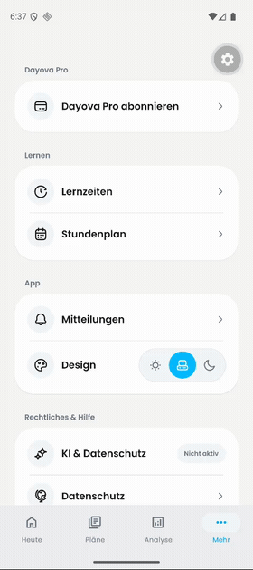

# Consistent native page transitions

Evidence for [PR #550](https://github.com/Dayova/dayova-mvp/pull/550).
The previews below are animated GIFs. The linked MP4s contain the same complete
recordings, resized to 480 px wide and encoded at 30 fps for GitHub delivery.
None of the recordings contains audio. Playback speed and sequence are unchanged.

## Android: reported behavior before the fix

[Open or download the Android recording](android-before.mp4).

User-supplied recording: `signal-2026-09-08-17-27-47-860_002.mp4`.
Lernzeiten fades around 2 s, whereas Stundenplan slides horizontally around
3.5 s and 12 s. This demonstrates the reported inconsistency before the fix.
**It is not an Android after-fix recording.**

Coverage: 14.12-second video; 28 full-timeline frames sampled at 2 fps (0.5-second interval); 2 contact sheet(s); 18 additional frames from 00:00:01.800 to 00:00:03.900 at 10 fps; no audio stream.

## Android: same navigation sequence with the fix

[Open or download the Android after recording](android-after.mp4).

Recorded on the Pixel 9 / Android 16 emulator with the real development client
and the JavaScript fix in `bf85321`, using a synthetic development account with
no learning times or timetable. No navigation mocks or animation changes were
introduced for recording; Android animation scales were all 1.

The sequence matches the original app interactions, including Android's
right-edge back gesture after every destination. Pauses between actions are
longer to verify each destination and return; playback has not been sped up or
cut. The original's final notification-shade action used to stop recording is
outside the app sequence and is not repeated.

| Approximate video time | Action |
| --- | --- |
| 3.5 s / 6.5 s | Lernzeiten / back to Settings |
| 9.7 s / 12.5 s | Stundenplan / back to Settings |
| 15.7 s / 18.6 s | Lernzeiten / back to Settings |
| 22 s / 25.3 s | Stundenplan / back to Settings |
| 28.9 s / 32.3 s | Mitteilungen / back to Settings |
| 35.6 s / 38.9 s | Stundenplan / back to Settings |

Focused frames show Lernzeiten fading in at 3.5–3.6 s, Stundenplan at 9.7 s,
and Mitteilungen at 28.9–29.1 s. The timetable's former full horizontal slide
is absent. All six destinations and returns were also checked against Android's
native accessibility hierarchy during this recording.

Coverage: 41.13-second video; 41 full-timeline frames sampled at 1 fps (1-second interval); 3 contact sheet(s); 12 additional frames from 00:00:03.000 to 00:00:04.200 at 10 fps; 12 additional frames from 00:00:09.200 to 00:00:10.400 at 10 fps; 12 additional frames from 00:00:28.200 to 00:00:29.400 at 10 fps; no audio stream.

The development-tools gear is emulator tooling. The capture uses 480×1078
resolution and variable source frame timing, normalized to 30 fps for delivery;
repeated frames do not establish 30 fps rendering performance. This evidence
supports the route sequence and transition style, not exact animation timing.

## iOS: navigation verification with the fix

[Open or download the iOS recording](ios-verification.mp4).

Recorded on the iPhone 17 / iOS 26.5 simulator with the JavaScript change in
`bf85321`. Settings opens Lernzeiten (around 9 s), Stundenplan (around 15 s),
and Mitteilungen (around 25 s); each destination returns to Settings.
The development-tools gear is simulator tooling.

Coverage: 47.63-second video; 48 full-timeline frames sampled at 1 fps (1-second interval); 3 contact sheet(s); no audio stream.

These recordings were inspected across their full timelines. There is no audio
to transcribe. Sampling and compressed previews establish the visible page
sequence, not exact frame timing or animation performance. iOS equivalence of
`slide_from_right` and `default` was also checked in the pinned native
`react-native-screens/ios/RNSConvert.mm` implementation, which maps both to
`RNSScreenStackAnimationDefault`.

The Android after-fix sequence and transition style were visually verified as
described above. The relevant 29 tests, TypeScript, Biome, and ESLint checks
passed for the code change; this follow-up adds evidence only.
