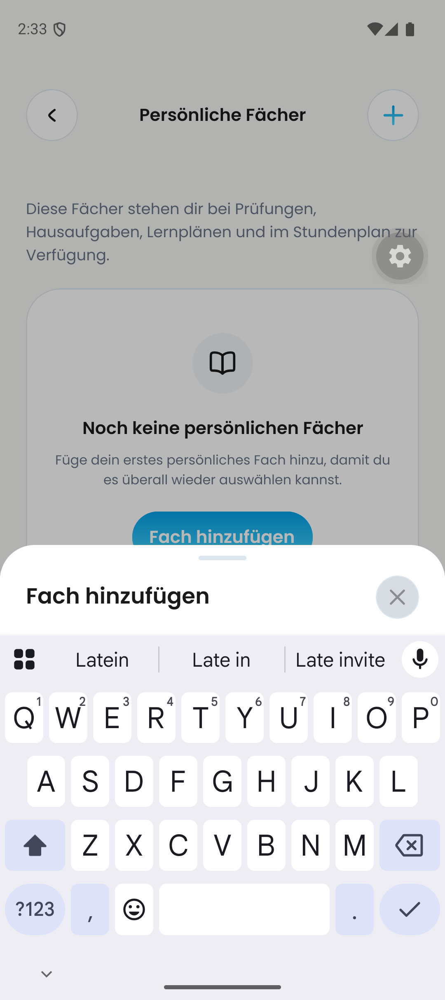
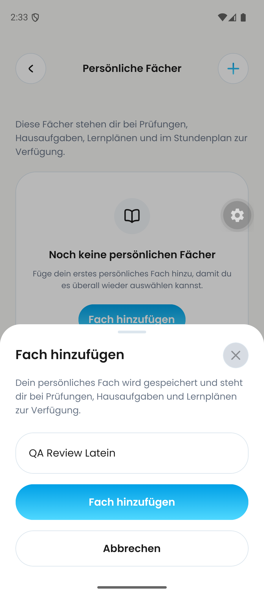

# DAY-187 — Android keyboard acceptance remains open

24 September 2026, Pixel 9 Android 16 emulator, `com.dayova.dev`, integrated QA source `52568c261d530d166563c9592dd9178a74cc4469` (contains #710 head `fa75b964`; not an isolated head test).

Opened Personal subjects from an empty QA account and tapped **Fach hinzufügen**. The original still image with the native keyboard open shows only the sheet title above the keyboard: input and actions are not visible. Entering the synthetic text `QA Review Latein` and dismissing the keyboard exposes the input and buttons again.

This is **not a passed keyboard-layout acceptance**. It also does not prove successful creation, rename, linked-record propagation or error recovery. The subsequent save attempt selected an ambiguous duplicate text node and left the dialog open; no successful save is claimed.

This is screenshot evidence of the captured states, not a complete animation/video analysis. Existing iPad CRUD and historical images remain valid within their original scope. Next step: isolate/reproduce the Android sheet keyboard behavior on the PR stack before claiming all-platform completion.
