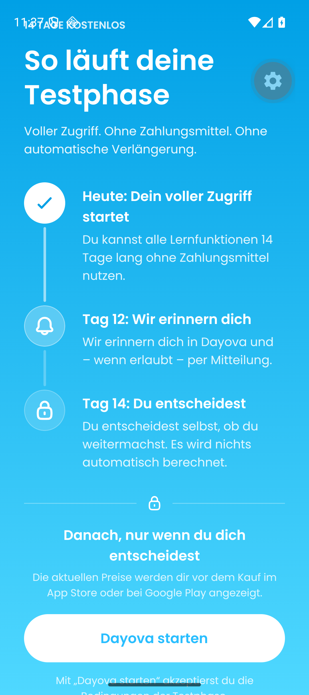
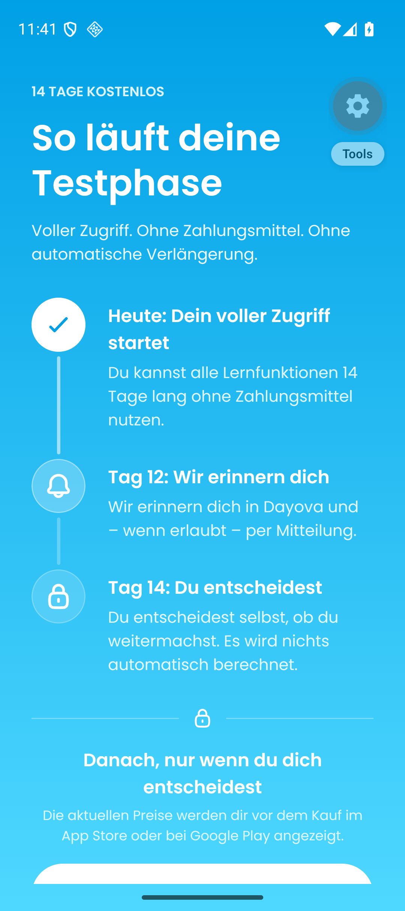
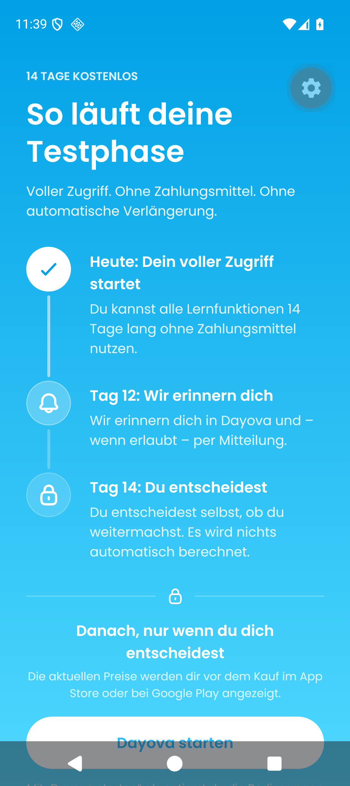
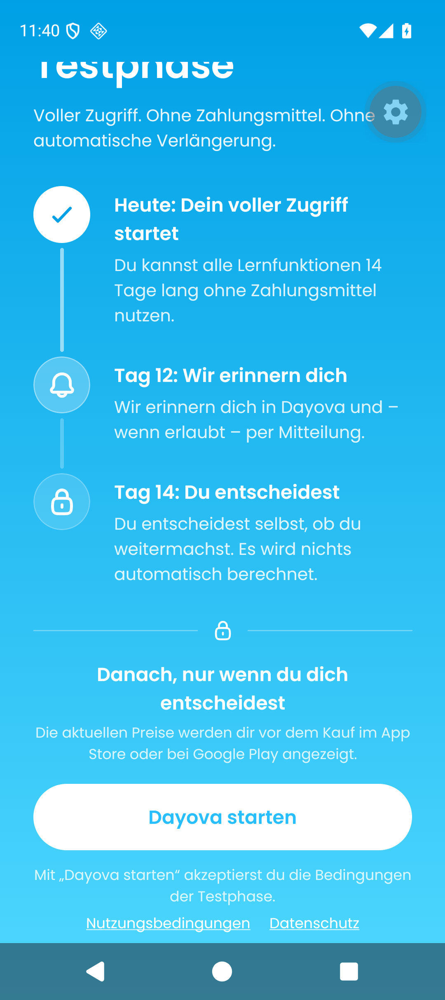
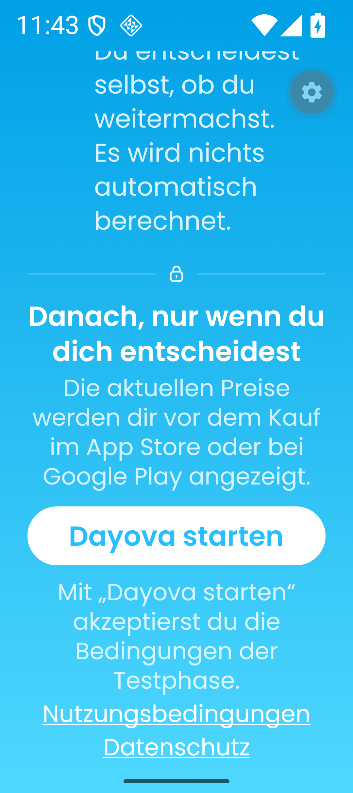
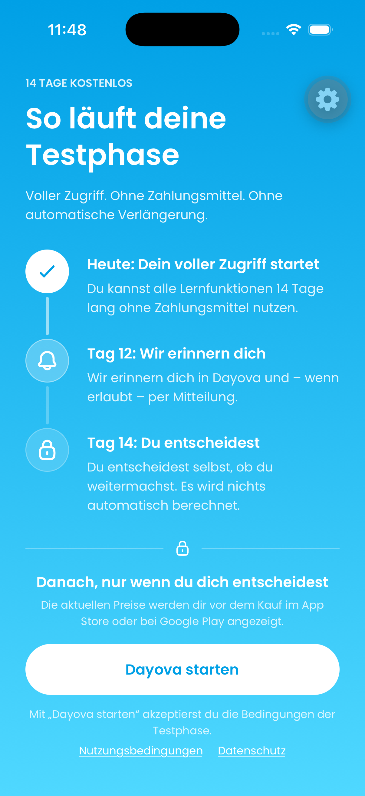

# DAY-371: Trial screen safe areas

Verified 5 September 2026 against base `3f69d92` and the accompanying fix.
Issue: [DAY-371](https://linear.app/dayova/issue/DAY-371/android-systemleisten-verdecken-text-auf-dem-testphasen-screen).

## Cause and fix

The trial screen enabled scrolling only below a window-height threshold of 820
points or above the default font scale. In that mode it removed its explicit top
padding and relied on `contentInsetAdjustmentBehavior="automatic"`, which is
[an iOS-only adjustment](https://reactnative.dev/docs/scrollview#contentinsetadjustmentbehavior).
On Android this put the introductory label underneath the status bar. Above the
threshold, wrapping and system-bar space could still cause content to overflow,
but scrolling was disabled, leaving the footer unreachable.

The scroll viewport now uses the actual safe-area margins on both platforms.
Content remains scrollable whenever it overflows, with an intrinsically sized,
growing inner container. The gradient remains full-screen. The old minimum
bottom spacing is preserved without counting the bottom inset twice. Bouncing
is disabled, so fitting content remains stationary on iOS.

## Native verification

The production `TrialActivationScreen`, shared UI components, fonts, gradient,
and native safe-area provider were rendered in a temporary local entry point.
Only the access hook was replaced with an inactive trial and a rejecting
activation callback; no account or backend data was mutated. This isolates
layout from the authenticated onboarding journey. The temporary entry point,
resolver override, and access fixture were removed after verification.

- Android: existing `DAY_169_Pixel_9` AVD, Android 16 / API 36, 1080 × 2424,
  development app `com.dayova.dev`, version 1.0.4 (version code 1).
- iOS: iPhone 17 simulator, iOS 26.5, 1206 × 2622, existing development build
  `de.dayova.app-dev`, using the current JavaScript screen.
- The native builds were reused; this change requires no native-code change.
- The original Android density (420), font scale (2.0), and gesture navigation
  were restored. Both simulators were returned to their stopped state.
- No physical Galaxy A16 or physical Pixel 9 was tested. The emulator reproduces
  both reported failure modes; it is not Samsung One UI verification.

| Scenario | Before | After |
| --- | --- | --- |
| Android gesture navigation, density 480, font scale 1.0 | Label bounds `[84,60,996,114]` overlap the status bar, whose reported height is 137 px | Label bounds `[84,216,996,270]` clear the status bar |
| Android three-button navigation, density 460, font scale 1.0 | Start button crosses the navigation bar; a swipe does not expose the privacy link | Footer scrolls fully into view; privacy text ends at 2263 px, above the 2286 px navigation boundary |
| Android gesture navigation, density 480, font scale 2.0 | Not used as a separate before comparison | Footer reflows and remains reachable; privacy text ends at 2328 px, above the 2352 px navigation boundary |
| iPhone 17, default content size | Entire screen fits | Entire screen still fits, with unchanged visible content spacing |

UIAutomator bounds assertions failed on the original Android screen and passed
after the fix. These are the corresponding commands/results from the local
verification helper (run `node assert-safe-area.mjs` from this directory; the
XML snapshots are retained here):

```text
node assert-safe-area.mjs android-compact-before.xml "14 TAGE KOSTENLOS" 137 2352
FAIL: Text overlaps status bar: 60 < 137

node assert-safe-area.mjs android-threebutton-before-scrolled.xml "Datenschutz" 137 2286
FAIL: Missing accessible content: Datenschutz

node assert-safe-area.mjs android-compact-after.xml "14 TAGE KOSTENLOS" 137 2352
PASS: bounds=[84,216,996,270]

node assert-safe-area.mjs android-threebutton-after.xml "Datenschutz" 137 2286
PASS: bounds=[654,2211,873,2263]

node assert-safe-area.mjs android-large-text-after.xml "Datenschutz" 137 2352
PASS: bounds=[316,2238,765,2328]
```

Coverage: these are still screenshots and accessibility-tree snapshots, plus
scripted scroll checks. They demonstrate the listed layouts and footer
reachability, not animation timing, a full account-to-trial journey, or a
successful backend activation. The development-tools gear is simulator tooling.

## Screenshots

### Android: status bar

Before: 

After: 

### Android: three-button navigation

Before: 

After scrolling: 

### Android: 200% font scale



### iOS comparison

Before: 

After: 

## Regression tests

The three viewport assertions fail against the original production code (with
only the test ID added), while the two existing tests pass. All six tests pass
with the fix, including a system-inset change while an activation error is shown.

On this local checkout, Jest spent several minutes transforming the 6 MB,
already executable Hugeicons CommonJS bundle. Verification used the normal Jest
configuration with that precompiled bundle additionally excluded from Babel:

```sh
pnpm exec jest --runInBand --watchman=false --roots src \
  --runTestsByPath src/features/access/trial-activation-screen.ui.test.tsx \
  --transformIgnorePatterns \
  'node_modules/(?!(.pnpm|(jest-)?react-native|@react-native(-community)?|@gorhom/.*|@hugeicons/.*|@rn-primitives/.*|expo(nent)?|@expo(nent)?/.*|react-navigation|@react-navigation/.*|nativewind|react-native-css-interop|react-native-reanimated|react-native-safe-area-context|react-native-svg))' \
  '/@hugeicons/core-free-icons/dist/cjs/'
```

The same override is used for the full UI suite by omitting `--runTestsByPath`
and its file argument. No repository test configuration was changed.

Final checks: `pnpm check` passed; `pnpm test:unit` passed (732 Vitest tests and
17 script tests); the complete UI suite passed (208 tests in 55 suites).
