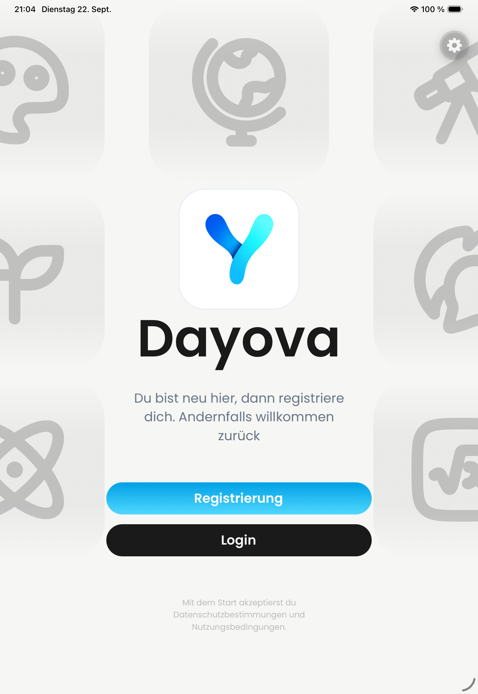

# DAY-402: iPad artwork overlap correction

Captured on 2026-09-22 from source commit `58c045d` on a dedicated iPad Pro 11-inch (M4), iOS 26.4 simulator, using the development client and local Metro server.

The portrait still shows separated decorative rows and the unchanged central logo and sign-in actions. The floating Tools control is development-client UI, not production artwork.

Automated geometry tests cover 834×1194, 1194×834 and 1024×1366: vertical separation, viewport bounds and horizontally centered columns. The full login-screen suite passed (49 tests), as did TypeScript and ESLint. Independent Standards and Spec reviews found no remaining issues in the fix.

Scope: this is an after-only portrait still, not a matched before/after recording, native landscape verification, onboarding test, or production OTA evidence. Jakob's visual HOLD remains pending reviewer acceptance.
