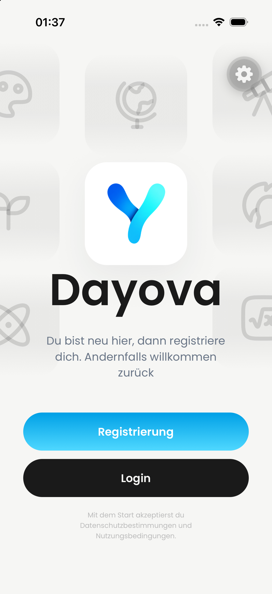
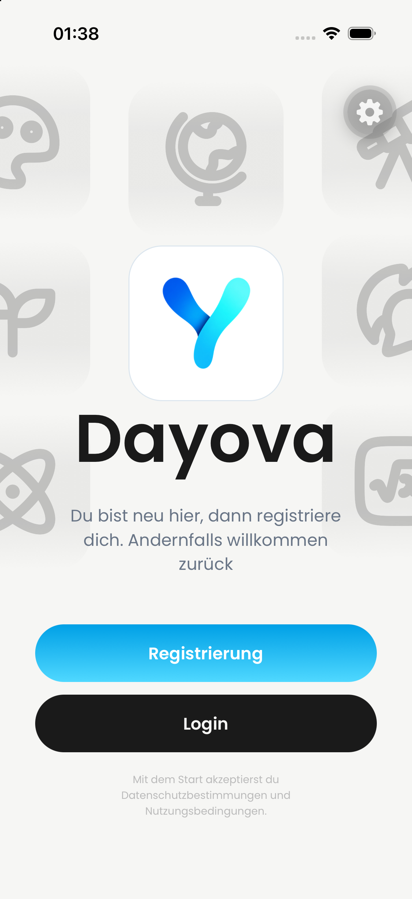

# PR #653 — matched iPhone comparison

Captured 23 September 2026 on Dayova Jakob Review iPhone (iPhone 17,
iOS 26.4, 1206×2622). Same installed development client and device.
Before: actual PR base `00c5b190714ec2c4946c1190ed6078b6ed77b285`, Metro 8097.
After: PR head `a8cc4472ae71d9e811ca1245efafa24af4ac3127`, Metro 8098.
No source edits or backend deployment were used for these captures.

| Before | After |
| --- | --- |
|  |  |
| [Before recording](before.mp4) | [After recording](after.mp4) |

## Inspection

The logo tile's broad shadow is replaced by a fine outline. Decorative icons
change, while the registration/login actions remain visible and separated.
The floating gear/Tools control belongs to development tooling.

Both recordings were inspected across all full-timeline contact sheets.
Before: welcome visible at 0–1.5s, restart/splash follows, welcome returns
at 9.5s and remains visible through 12s. After: welcome visible at 0–2s,
restart/dev-client loading follows, welcome returns at 12s through 13s.
These development loading times are not a production performance benchmark.

Coverage: 12.52-second video; 25 full-timeline frames sampled at 2 fps (0.5-second interval); 2 contact sheet(s); no audio stream.

Coverage: 13.31-second video; 27 full-timeline frames sampled at 2 fps (0.5-second interval); 2 contact sheet(s); no audio stream.

No audio/transcription; behavior between samples is not asserted. An earlier
empty/static capture failed frame sampling and is excluded from the evidence.

## Limits and review status

This completes the matched iPhone portrait screenshot/recording set, not the
entire PR acceptance. No registration, login, tablet landscape, or Android
behavior is claimed here. The existing iPad visual HOLD remains for reviewer
acceptance. The distinct DAY-289 product-review workflow remains a documented
workflow gap; these observations do not replace it. Do not mark this PR ready
solely on the basis of these four files.
