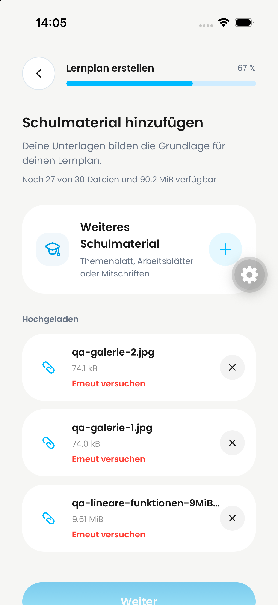
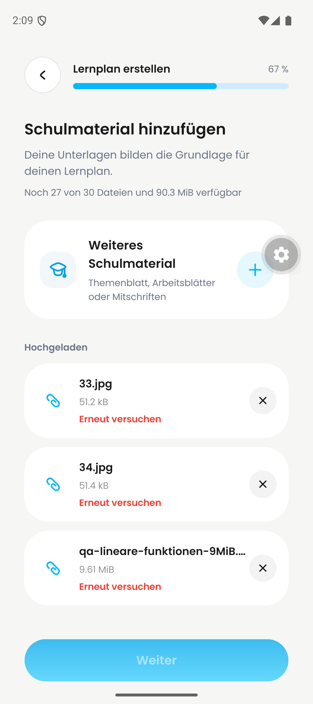

# DAY-403 / PR #656 — native large-document evidence

## Result: 9.61 MiB PDF accepted and uploaded; processing blocked

Selected qa-lineare-funktionen-9MiB.pdf through native Files on both platforms. Exact fixture size: **10,081,819 bytes (9.614 MiB)**, above the old 7 MiB boundary. Both clients accept it and show 9.61 MiB under Hochgeladen; no size rejection occurred.

Fixture is a valid single-page synthetic math PDF enlarged with inert PDF-comment padding. This proves admission/transfer above 7 MiB, **not realistic multipage parsing performance, the exact 25 MiB boundary, or successful AI processing**.

PR head at start: 2e89275e1a46314effa4acc168e4bc7044ef1ceb. The tested QA src/lib/upload-policy.ts matches that head; the integrated creation flow includes other PR changes.

| iPhone result | Android result |
| --- | --- |
|  |  |

[Full iPhone recording](iphone-review.mp4) · [Full Android recording](android.mp4)

- iPhone: 03:47 file visible; 06:14 selected; by 07:55 PDF appears at 9.61 MiB with retry. The sampled frames do not resolve the brief processing transition.
- Android: 00:00 Files picker; 00:10–00:25 uploading; 00:26 PDF appears at 9.61 MiB / Wird verarbeitet; 00:27 retry. Retry state persists to the recording end.
- The two image rows already present are from the separate #652 test, not successful processed documents.

Not tested here: exact 25 MiB and over-limit native uploads, Office/text documents, physical devices, successful processing/plan generation.

## Test environment and limits

Run: 2026-09-24. Existing QA accounts, iPhone simulator (iOS 26.4, de.dayova.app-dev) and Pixel 9 emulator (Android 16, com.dayova.dev). Not physical devices.

Frontend: integrated QA branch codex/jakob-qa-integration-20260922, clean commit 52568c261d530d166563c9592dd9178a74cc4469. This is **integration evidence, not certification of the isolated PR head**.
Backend: dev trustworthy-skunk-257. No production deployment or configuration was changed.

## Confirmed processing blocker

Files reach “Hochgeladen”; subsequent processing ends in “Erneut versuchen”, with Weiter disabled. Live dev logs show successful upload:finalizeUpload, learningPlans:storeUploadedDocument and learningPlans:registerUploadedDocument, followed by learningPlanAi:processUploadedDocument failing with:

> Uncaught Error: Konfiguriere GOOGLE_VERTEX_API_KEY oder GOOGLE_VERTEX_PROJECT + GOOGLE_VERTEX_LOCATION.

[Dev backend dashboard](https://dashboard.convex.dev/t/philipp-schossig/dayova-mvp/trustworthy-skunk-257).

This does not establish that processing would pass after configuration is corrected. Configure the intended QA Vertex connection with owner approval, then rerun processing through knowledge check / plan creation. No release or merge approval is implied.

## Recording inspection

Used inspect-video-evidence: complete-timeline contact-sheet sampling, not just poster frames. No audio streams; transcription not applicable. Sampling can miss short transitions. iPhone review copies preserve the complete timeline but are transcoded to 720px width / 5 fps; Android recordings are originals. Raw recording hashes and sampling details are in the adjacent manifests. No historical before-state was recreated in this run.

Coverage: 535.35-second video; 80 full-timeline frames sampled at 0.149435 fps (6.691875-second interval); 5 contact sheet(s); no audio stream.

Coverage: 97.66-second video; 98 full-timeline frames sampled at 1 fps (1-second interval); 7 contact sheet(s); no audio stream.
