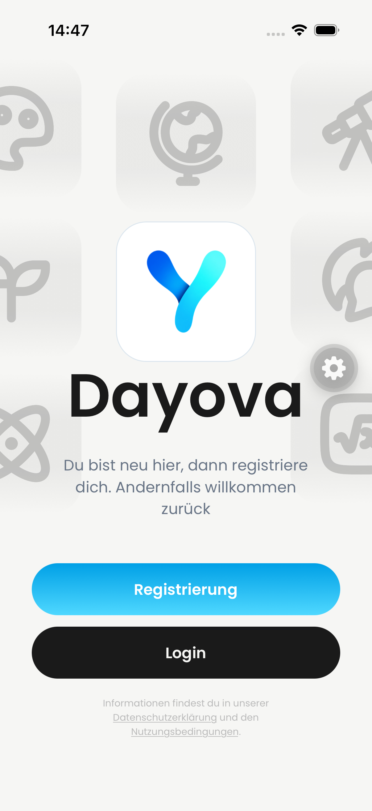
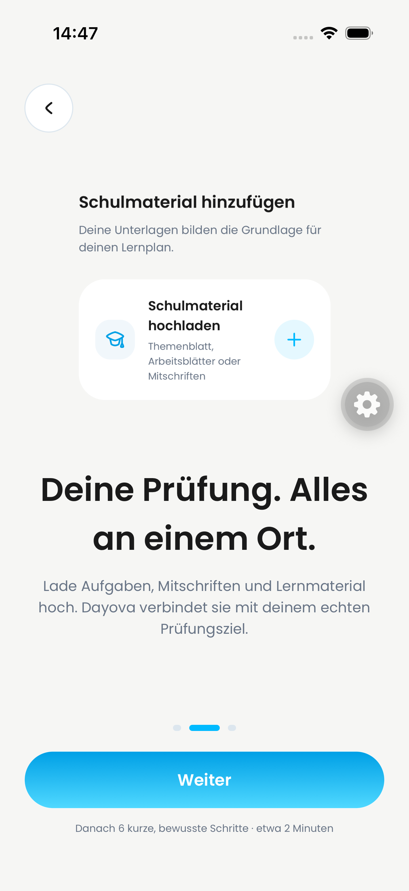
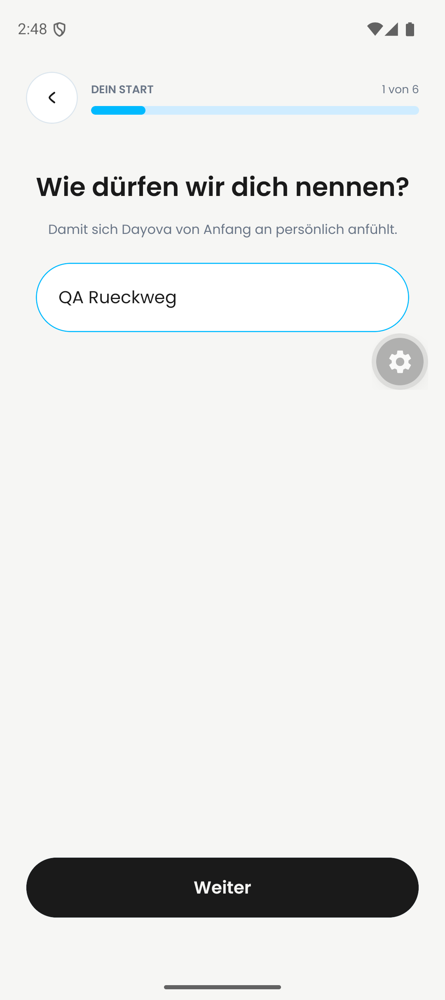

# DAY-416 — targeted native registration Back evidence

24 September 2026. Integrated development QA source `52568c261d530d166563c9592dd9178a74cc4469`, not isolated PR-head or production. iPhone simulator iOS 26.4 and Pixel 9 emulator Android 16. Existing QA accounts were signed out, not deleted. No new registration was submitted.

## Observed

- iPhone: explicit Back from intro 1 reaches registration/login welcome; intro 2→1 and intro 3→2→1 work. Maestro flow completed; inspected end-state screenshots below. No iOS gesture-animation claim.
- Android: explicit Back from intro 1 reaches welcome; system Back from intro 2 reaches intro 1; explicit Back from intro 3 reaches 2 then 1. Flow completed and screen recording inspected across its full timeline.
- Separate Android form check: entered synthetic name `QA Rueckweg`, advanced to grade, pressed system Back; name remained visible and its assertion passed. Further explicit form-back steps did not finish, so not claimed.

| iPhone: welcome after Back | iPhone: intro 2 after Back | Android: preserved name |
| --- | --- | --- |
|  |  |  |

Click a preview to open the original-resolution PNG. Preview formatting does not change the evidence or its coverage.

## Recording inspection

[Original Android recording](android-registration-back.mp4), SHA-256 `3deacfb10fcf512189ec09449df48eca2b6f68ba67aebbaff8c79237dc5fecef`.

`inspect-video-evidence` coverage: **Coverage: 97.51-second video; 98 full-timeline frames sampled at 1 fps (1-second interval); 7 contact sheet(s); no audio stream.** All seven sheets inspected, plus individual frames at 00:29/00:30. No transcription needed. Sampling supports navigation destinations, not frame-perfect animation quality; brief intermediate states under one second are not exhaustively reviewed.

- 00:21 intro 1; 00:22–00:25 welcome after explicit Back.
- 00:29 intro 2; 00:30–00:32 intro 1 after the flow's Android system Back.
- 00:35–00:36 intro 3; 00:38–00:39 intro 2 after explicit Back; 00:40 onwards intro 1 after another explicit Back.
- Remaining recording is idle on intro 1, not additional test coverage.

## Still not covered

iOS edge-back/cancelled gesture, persistence of every registration field, irreversible final account-creation boundary, and full fresh-account registration. This closes the specific intro-back device-evidence gap only, not all registration acceptance criteria.
