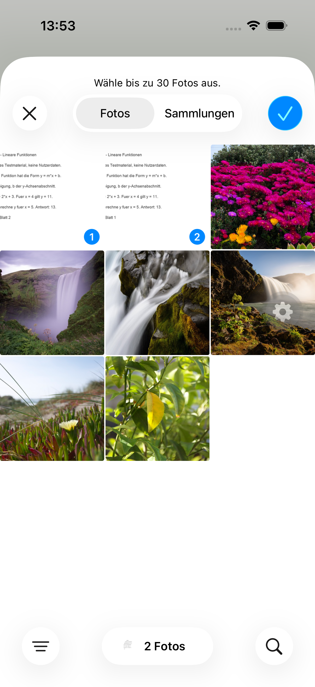
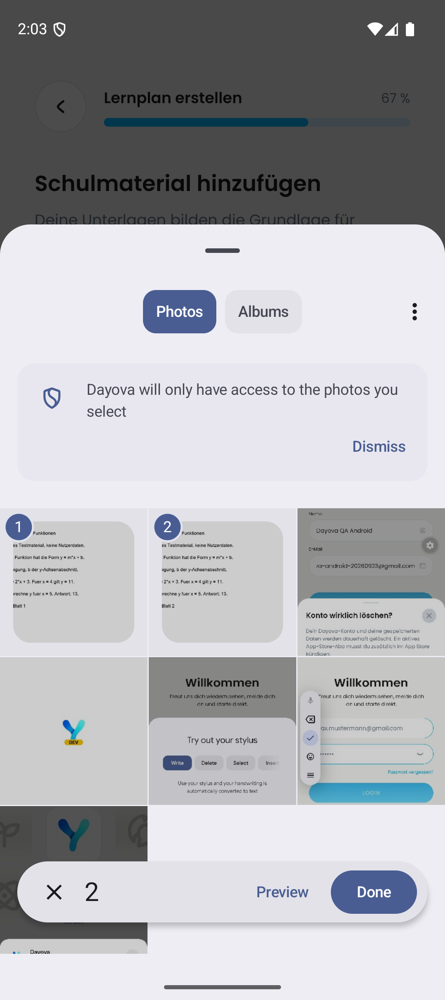
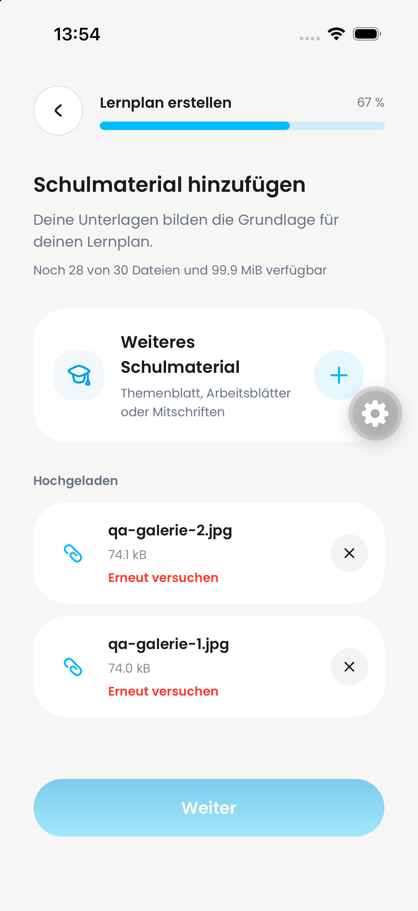
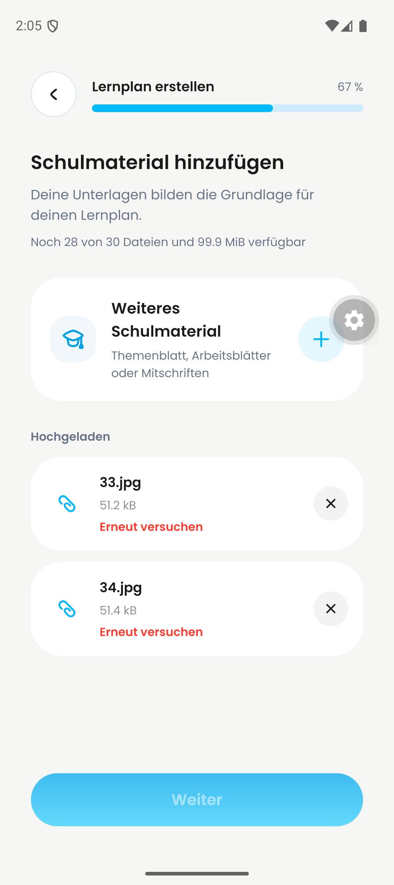

# DAY-422 / PR #652 — native gallery evidence

## Result: selection and upload pass; processing blocked

On both platforms, selected two synthetic local photos together in the native library picker, confirmed selection, and observed both JPEGs under Hochgeladen. iOS: qa-galerie-1.jpg / qa-galerie-2.jpg (~74 kB each). Android: 33.jpg / 34.jpg (~51 kB each).

PR head at start: d889b990c6ae472ac3fd10217d664be250e763ac.

| iPhone selection | Android selection |
| --- | --- |
|  |  |

| iPhone result | Android result |
| --- | --- |
|  |  |

[Full iPhone recording](iphone-review.mp4) · [Full Android recording](android.mp4)

- iPhone: approximately 06:51 both photos selected; 07:45–07:49 uploading; 07:51–07:52 both processing; around 07:55 both show retry.
- Android: 00:00 two selected; 00:15 uploading; 00:26 first file processing; 00:30 both listed with retry. At 01:50 the separate Files test begins; this later portion is not additional gallery coverage.

Not tested here: single-photo-only selection, iCloud-backed photos, real HEIC source, denied-permission recovery, camera regression. These remain unchecked. Successful continuation into plan creation is blocked.

## Test environment and limits

Run: 2026-09-24. Existing QA accounts, iPhone simulator (iOS 26.4, de.dayova.app-dev) and Pixel 9 emulator (Android 16, com.dayova.dev). Not physical devices.

Frontend: integrated QA branch codex/jakob-qa-integration-20260922, clean commit 52568c261d530d166563c9592dd9178a74cc4469. This is **integration evidence, not certification of the isolated PR head**.
Backend: dev trustworthy-skunk-257. No production deployment or configuration was changed.

## Confirmed processing blocker

Files reach “Hochgeladen”; subsequent processing ends in “Erneut versuchen”, with Weiter disabled. Live dev logs show successful upload:finalizeUpload, learningPlans:storeUploadedDocument and learningPlans:registerUploadedDocument, followed by learningPlanAi:processUploadedDocument failing with:

> Uncaught Error: Konfiguriere GOOGLE_VERTEX_API_KEY oder GOOGLE_VERTEX_PROJECT + GOOGLE_VERTEX_LOCATION.

[Dev backend dashboard](https://dashboard.convex.dev/t/philipp-schossig/dayova-mvp/trustworthy-skunk-257).

This does not establish that processing would pass after configuration is corrected. Configure the intended QA Vertex connection with owner approval, then rerun processing through knowledge check / plan creation. No release or merge approval is implied.

## Recording inspection

Used inspect-video-evidence: complete-timeline contact-sheet sampling, not just poster frames. No audio streams; transcription not applicable. Sampling can miss short transitions. iPhone review copies preserve the complete timeline but are transcoded to 720px width / 5 fps; Android recordings are originals. Raw recording hashes and sampling details are in the adjacent manifests. No historical before-state was recreated in this run.

Coverage: 514.06-second video; 80 full-timeline frames sampled at 0.155624 fps (6.425729-second interval); 5 contact sheet(s); 44 additional frames from 00:07:40.000 to 00:08:01.000 at 1 fps; no audio stream.

Coverage: 173.13-second video; 80 full-timeline frames sampled at 0.462079 fps (2.164134-second interval); 5 contact sheet(s); no audio stream.
