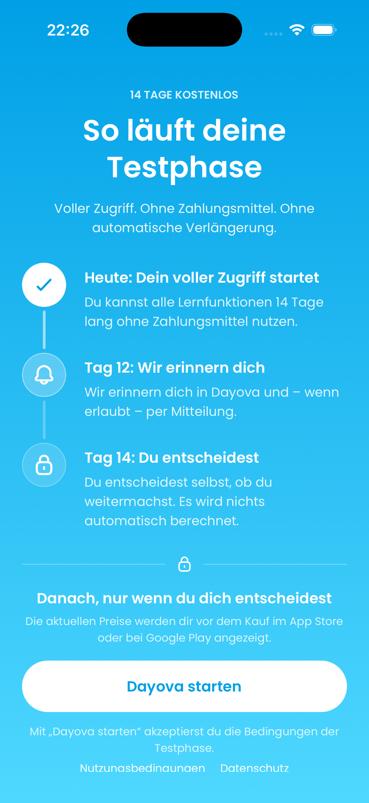

# DAY-423 / PR #659 — device run record (25 September 2026)

## Source and environment

- PR source: `6658f1776b6f50ea4195b49693ea9c21ba59928a` (`codex/day-423-learning-plan-recovery`).
- A separate, temporary Convex development deployment, `dev/day-423-pr659-device-qa`, accepted the checked-out functions and schema with `convex dev --once --typecheck enable`. It had the project's test Clerk issuer and Vertex key configured. The device has reached account setup against this deployment; a learning-plan request has not yet been observed.
- The worktree used a Clerk test publishable key, the isolated Convex URL, and disabled PostHog. No credentials or private email contents are included in this record.

## Local device attempts

| Device | Attempt | Observed result | PR feature coverage |
| --- | --- | --- | --- |
| Disposable iPhone 17 simulator, iOS 26.5 | `expo prebuild --platform ios`, followed by `pod install` | Prebuild succeeded. CocoaPods stopped while unpacking Hermes with `No space left on device - fcopyfile`. No native build of this PR was produced. | None |
| Same iPhone simulator | Installed a pre-existing **older** debug client (`dfc95ef`, Expo 57.0.8 / React Native 0.86.0) and connected it to Metro serving `6658f177` (Expo 57.0.20 / React Native 0.86.3). | The first connection exposed an IPv6-only Metro binding; after correcting that, Metro terminated with `ENOSPC` while transforming the bundle. The current PR JavaScript never loaded. The older client would have provided only a limited JS check even if it had loaded. The disposable simulator was removed after the attempt. | None |
| Existing `DAY_169_Pixel_9` Android AVD, Android 16 | Booted headless with SwiftShader and 2.5 GB guest RAM; opened its pre-existing development client (version 1.0.3) with an `adb reverse` to Metro. | The emulator displayed **System UI isn't responding**. No bundle request or Maestro app assertion completed. | None |
| Same Android AVD | Restarted with 4 GB guest RAM and the same conservative headless settings. | Android reported boot complete, but logcat recorded a `com.android.systemui` ANR. The app flow was not started. The emulator was shut down. | None |

The Mac had 8 GB of RAM and less than 1 GB of free disk space before cleanup. `pnpm store prune` removed 1.12 GB of unreferenced packages, but the iOS bundle transformation exhausted the remaining space as swap grew. These are **environment failures**, not observed regressions in PR #659. They do not establish that recovery works on either platform.

## EAS build and current-source iOS run

- An isolated, unsigned iOS simulator build [completed successfully on EAS](https://expo.dev/accounts/dayova/projects/dayova/builds/da0996b0-4cc4-4117-be29-3ea4e43615c9) at 20:04 UTC. Build ID: `da0996b0-4cc4-4117-be29-3ea4e43615c9`; build source: `694a2925afab0e461f4f1653ffa24404a3159f2f` on `codex/day-423-eas-qa-build`. Compared with PR head `85bebb501c189aabbd670c11e21c6d6c5a1798b3`, that source adds only the `day-423-device-qa` profile to `eas.json`; the app feature code is identical. The build embeds its JavaScript and uses a dedicated OTA channel, test Clerk credentials, and the isolated Convex deployment. The RevenueCat keys are dummy values: purchase flows are outside this run.
- After the build, `eas simulator:start --platform ios --type agent-device` returned **“EAS Simulator isn't available on dayova yet — it's coming soon.”** No cloud simulator session started or accrued run time.
- The EAS artifact was downloaded and installed without modification on an existing local iPhone 17 simulator (iOS 26.5). The previous app bundle, app data, and simulator keychain were backed up for restoration after QA. The current-source app launched and completed the registration, test-email verification, and account setup screens for a disposable QA account. It reached the 14-day trial activation screen. These screens show the native build and test backend can run together; they do **not** exercise DAY-423's material diagnosis or recovery.
- The next action, “Dayova starten,” explicitly accepts trial terms. The QA flow is paused at this screen pending authorization to accept those terms for the disposable account.

The screenshot records the last observed iOS screen. It is not evidence of a learning-plan outcome.

## Acceptance still needed

Run a native client compatible with the current source on iOS and Android against a test backend with working Vertex access. On each platform, create a plan with insufficient or unreadable material, verify the shown reason and recovery action, edit or replace material, retry, and confirm that the plan reaches a ready state while the intended inputs persist. Check separately that a full regeneration's replacement of existing sessions matches the product decision. Record the build/source identity and screenshots or a complete video timeline for the successful path.
