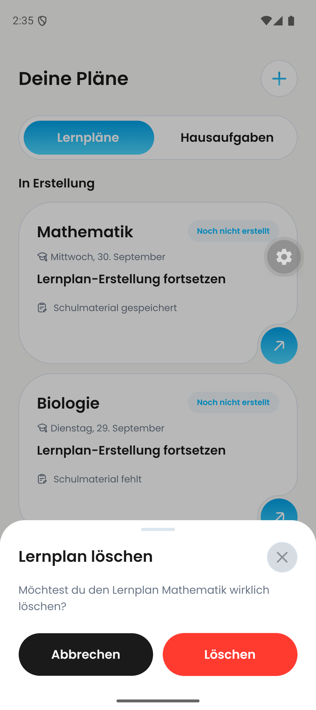
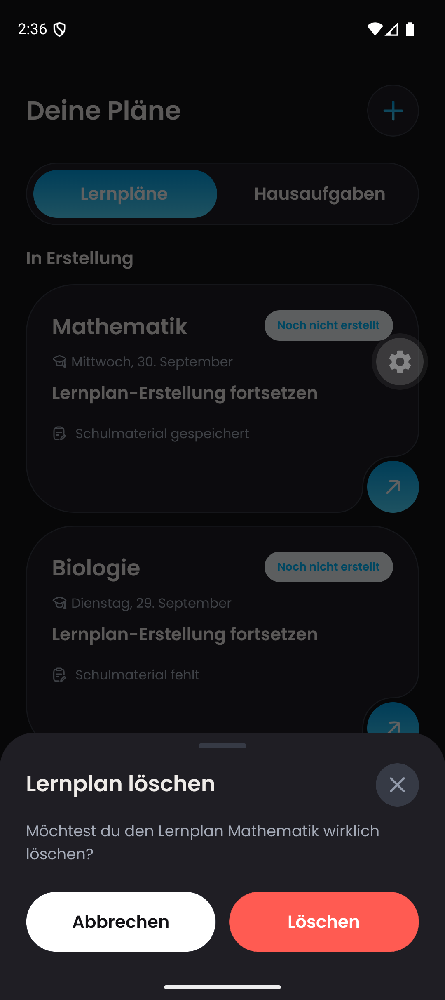

# DAY-445 — native Android confirmation evidence, 24 September 2026

Device: Dayova Pixel 9 emulator, Android 16, `com.dayova.dev`.
QA source: `52568c261d530d166563c9592dd9178a74cc4469` (integrated development build including this PR, not isolated PR-head or production).

Opened Plans, swiped a draft, opened the actual **Lernplan löschen** confirmation and cancelled. Repeated after setting Android dark appearance, then restored light appearance. Both Maestro runs completed successfully. No learning plan was deleted.

The inspected still images show a readable white **Löschen** label on a red button in both themes, with both actions above the system gesture bar. These are confirmation-state screenshots, not proof of a deletion request or its loading spinner.

Earlier iPad light/dark confirmation evidence: [23 September report](https://github.com/Dayova/dayova-mvp/blob/05bbe019/docs/evidence/homework-and-plan-dialog-2026-09-23/README.md).

Remaining: iPhone confirmation capture (the automated swipe did not reveal its action in this run), loading-spinner and enlarged-text acceptance. Do not mark all-platform/all-state acceptance complete.
