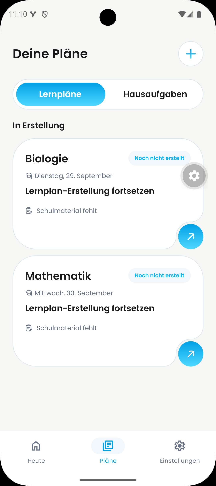

# DAY-469: Android action-button shadows

Issue: https://linear.app/dayova/issue/DAY-469

## Report and implementation

The reporter's Android screenshot shows gray drop shadows beneath both circular
arrow actions in Plans > Learning plans. The source image is preserved without
editing as `before-reporter.png`. The device model, Android version and application
build were not supplied; they cannot be inferred from the screenshot.

The implementation is based on main commit
`00c5b190714ec2c4946c1190ed6078b6ed77b285`, after DAY-393 / PR #657.
That PR retained elevation for stacking. This follow-up removes `elevation: 20`
from the shared visible action and `elevation: 30` from its transparent touch
target. Existing sibling `zIndex` values remain 20 and 30. Geometry, gradients,
icons and handlers are unchanged. Other consumers of `NotchedActionCard` receive
the same shadow removal, including decorative artwork.

The pictured learning-plan cards use card-press mode, whose action is decorative;
the transparent touch target belongs to the separate action-press mode. Both
paths are covered by the shared component's shadow-free lint boundary.

## Visual evidence

| Before (reporter, original build unknown) | After (native Android) |
| --- | --- |
|  |  |

### Evidence correction — 24 September 2026

Philipp supplied the original `Screenshot_1790241056.png` as Android after
evidence and confirmed that Android testing had taken place. It is copied
unchanged here as `after-android-reporter.png` (1080 × 2424). Both visible
learning-plan arrow buttons have no gray drop shadow and sit in their card
notches. This is still-image evidence, not proof of tapping or other modes.
The screenshot itself does not identify its exact source commit, APK version,
device model or Android version; those details are not inferred.

Android execution on the integrated QA branch was already documented in
[the Android QA report](https://github.com/Dayova/dayova-mvp/blob/1721cd3/docs/evidence/jakob-qa-2026-09-22/android/README.md).
That report names source `a53ef62`, Android 16, `com.dayova.dev`, and Metro 8095.
The integration includes #719; `src/components/ui/notched-action-card.tsx`
is byte-identical between `a53ef62`, later QA source `6aaba8bd`, and this PR's
pre-evidence head `d4e0339838ba4f06d5bd6b8f915075aebda4029c`.
This establishes shared-component source equivalence, not an exact-build
attribution for the newly supplied screenshot or isolated-PR acceptance.

The former blanket statement that no Android execution or after image exists
is therefore obsolete. The 22 September EAS failure below is historical only.
Dedicated action-only hit testing, decorative mode and an iOS visual smoke
test are not established by this screenshot. Jakob's
[24 September merge hold](https://github.com/Dayova/dayova-mvp/pull/719#issuecomment-5811024470)
remains until he accepts the evidence; this update does not self-approve it.

Jakob requested adjacent before/after evidence in
[PR #657](https://github.com/Dayova/dayova-mvp/pull/657#issuecomment-5766118902).
Capture the same screen and state on the same Android device for a controlled
comparison, recording base/fix commits and device/build information. Keep the
reporter image as additional original evidence when its state cannot be recreated.

## Validation

- Existing NotchedActionCard UI suite: 2 tests passed.
- Interface-shadow rule: 14 tests passed, including rejection of action elevation.
- ESLint on the changed component: passed.
- TypeScript (`tsc --noEmit`): passed.
- `git diff --check`: passed.

These checks do not establish native Android stacking, hit testing or appearance.
The after image now documents both learning-plan cards visually. Action-press
behavior, decorative mode and an iOS visual smoke test remain separate checks.
The earlier draft-only instruction was superseded by Philipp's explicit review
handoff on 22 September. Jakob/Fabius own approval and merge.

## Historical Android capture blocker (22 September 2026)

The requested EAS test was attempted using the existing `development` profile
and source commit `a0b2c1b`. No finished Android development client was available.
[Build 48665bc0-14ee-43a2-b7b5-19d8a30fd639](https://expo.dev/accounts/dayova/projects/dayova/builds/48665bc0-14ee-43a2-b7b5-19d8a30fd639)
failed in `READ_APP_CONFIG` before native compilation because the development
environment lacks `EXPO_PUBLIC_REVENUECAT_ANDROID_API_KEY`.

The remote simulator was not started because there was no usable current build.
At that time, the next step was to resume after the Android development environment had its correct RevenueCat
public SDK key configured, then build the development client and capture the
comparison. No billing configuration or production environment was modified.
