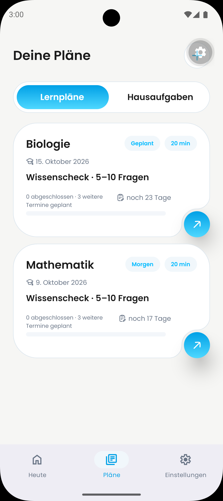

# DAY-469: Android action-button shadows

Issue: https://linear.app/dayova/issue/DAY-469

## Report and implementation

The reporter's Android screenshot shows gray drop shadows beneath both circular
arrow actions in Plans > Learning plans. The source image is preserved without
editing as `before-reporter.png`. The device model, Android version and application
build were not supplied; they cannot be inferred from the screenshot.

The implementation is based on main commit
`00c5b190714ec2c4946c1190ed6078b6ed77b285`, after DAY-393 / PR #657.
That PR retained elevation for stacking. This follow-up removes `elevation: 20`
from the shared visible action and `elevation: 30` from its transparent touch
target. Existing sibling `zIndex` values remain 20 and 30. Geometry, gradients,
icons and handlers are unchanged. Other consumers of `NotchedActionCard` receive
the same shadow removal, including decorative artwork.

The pictured learning-plan cards use card-press mode, whose action is decorative;
the transparent touch target belongs to the separate action-press mode. Both
paths are covered by the shared component's shadow-free lint boundary.

## Visual evidence

| Before (reporter, original build unknown) | After (native Android) |
| --- | --- |
|  | Pending native capture; no visual approval claimed. |

Jakob requested adjacent before/after evidence in
[PR #657](https://github.com/Dayova/dayova-mvp/pull/657#issuecomment-5766118902).
Capture the same screen and state on the same Android device for a controlled
comparison, recording base/fix commits and device/build information. Keep the
reporter image as additional original evidence when its state cannot be recreated.

## Validation

- Existing NotchedActionCard UI suite: 2 tests passed.
- Interface-shadow rule: 14 tests passed, including rejection of action elevation.
- ESLint on the changed component: passed.
- TypeScript (`tsc --noEmit`): passed.
- `git diff --check`: passed.

These checks do not establish native Android stacking, hit testing or appearance.
Before review approval, verify both learning-plan cards, action-press behavior,
decorative mode, and an iOS visual smoke test. Keep the PR in draft until the
native evidence is attached. Jakob/Fabius own approval and merge.
