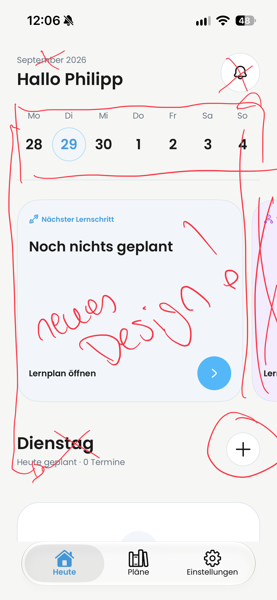
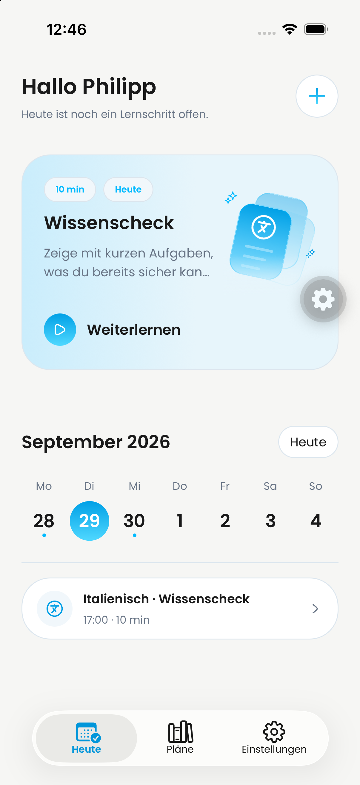
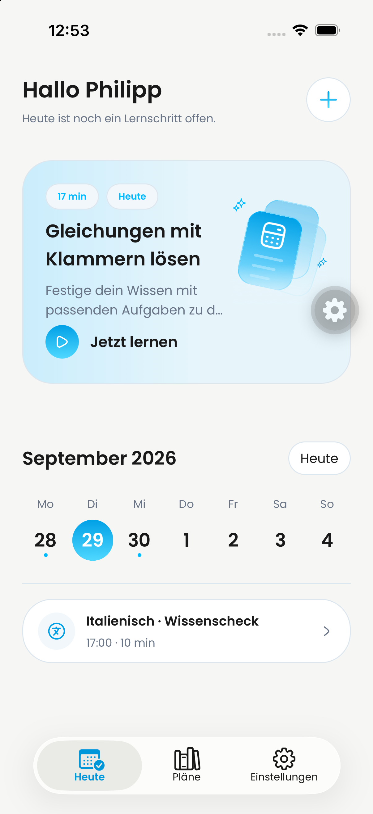
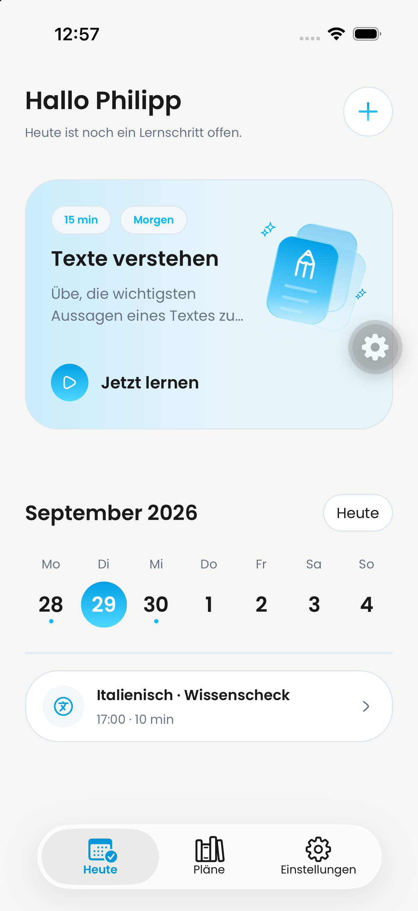

# Heute-Dashboard: Review-Medien

Von Philipp bereitgestellter Produktvergleich für PR #797. Das Vorher-Bild wurde aus IMG_1911.heic in PNG konvertiert; beide Videos und das Nachher-Bild sind unveränderte Kopien der bereitgestellten Dateien.

## Vorher

[Vorher-Aufnahme ansehen](before.mp4)

## Nachher

[Nachher-Aufnahme ansehen](after.mp4)

## Zusätzliche Kalender-Aufnahme (29. September, 13:37)

[Kalender-Auswahl und Tageswechsel ansehen](calendar-selection-1337.mp4)

Von Philipp bereitgestellte Aufnahme, unverändert übernommen. Bei 00:02 ist der
29. September ausgewählt, bei 00:03 der 28. September mit erledigtem Eintrag;
00:04–00:06 zeigen leere Oktobertage. Bei 00:04.500 sind unterschiedlich große
Auswahlkreise während eines Wechsels sichtbar. Die Stichprobe belegt keine
exakte Animationsdauer oder ruckelfreie Bildrate. Kurzzeitige Lade-/Übergangszustände
sind enthalten; kein Nachweis sämtlicher Navigationspfade oder eines Release-Builds.

> Coverage: 9.23-second video; 18 full-timeline frames sampled at 2 fps (0.5-second interval); 2 contact sheet(s); no audio stream.

Keine Audiospur, daher keine Transkription. Beide Kontaktbögen vollständig geprüft.

## Von Philipp bestätigte Kartenvarianten

### 1. Angefangener Wissenscheck – Weiterlernen

### 2. Neuer Lernschritt – Jetzt lernen

### 3. Nächster Lernschritt morgen

Die Varianten 2 und 3 zeigen ausschließlich für die obere Karte eingesetzte lokale Vorschau-Daten. Header und Kalender zeigen weiterhin die echten Vorschau-Einträge. Lerndaten wurden dafür nicht verändert. Diese drei Bilder sind keine vollständige visuelle Prüfung aller Leer-, Lade- und Datumszustände.

Der Vorherstand ist ein Produktvergleich, kein verifizierter Vergleich mit dem tatsächlichen PR-Parent #796. Die Nachher-Aufnahme zeigt eine lokale Vorschau, keinen ausgelieferten Build. Zeitachsen-Beobachtungen und Prüfgrenzen stehen in der PR-Beschreibung.
