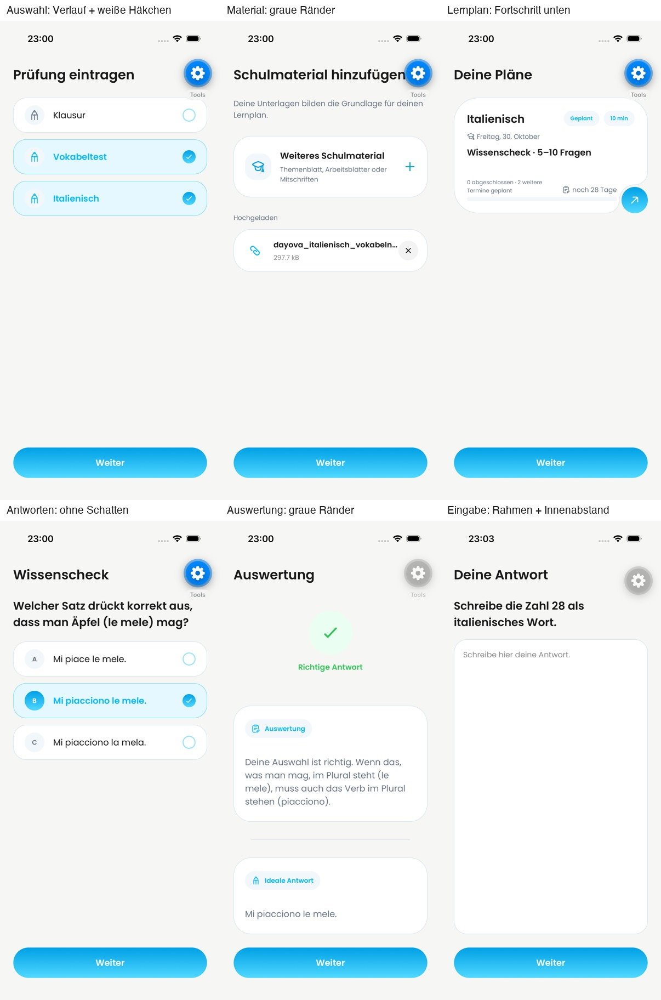

# DAY-497: native component previews

Captured on 3 October 2026 on a dedicated iPhone 17 Pro simulator, iOS 26.4,
1206×2622, default light theme and text size. Original report images are in
[GitHub #826](https://github.com/Dayova/dayova-mvp/issues/826), synced with
[DAY-497](https://linear.app/dayova/issue/DAY-497).

The PNGs are unedited native captures. The overview only scales and arranges
those captures with labels. The gear marked Tools is Expo development chrome,
not a Dayova UI change. Every depicted card, selection row, feedback view and
answer field imports the actual implementation. Preview headings, navigation,
fixed data and the Continue button are fixture scaffolding. The selection page
shows examples from separate exam/subject groups together, not a multiselect.

The answer field was revised after visual inspection to put its padding on the
surrounding View, keeping text inset consistently on iOS. `06-input.png` and
`07-input-keyboard.png` show this final real TextAnswer component. Typed text and
focus state were exercised in the simulator. The fixture does not reproduce
the production screen's keyboard avoidance, routing, auth or backend submission.
Those flows, Android, dark mode, and enlarged system text were not visually
verified here. White glyphs on the existing bright gradient remain a known
contrast limitation accepted by the requested visual direction.

For reproduction, copy `preview-fixture.tsx.txt` to `src/design-preview.tsx`,
temporarily replace the root index.ts import with `./src/design-preview`, and
start the development client using a localhost Metro server. Restore index.ts
and remove the temporary fixture afterward. The fixture was not shipped in the
application. Its "Weiter" button cycles through six views.
