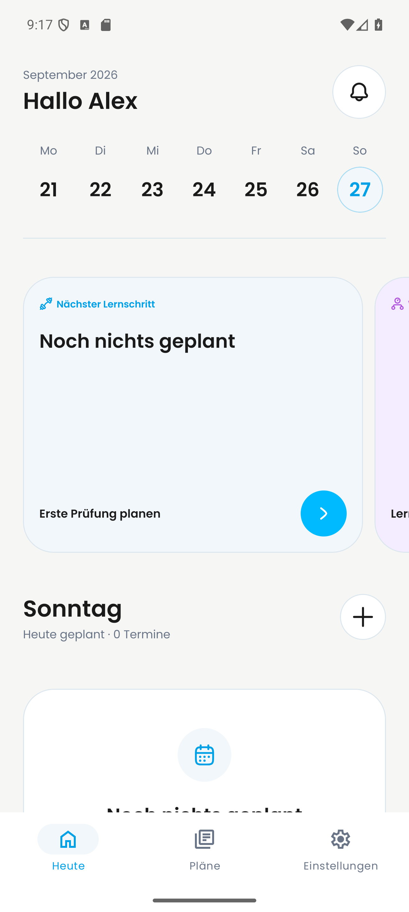
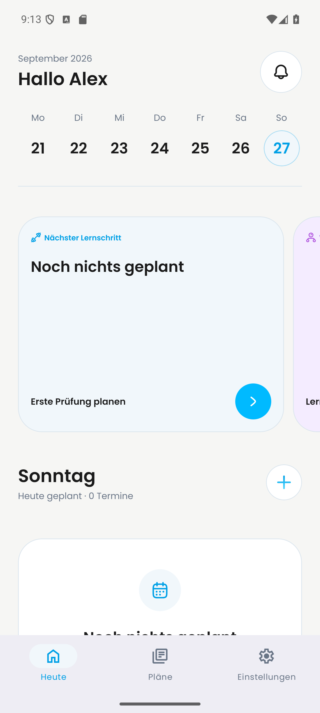

# PR #693: Dashboard-Plus auf Android

Standbilder vom 27. September 2026 auf demselben Pixel-9-Pro-Emulator (Android 16, 1280 × 2856) mit demselben synthetischen Testkonto. Der gezeigte Bildschirm ist **Heute / Dashboard**, nicht „Pläne“.

| Vorher: `main` (`8c9ed0ce`) | Nachher: PR #693 (`246e2e8e`) |
| --- | --- |
|  |  |

## Herkunft

- Vorher: `origin/main` bei `8c9ed0cecddf60ad971cd3d5a61821b8271a5e33`, dem Remote-Stand zum Aufnahmezeitpunkt.
- Nachher: Head von [PR #693](https://github.com/Dayova/dayova-mvp/pull/693) bei `246e2e8e90f5622ff9128a0a716e3c041d2332ab`.
- Der PR hat `06e18ea6c1dac486ae1d98a4fdfae0ad0e167bee` als Merge-Basis. Das ist **nicht** das Vorher-Bild dieses Vergleichs.
- Auf dem Emulator wurde ein lokal aus `06e18ea6` gebauter Android-Entwicklungsclient für x86_64 installiert. Die App-Daten blieben bei der Installation erhalten. `package.json` und `pnpm-lock.yaml` änderten sich zwischen diesem Commit und dem aufgenommenen `main` nicht.
- Die JavaScript-Bundles wurden nacheinander aus den ausgecheckten Commits mit `APP_VARIANT=development expo start --dev-client --host lan --clear` geladen: PR-Head über Port 8093, aktuelles `main` über Port 8094. Metro meldete jeweils einen neuen Android-Bundle-Build. Die Umgebungsvariablen verwiesen auf eine Clerk-Testinstanz und ein Convex-Entwicklungsdeployment.
- Beide Aufnahmen zeigen denselben angemeldeten Account, den ausgewählten Sonntag, vollständig geladene Dashboard-Daten und dieselbe Bildschirmgröße. Die PNGs stammen direkt aus `adb shell screencap -p`; sie wurden nicht visuell bearbeitet.

## Beobachtung und Grenze

Am Mittelpunkt des Dashboard-Plus (`x=1138, y=1930`) ist `main` dunkel (`RGB 26,26,26`) und der PR-Head blau (`RGB 37,186,242`). Im 200×200-Pixel-Ausschnitt um die Aktion unterscheiden sich 924 von 40.000 Pixeln. Die Dateien haben unterschiedliche SHA-256-Hashes und sind keine Kopien desselben Bildes.

Das ist ein **Android-Standbildvergleich** der Dashboard-Aktion. Seit der Merge-Basis enthält `main` weitere Änderungen, unter anderem am unteren Dashboard-Abstand; Unterschiede außerhalb der Plus-Aktion lassen sich daher nicht allein PR #693 zuordnen. Eine iOS-Laufzeitprüfung ist damit nicht erbracht.
