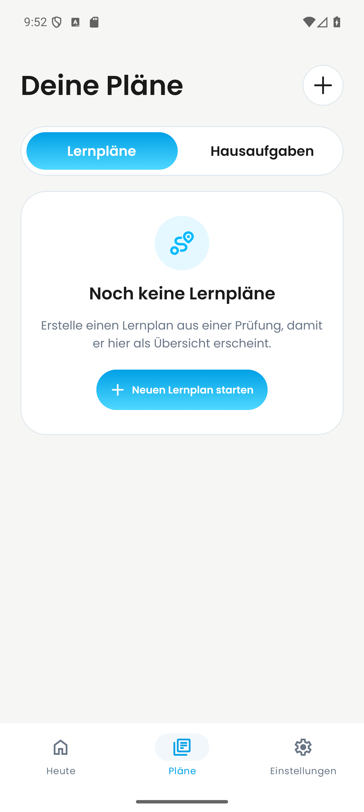
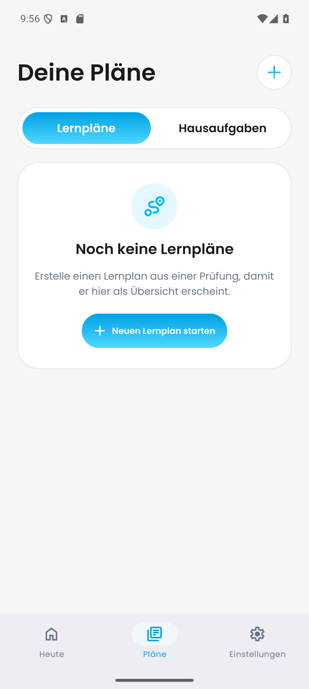

# PR #693: Pläne-Plus auf Android

Standbilder vom 27. September 2026 auf demselben Pixel-9-Pro-Emulator (Android 16, 1280 × 2856) mit demselben synthetischen Testkonto. Der gezeigte Bildschirm ist **Deine Pläne / Lernpläne**.

| Vorher: `main` (`8c9ed0ce`) | Nachher: PR #693 (`246e2e8e`) |
| --- | --- |
|  |  |

## Herkunft

- Vorher: `origin/main` bei `8c9ed0cecddf60ad971cd3d5a61821b8271a5e33`, dem Remote-Stand zum Aufnahmezeitpunkt.
- Nachher: Head von [PR #693](https://github.com/Dayova/dayova-mvp/pull/693) bei `246e2e8e90f5622ff9128a0a716e3c041d2332ab`.
- Auf dem Emulator lief derselbe lokal aus der Merge-Basis `06e18ea6c1dac486ae1d98a4fdfae0ad0e167bee` gebaute Android-Entwicklungsclient für x86_64. `package.json` und `pnpm-lock.yaml` änderten sich zwischen diesem Commit und dem aufgenommenen `main` nicht.
- Die JavaScript-Bundles wurden nacheinander aus den exakt ausgecheckten Commits mit `APP_VARIANT=development expo start --dev-client --host lan --clear` geladen: `main` über Port 8095, PR-Head über Port 8096. Metro meldete jeweils einen neuen Android-Bundle-Build. Die Umgebungsvariablen verwiesen auf eine Clerk-Testinstanz und ein Convex-Entwicklungsdeployment.
- Beide Aufnahmen zeigen denselben angemeldeten Account, die ausgewählte Registerkarte „Lernpläne“, denselben leeren Pläne-Zustand und dieselbe Bildschirmgröße. Die PNGs stammen direkt aus `adb shell screencap -p`; sie wurden nicht visuell bearbeitet.

## Beobachtung und Grenze

Am Mittelpunkt des Kopfbereich-Plus (`x=1138, y=300`) ist `main` dunkel (`RGB 26,26,26`) und der PR-Head blau (`RGB 40,189,243`). Im 200×200-Pixel-Ausschnitt um die Aktion unterscheiden sich 920 von 40.000 Pixeln. Die Dateien haben unterschiedliche SHA-256-Hashes und sind keine Kopien desselben Bildes.

Das ist ein **Android-Standbildvergleich** der Pläne-Aktion. Der [Dashboard-Vergleich](../day-693-dashboard-android/README.md) dokumentiert den anderen Bildschirm separat. Eine iOS-Laufzeitprüfung ist damit nicht erbracht.
