# Direkt eingebettete PR-Bildnachweise

Diese Bildsammlung trennt exakte PR-Base/Head-Vergleiche, historische Nutzeraufnahmen, gemeinsame QA-Aufnahmen und Fehlerbelege. Nicht vorhandene Gegenbilder werden nicht erfunden. Keine Statusänderung, kein Merge und keine Production-OTA.

## PR #651: Lernzeiten

Historische iPad-Ansicht und iPad-Aufnahme des gemeinsamen QA-Stands, kein isolierter PR-Vergleich. Klassenstufen-Defaults und Erinnerung nach Wissenscheck bleiben unbelegt.

| Historisch, iPad | Gemeinsamer QA-Stand, iPad |
| --- | --- |
|  | 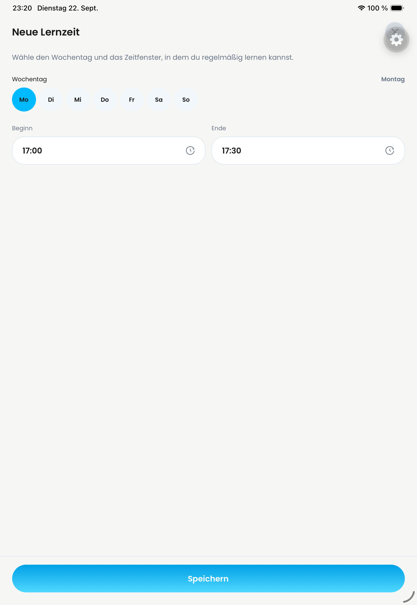 |

### iPhone: gespeicherte Lernzeit

### iPhone: bearbeiten

### iPhone: Swipe-Aktion

### Android: gespeichert

### Android: bearbeiten

### Android: Swipe-Aktion

## PR #652: Material-Quellenauswahl

Historisches iPhone vs neueres iPad, Builds unbekannt. Die sichtbare Mediathek-Option belegt weder Fotoauswahl, Mehrfachauswahl, iCloud noch Berechtigungsfehler. Diese Tests bleiben offen.

| Historisch, iPhone | Nutzeraufnahme 22.09., iPad |
| --- | --- |
|  |  |

## PR #653: Exakte PR-Vergleiche: Welcome

Bereits erfasste Portrait-Aufnahmen: Base 00c5b190714ec2c4946c1190ed6078b6ed77b285 → Head a8cc4472ae71d9e811ca1245efafa24af4ac3127. Separate Entwicklungsclients/Metro, keine Production-OTA. Jakobs visueller HOLD und übrige Abnahmekriterien bleiben unverändert.

| iphone — PR-Base | iphone — PR-Head |
| --- | --- |
|  |  |

| ipad — PR-Base | ipad — PR-Head |
| --- | --- |
| 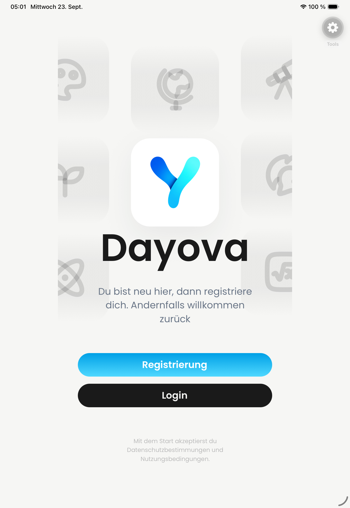 | 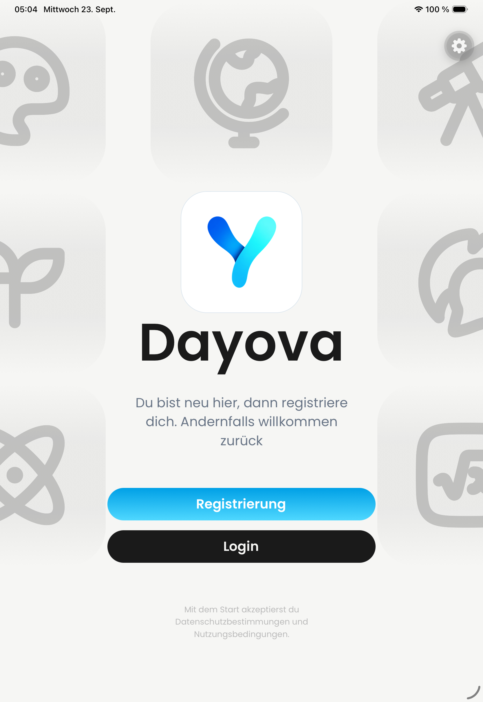 |

| android — PR-Base | android — PR-Head |
| --- | --- |
| 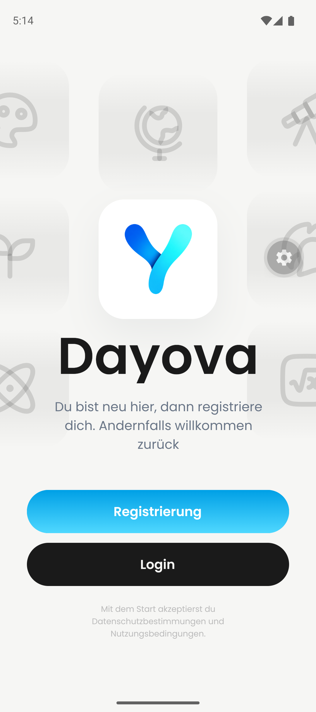 | 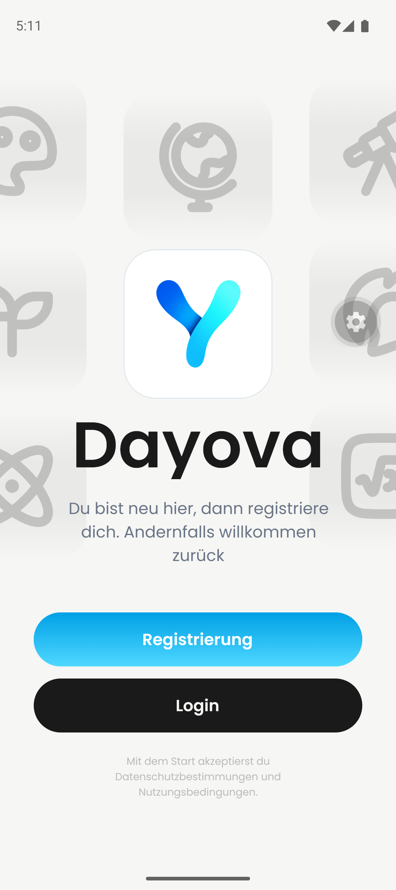 |

## PR #655: Persönliche Fächer

Historische iPhone-Fachauswahl und neue iPad-Nutzeraufnahme, kein exakter PR-Base/Head-Vergleich. Verknüpfte Einträge, vollständige Android-/Tastatur-/Fehlerfälle bleiben offen.

| Historisch: kein Hinzufügen-Eintrag | iPad: Fach hinzufügen sichtbar |
| --- | --- |
|  |  |

### iPad: Eingabedialog

### Android: Fach umbenennen

### Android: Swipe-Aktion

### Android: Auswahl

## PR #656: Upload-Grenze und vorhandene QA-Ergebnisse

Links: historischer Fehler bei 9,07 MiB. Rechts: neuere Anzeige 30 Dateien/100 MiB auf iPad. Das ist ausdrücklich KEIN Nachweis eines erfolgreichen 8–25-MiB-Uploads. Der separate QA-Erfolg betrifft nur eine synthetische 804-Byte-Datei. Production-R2 und große Dateien bleiben offen.

| Historisch: 7-MiB-Grenze | Neuere Anzeige, iPad |
| --- | --- |
|  |  |

### QA: nur 804 Byte als hochgeladen angezeigt

## PR #659: KI-Fehlerbelege, kein Erfolgsvergleich

Historischer Wissenscheck-Fehler und späterer QA-Konfigurationsfehler. Beide sind Fehlerzustände. Kein nachgewiesener erfolgreicher Retry/Recovery; QA-Vertex bleibt Voraussetzung.

| Historischer Fehler | QA-Fehler 23.09. |
| --- | --- |
|  |  |

## PR #661: Kontolöschung: beobachteter Fehler

Nutzeraufnahme 23.09.2026, 11:24, iPad. Kein erfolgreicher Nachher-Beleg und keine bestätigte vollständige Datenlöschung. Clerk-Konfiguration/End-to-End-Abnahme bleiben offen. Private E-Mail-/ausgefüllte Passwortbilder werden nicht veröffentlicht.

### Kontolöschung fehlgeschlagen

## PR #693: Exakte PR-Vergleiche: Plus-Aktion

Bereits erfasste Base 00c5b190714ec2c4946c1190ed6078b6ed77b285 → Head 3ee67f8273c21578c6b1fec1ccb2ea3304a846eb. Native Entwicklungsclients, keine Production-OTA; Bilder belegen nur die gezeigten Ansichten.

| iPhone — PR-Base | iPhone — PR-Head |
| --- | --- |
|  | 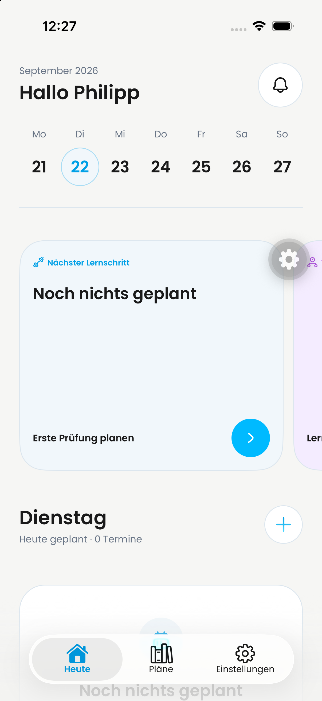 |

| Android — PR-Base | Android — PR-Head |
| --- | --- |
| 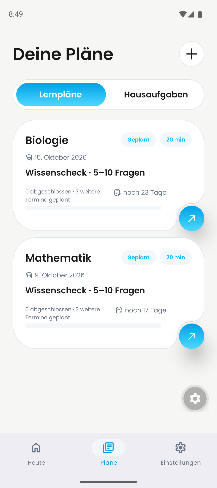 | 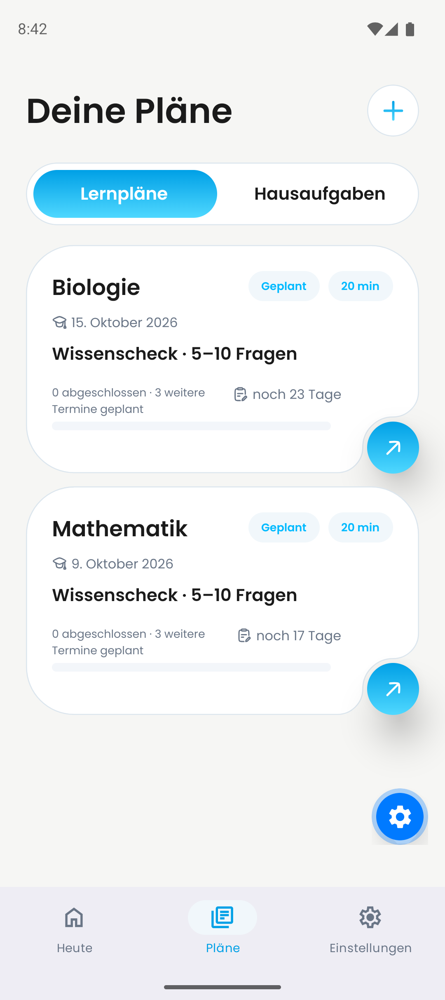 |

## PR #698: Navigation: native QA-Endzustände

Gemeinsamer QA-Stand, nicht isolierter PR-Head. Einzelbilder zeigen erhaltene Auswahl; sie belegen keine Animation oder Release-Kaltstart-Links. Diese Kriterien bleiben separat.

### ipad: Fach nach Zurück

### iphone: Fach nach Zurück

### android: Fach nach Zurück

### ipad: Hausaufgabe nach Zurück

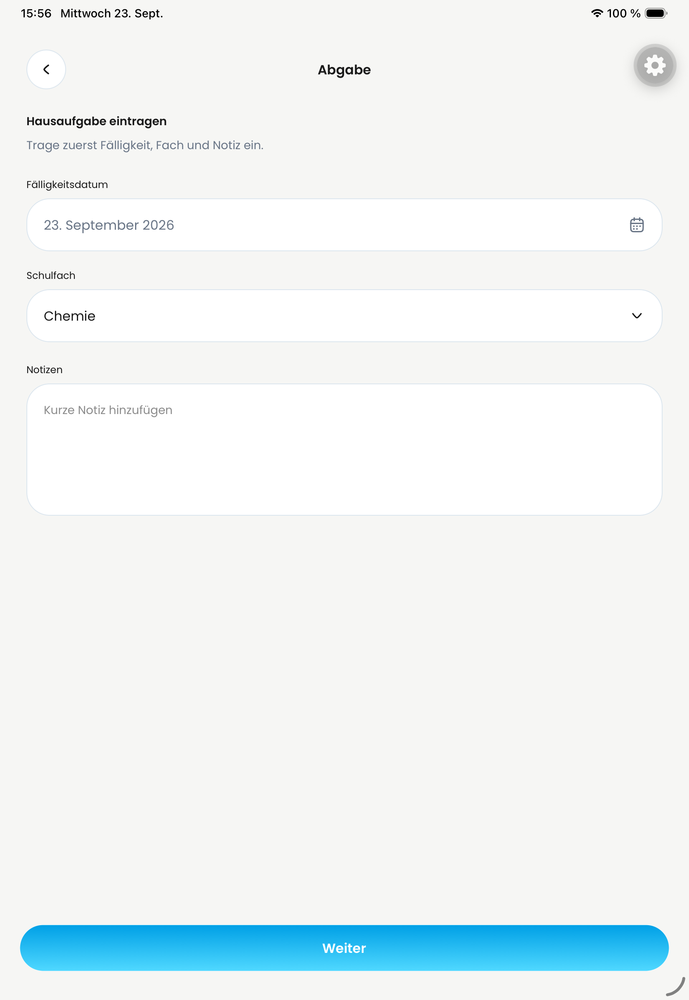

### iphone: Hausaufgabe nach Zurück

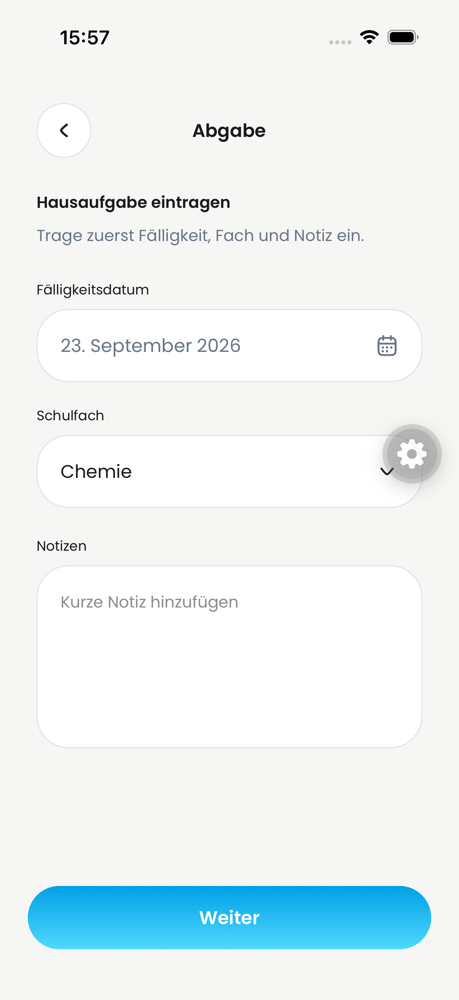

### android: Hausaufgabe nach Zurück

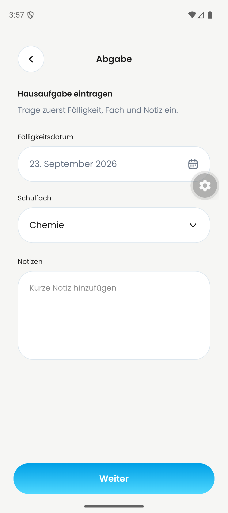

## PR #707: Wiederholung: fehlender Erfolgsbeleg

Für die eigentliche Wiederholung gibt es keinen neuen erfolgreichen Vorher-/Nachher-Nachweis. Der abgebildete gemeinsame QA-Fehler blockiert vorgelagert die Erstellung. Dieses Bild ist ein Blockerbeleg, keine Abnahme von #707.

### Vorgelagerte QA-Erstellung fehlgeschlagen

## PR #711: Lernplan-Löschdialog, iPad

Gemeinsamer QA-Code 6aaba8bd (Aufnahmestand 1721cd3c), nicht isolierter PR-Head. Light/Dark sind Theme-Vergleiche, NICHT Vorher/Nachher. Dialog jeweils abgebrochen. Loading, erfolgreiche Löschung und weitere Plattformen bleiben offen.

| Light Mode | Dark Mode |
| --- | --- |
| 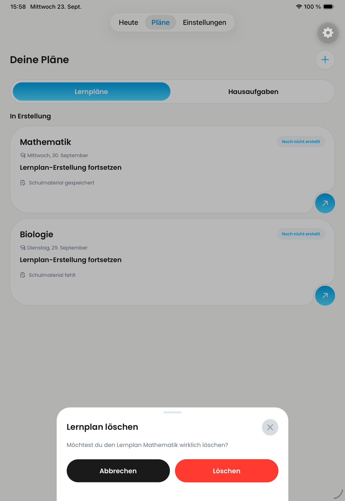 | 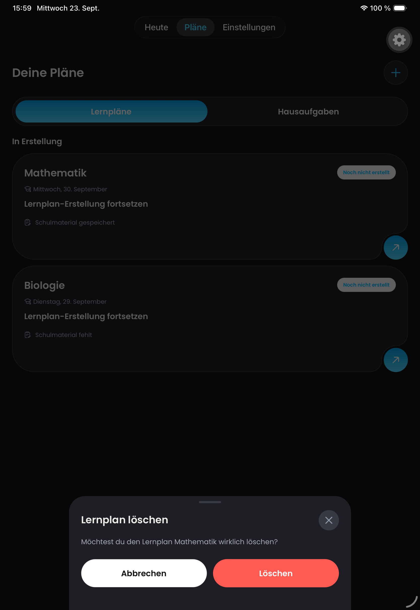 |

## PR #710: Persönliche Fächer

Historische iPhone-Fachauswahl und neue iPad-Nutzeraufnahme, kein exakter PR-Base/Head-Vergleich. Verknüpfte Einträge, vollständige Android-/Tastatur-/Fehlerfälle bleiben offen.

| Historisch: kein Hinzufügen-Eintrag | iPad: Fach hinzufügen sichtbar |
| --- | --- |
|  |  |

### iPad: Eingabedialog

### Android: Fach umbenennen

### Android: Swipe-Aktion

### Android: Auswahl

## PR #722: Navigation: native QA-Endzustände

Gemeinsamer QA-Stand, nicht isolierter PR-Head. Einzelbilder zeigen erhaltene Auswahl; sie belegen keine Animation oder Release-Kaltstart-Links. Diese Kriterien bleiben separat.

### ipad: Fach nach Zurück

### iphone: Fach nach Zurück

### android: Fach nach Zurück

### ipad: Hausaufgabe nach Zurück

### iphone: Hausaufgabe nach Zurück

### android: Hausaufgabe nach Zurück

## Weitere nicht geschlossene Lücken

#708: vollständige native Busy-/Success-/Error- und Screenreader-Abnahme fehlt. #709: kein erfolgreicher neuer Wissenscheck-/Tastatur-/Großschrift-Nachweis. #662: Infrastrukturänderung; relevante CI-/Konfigurationsprotokolle statt sachfremder UI-Bilder erforderlich. #719: separater Android-Schatten-Task enthält den Reporter-Vorher-Beleg; kein neuer exakter Nachher-Beleg in dieser Sammlung. Fehlende Belege bleiben offen.

#657: sieben defekte Branch-Bildverweise durch Commit fd3939533693f168a2bfe943aaadbeae9f8e2343 ersetzt. Browserprüfung am 23.09.2026: alle sieben Bilder geladen (natürliche Breite > 0), erste Vergleichssektion zusätzlich visuell geprüft. Drei exakte historische Vergleichspaare, Trial weiterhin nur Nachher.

