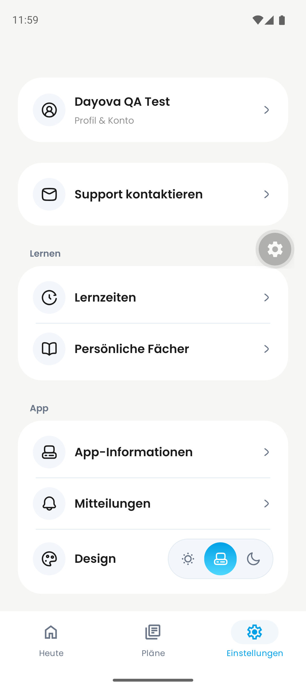
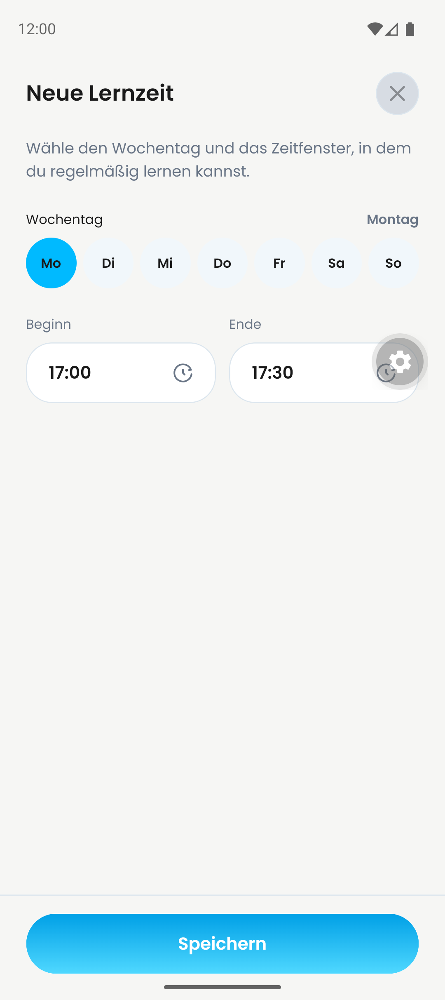
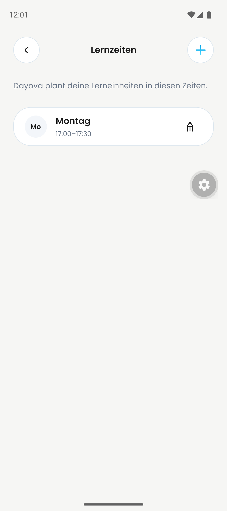
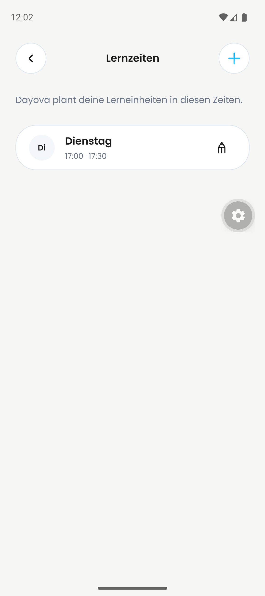
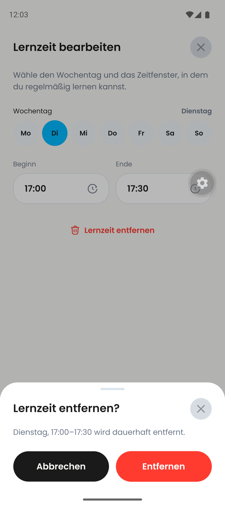
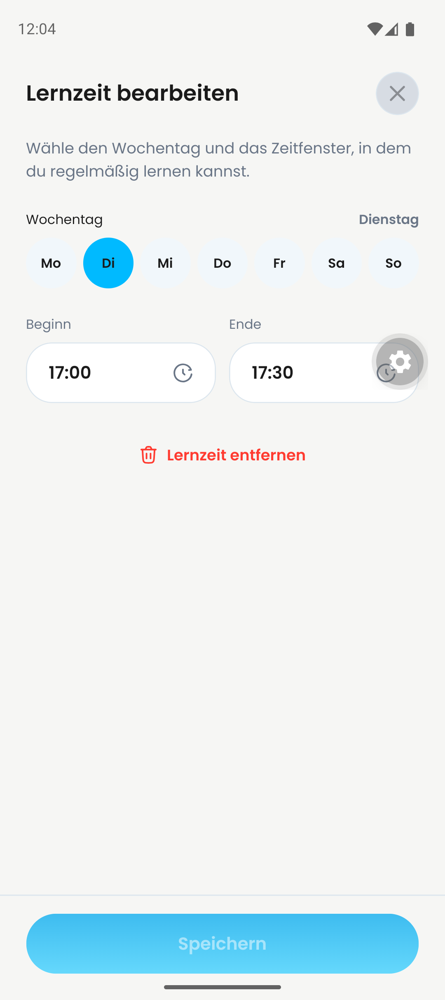
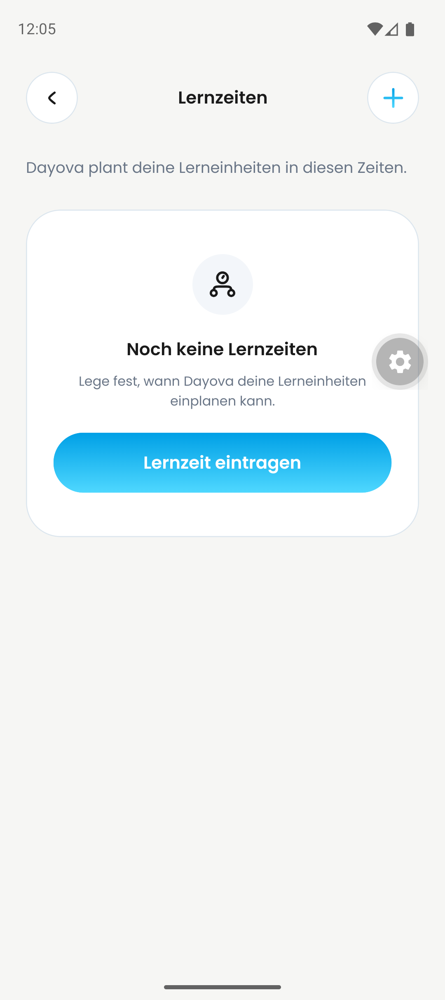

# Android: Lernzeiten – gemeinsamer QA-Stand

Aufnahme: 23.09.2026, 00:00–00:05 CEST (Hostzeit). Emulator: Pixel 9,
Android 16, `com.dayova.dev`, Metro 8095. Quellstand `a53ef62`.
Die Emulator-Statusleiste verwendet ein anderes Zeitformat als der Host.

Der entbehrliche Testaccount wurde vor der Prüfung anhand der vollständigen
Adresse im Profil verifiziert. Der Profilbeleg mit E-Mail wird nicht veröffentlicht.

Bestanden: leere Liste → Montag 17:00–17:30 anlegen → Dienstag speichern →
Löschung abbrechen (Editor und Dienstag bleiben) → Löschung bestätigen → leere Liste.
Die Ergebnisse wurden jeweils anhand der Android-UI-Hierarchie und Screenshots
geprüft. Entfernt wurde nur die eigens angelegte Testlernzeit; sie ist neu anlegbar.

| Zustand | Screenshot |
| --- | --- |
| Einstellungen |  |
| Leer |  |
| Anlegen |  |
| Montag gespeichert |  |
| Dienstag gespeichert |  |
| Löschdialog |  |
| Abgebrochen |  |
| Gelöscht |  |

Grenzen: Integrationstest, kein isolierter PR-Vorher-/Nachhervergleich.
Keine Abnahme der altersabhängigen Defaults, Zeitpicker-Grenzfälle,
Wissenscheck-Erinnerung oder des vollständigen Lernplans. Kein Production-/OTA-Nachweis.
