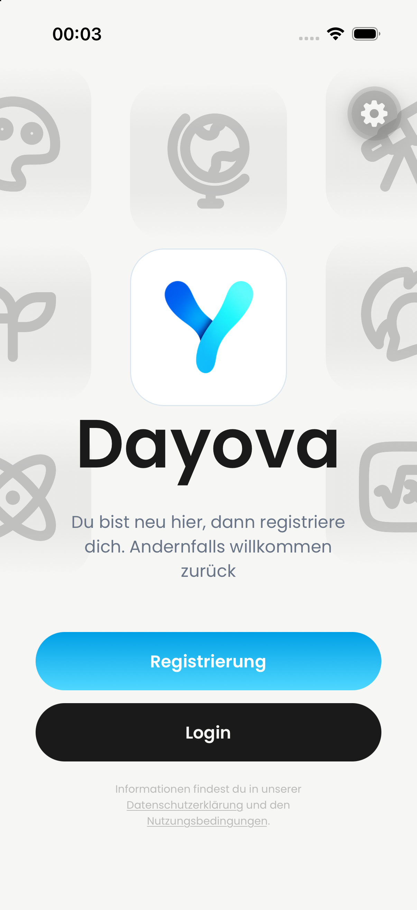
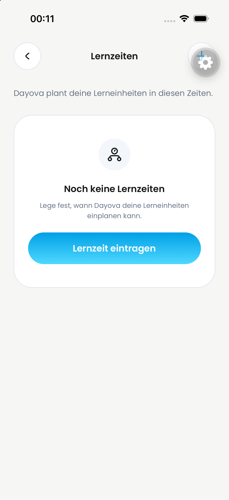
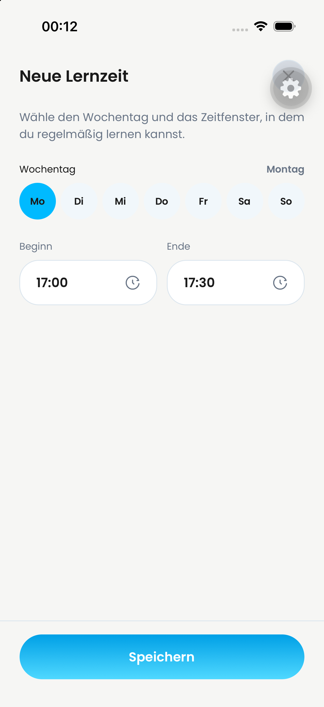
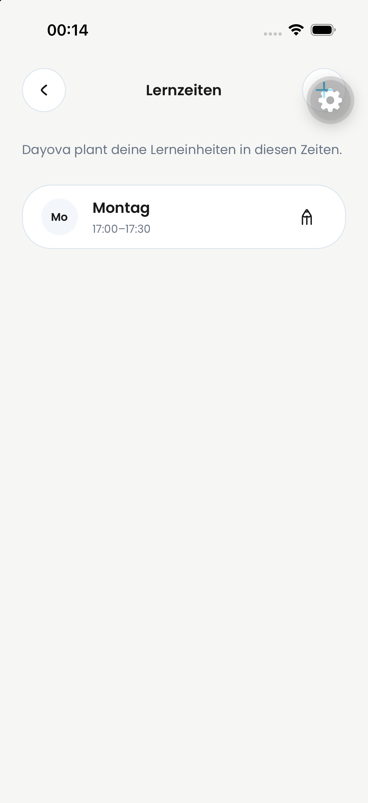
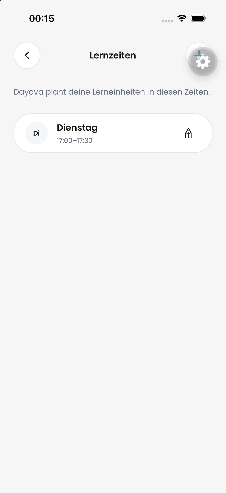
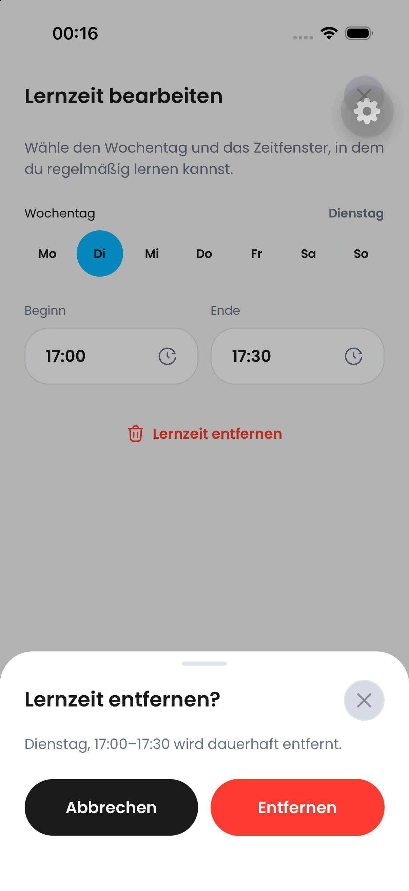

# iPhone: Startnachweis

23.09.2026, 00:03 CEST. Separater Simulator „Dayova Jakob Review iPhone“,
iPhone 17 / iOS 26.4; `de.dayova.app-dev`, Metro 8095, Quellstand `a53ef62`.
Dasselbe native App-Bundle wie auf dem QA-iPad. Start ohne sichtbaren nativen
Modulfehler; Willkommensscreen nach Schließen der Dev-Client-Einführung sichtbar.

Nur After-/Integrationsbeleg. Kein vollständiger Neunutzer- oder Login-Test.
Die Anmeldung wurde anschließend vom Nutzer durchgeführt und die Identität des
freigegebenen QA-Accounts in der App per Maestro-Assertion verifiziert.

## Lernzeiten: bestanden

23.09.2026, 00:11–00:19 CEST, Integrationsstand `216757c`.
Maestro prüfte: leer → Montag 17:00–17:30 anlegen → auf Dienstag ändern →
Löschdialog abbrechen (Dienstag bleibt im Editor) → Entfernen bestätigen →
Liste leer, Dienstag nicht mehr vorhanden. Nur der selbst angelegte Testeintrag
wurde entfernt. Die Bilder enthalten keine E-Mail-Adresse oder Zugangsdaten.

| Leer | Anlegen | Gespeichert |
| --- | --- | --- |
|  |  |  |

| Geändert | Löschdialog | Nach Löschung |
| --- | --- | --- |
|  |  |  |

Dies ist kein Nachweis für Neuregistrierung, Kontolöschung, Upload,
Wissenscheck oder vollständige Lernplan-Erstellung und kein isolierter
Before-/After-Test eines einzelnen PR-Heads.
