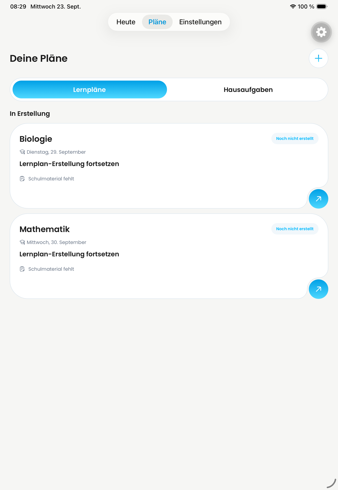
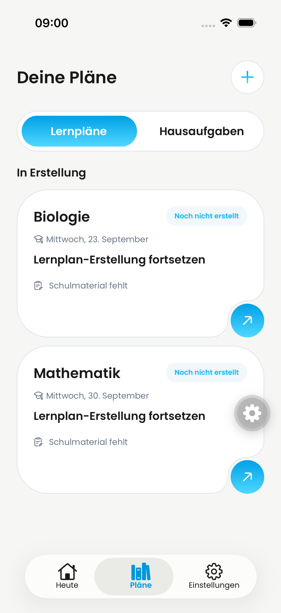
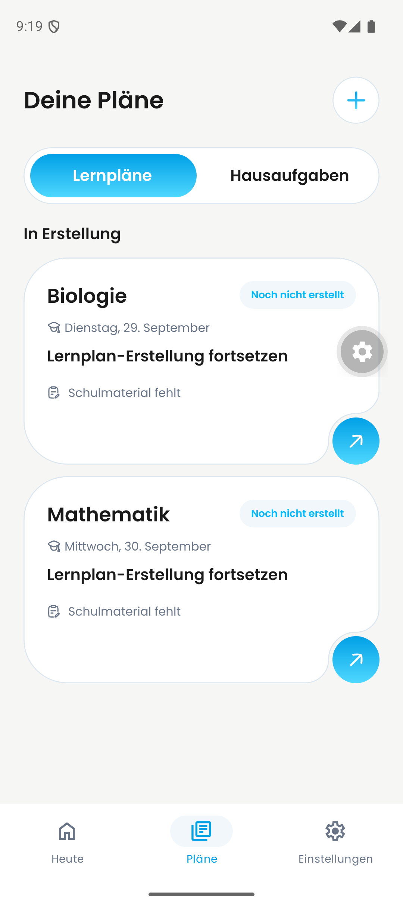
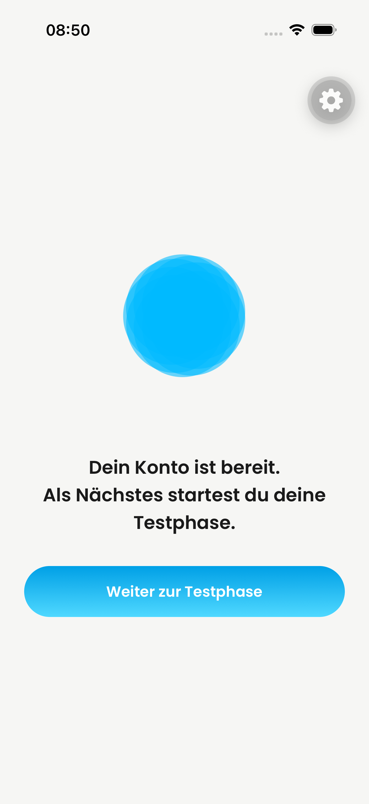
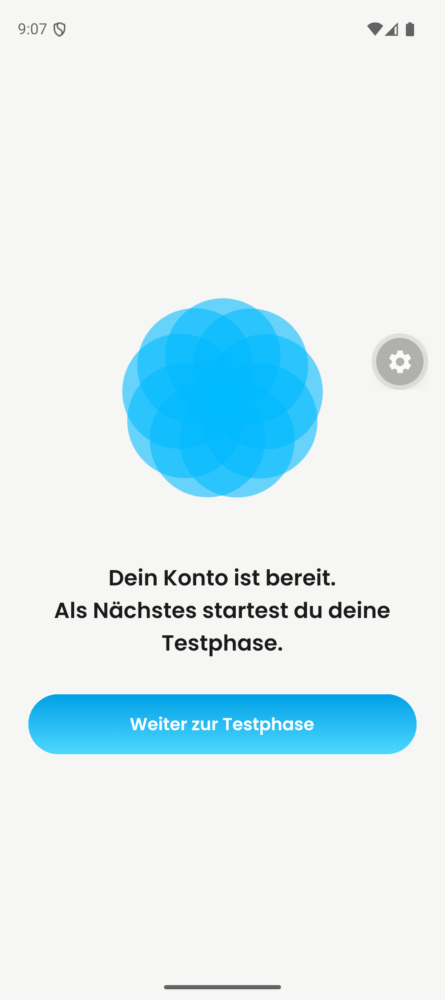

# Native QA evidence — 23 September 2026

Owner: Philipp Schossig. Evidence inspection and publication: Codex-assisted.
These are previously captured screenshots of the combined local QA development
build, not fresh tests of the latest commit, individual PR before/after comparisons,
production builds, or OTA-installation evidence. Exact capture-time source SHA is
not established by these images. Originals remain in the local dated QA folder.
The five images were visually inspected before publication; they contain no email,
password, verification code, or API key. Grey gears are simulator overlays.

## Observed states

| iPad | iPhone | Android |
| --- | --- | --- |
|  |  |  |

All three lists contain Mathematics and Biology **drafts**, with missing school
material. Mathematics is dated 30 September. Biology is 29 September on iPad and
Android, but 23 September on iPhone. The earlier iPhone date-selection screenshot
already showed 23 September; this is not evidence of a backend date-conversion bug.
No successful upload, AI generation, knowledge check, or repetition is inferred.

| iPhone registration result | Android registration result |
| --- | --- |
|  |  |

These images document the visible account-ready screen only, not every preceding
registration step or successful subsequent deletion.

## Remaining acceptance gates

- Account deletion: server verification correction is in PR #661. Real device
  deletion and final worker/provider completion remain unverified. The matching
  Clerk server key is absent from QA; the user assigned access/configuration to
  Jakob. Do not use the unrelated personal Clerk development application's key.
- Material upload, complete generated plan, knowledge check and repetition:
  native acceptance remains open. QA-only Convex storage was enabled; that is
  configuration, not a passed upload or production R2 test.
- Individual PR before/after evidence, popup/calendar design comparison, long
  iPad profile email overflow, and navigation integration #698 remain open.
- Backend deployments are paused after the shared-development collision with
  ongoing podcast work. Podcast integration is explicitly excluded by the user.
- PR #657 is merged; review/merge/OTA status must be checked separately for the
  other PRs. No blanket ready-for-review or completion claim is made here.

See [earlier QA evidence](../jakob-qa-2026-09-22/README.md) for learning-time CRUD
and subject-management results. Older blocker descriptions there are historical;
the gates above supersede them where explicitly stated.
