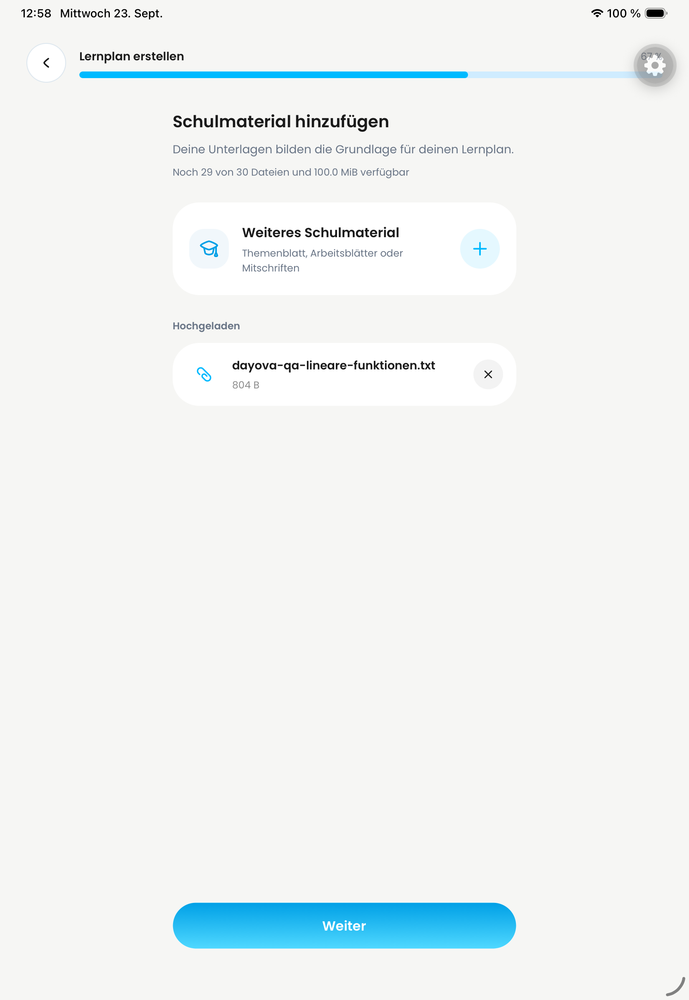
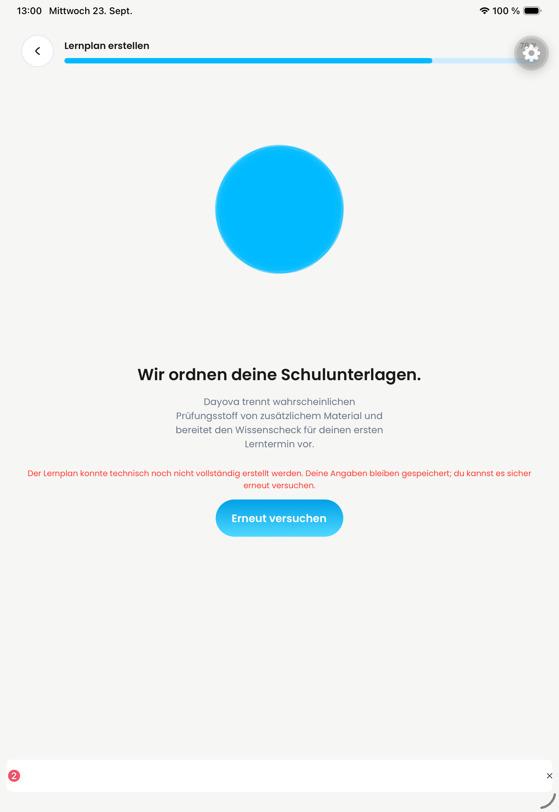

# Native QA evidence — 23 September 2026

Owner: Philipp Schossig. Evidence inspection and publication: Codex-assisted.
The first five images below are previously captured screenshots of the combined local QA development
build, not fresh tests of the latest commit, individual PR before/after comparisons,
production builds, or OTA-installation evidence. Exact capture-time source SHA is
not established by these images. Originals remain in the local dated QA folder.
The five images were visually inspected before publication; they contain no email,
password, verification code, or API key. Grey gears are simulator overlays.

## Observed states

| iPad | iPhone | Android |
| --- | --- | --- |
|  |  |  |

All three lists contain Mathematics and Biology **drafts**, with missing school
material. Mathematics is dated 30 September. Biology is 29 September on iPad and
Android, but 23 September on iPhone. The earlier iPhone date-selection screenshot
already showed 23 September; this is not evidence of a backend date-conversion bug.
No successful upload, AI generation, knowledge check, or repetition is inferred.

| iPhone registration result | Android registration result |
| --- | --- |
|  |  |

These images document the visible account-ready screen only, not every preceding
registration step or successful subsequent deletion.

## Remaining acceptance gates

### Fresh iPad retest, 23 September, 12:58–13:00 CEST

Local QA source: `64c28feaff06bf53cfde9aee6c3ae1dc91d120dd`,
using the native QA development client.
No backend deployment was performed. This is not production or OTA evidence.

| Native material upload passed | Subsequent generation blocked |
| --- | --- |
|  |  |

- Opened the existing Mathematics draft, the missing-material prompt, upload
  form, source selector, and native Files picker. Selected a synthetic 804-byte
  text file about linear functions. The app displayed **Hochgeladen** and enabled
  **Weiter**. This proves this small-file QA upload, not production R2, large-file
  limits, or other file types. Intermediate screenshots remain in the local
  `Dayova-QA-2026-09-23-neuregistrierung/retest-ipad-*` folders.
- Accepted the AI-processing consent for this synthetic QA material. Generation
  stopped at 78% with a technical error; knowledge-check and repetition acceptance
  therefore remain untested.
- Read-only recent QA logs identify `learningPlanAi:generateKnowledgeQuestions`
  failing with:
  `Konfiguriere GOOGLE_VERTEX_API_KEY oder GOOGLE_VERTEX_PROJECT + GOOGLE_VERTEX_LOCATION.`
  Next: the environment owner must configure the intended QA Vertex credentials;
  then repeat generation, knowledge check, and repetition on all three platforms.
  No unrelated or production secret was copied.
- The earlier blank iPad screen was recovered by restarting only the owned QA
  Metro process and rebuilding its generated NativeWind stylesheet (previously
  empty; then 43,829 bytes). Native home assertion subsequently passed. This does
  not establish why the cache became empty or prove a permanent code fix.
  Debugger access also worked with the required matching localhost Origin.
- The long iPad profile email still overflowed its field. Its private screenshot
  is retained locally; it is not included in the public evidence.
- Both new published images were visually checked: no credentials, email address,
  or personal learning material. No account deletion was completed in this retest.

### Earlier follow-up verification, 23 September (historical)

- PR #661's `Lint, typecheck, and test` job succeeded for head `7c0692d`:
  [EAS CI job](https://expo.dev/accounts/dayova/projects/dayova/workflows/01a0cdad-4447-7e62-a3d0-e065bcdae2bf#job-01a0cdad-467c-79d8-ac99-19da598bef64).
  Convex deployment, production OTA gates and Send updates were **skipped**.
  GitHub's green check display must not be interpreted as a deployment result.
- The iPad profile email overflow was observed again before restarting the QA
  client. After restarting without clearing app data, the client displayed a blank
  screen. The local Metro status, iOS manifest and bundle returned HTTP 200, and
  the iPad appeared in Metro's debugger target list. A debugger WebSocket attempt
  returned HTTP 401; no successful runtime-error inspection was obtained.
  These observations do not establish the cause of the blank screen or overflow.
- No backend was deployed and no account was deleted during this follow-up.
  Resume the iPad visual regression test only after the QA client renders again.
  Private diagnostic screenshots are not included because the profile capture
  contains the test-account email address.

### Still open

- Account deletion: server verification correction is in PR #661. Real device
  deletion and final worker/provider completion remain unverified. The matching
  Clerk server key is absent from QA; the user assigned access/configuration to
  Jakob. Do not use the unrelated personal Clerk development application's key.
- Material upload: the small synthetic iPad upload now passed as documented above.
  Other platform upload acceptance and production R2 remain open. Complete generated
  plan, knowledge check and repetition are blocked by the verified Vertex error.
- Individual PR before/after evidence, popup/calendar design comparison, long
  iPad profile email overflow, and navigation integration #698 remain open.
- Backend deployments are paused after the shared-development collision with
  ongoing podcast work. Podcast integration is explicitly excluded by the user.
- PR #657 is merged; review/merge/OTA status must be checked separately for the
  other PRs. No blanket ready-for-review or completion claim is made here.

See [earlier QA evidence](../jakob-qa-2026-09-22/README.md) for learning-time CRUD
and subject-management results. Older blocker descriptions there are historical;
the gates above supersede them where explicitly stated.
