# Originale Vorher-Bilder aus Linear

Originale historische Bildbelege aus Linear, unverändert einschließlich vorhandener Annotationen. Build-Zuordnung meist unbekannt: kein isolierter PR-Base/Head-Vergleich und keine neue Funktionsabnahme. Neuere Belege sind separat bezeichnet. DAY-445: in Linear genannte Originaldateien lokal wiedergefunden. Private E-Mail-Aufnahmen und das Video wurden nicht erneut veröffentlicht.

53 unterschiedliche Bilder; 75 ursprüngliche sichere Linear-Anhänge (Duplikate gemeinsam gespeichert), dazu 2 in DAY-445 referenzierte Dateien.

## DAY-417

### Before – Lernzeiten-Zusammenfassung

[Original in Linear](https://uploads.linear.app/25636614-9b48-4853-ae2c-f1d96a015b4e/214fb7ae-9baa-4c66-9f8e-07705496590f/ded7ba96-8007-429c-8727-f5b74e6e7966) · Quelle: DAY-417

<a href="day-417-11c1bb7c.png">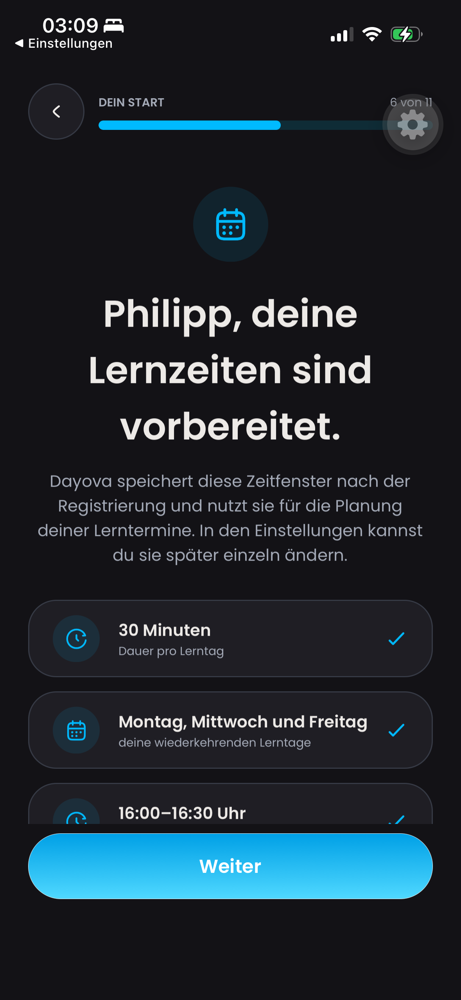</a>

### Before – Startzeit im Onboarding

[Original in Linear](https://uploads.linear.app/25636614-9b48-4853-ae2c-f1d96a015b4e/3dd80b5a-6dc3-4842-9460-2f3805434f35/33393040-0d0c-4c6b-bfc3-015b14ba84ce) · Quelle: DAY-417

<a href="day-417-d3f59238.png">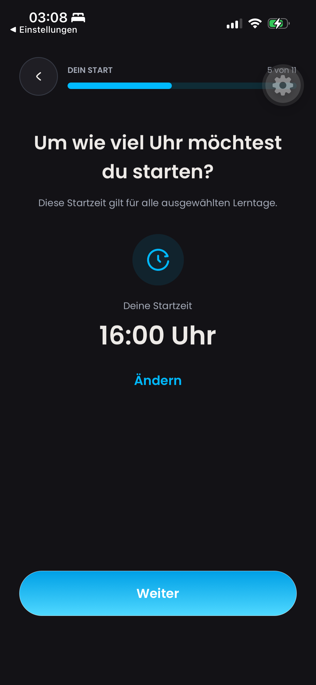</a>

### Before – Lerntage im Onboarding

[Original in Linear](https://uploads.linear.app/25636614-9b48-4853-ae2c-f1d96a015b4e/085a8706-755f-4c3e-8277-981955b7095c/e0e0a64b-338e-4aa4-883d-46fde95782bd) · Quelle: DAY-417

<a href="day-417-945fe13c.png">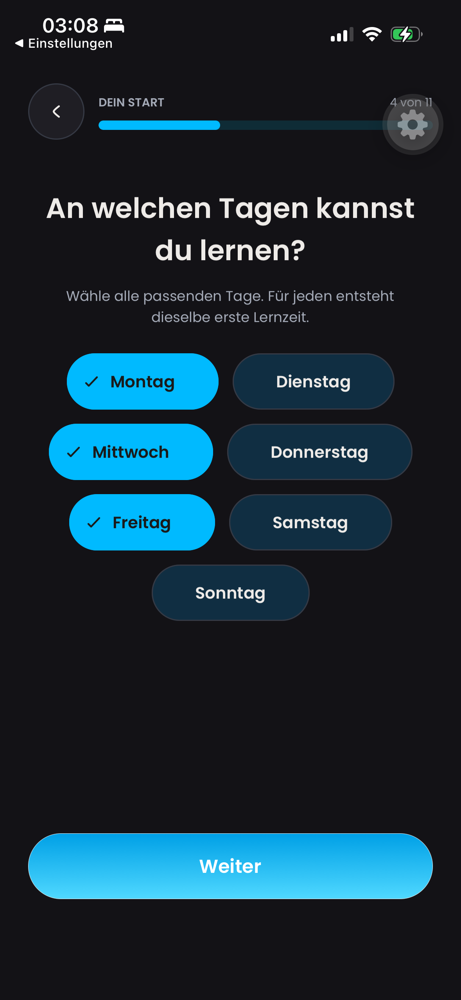</a>

### Before – Lernzeiten-Erklärung im Onboarding

[Original in Linear](https://uploads.linear.app/25636614-9b48-4853-ae2c-f1d96a015b4e/0457a692-bfa1-4abf-b274-904f165d23c0/6b74c070-c087-4c9f-a9e3-6c5eb90ef568) · Quelle: DAY-417

<a href="day-417-1f9bc750.png">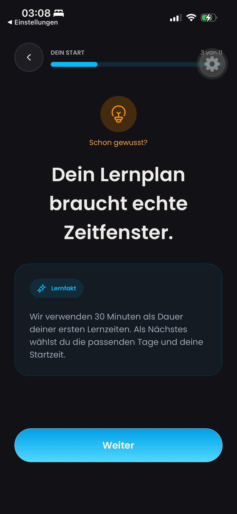</a>

### Before – Lernzeitdauer im Onboarding

[Original in Linear](https://uploads.linear.app/25636614-9b48-4853-ae2c-f1d96a015b4e/8b386e66-64a6-4322-b464-d3ee777cdd7e/0c891396-e79b-4801-9b5f-52c9e10207aa) · Quelle: DAY-417

<a href="day-417-5e16e07b.png">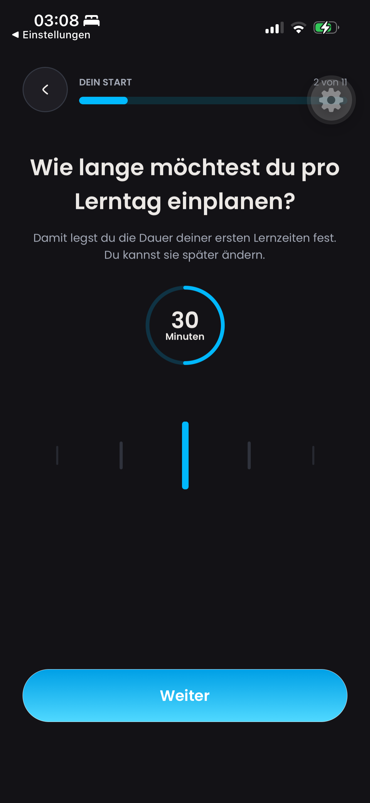</a>

## DAY-402

### 01 startseite illustrationen unklar hintergrund verlauf

[Original in Linear](https://uploads.linear.app/25636614-9b48-4853-ae2c-f1d96a015b4e/f8fc0be4-c0eb-4c75-a49c-9947c288e071/ef723843-5903-479a-8780-cd175fa4d465) · Quelle: DAY-402

<a href="day-402-814cd55e.jpg">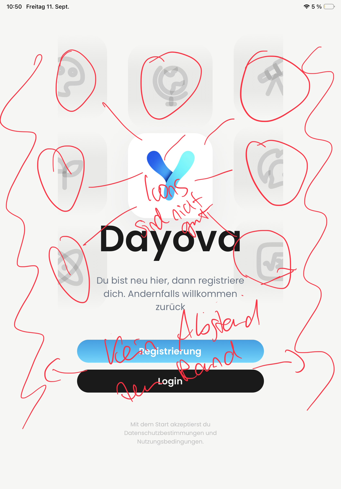</a>

### 02 intro heute unnoetige seite hintergrund weg

[Original in Linear](https://uploads.linear.app/25636614-9b48-4853-ae2c-f1d96a015b4e/83c64168-bd9e-4f91-8ba7-685e409fe5b9/a202e58a-fdd3-4ddf-beff-e9d01c54e156) · Quelle: DAY-402

<a href="day-402-038c6a8a.jpg">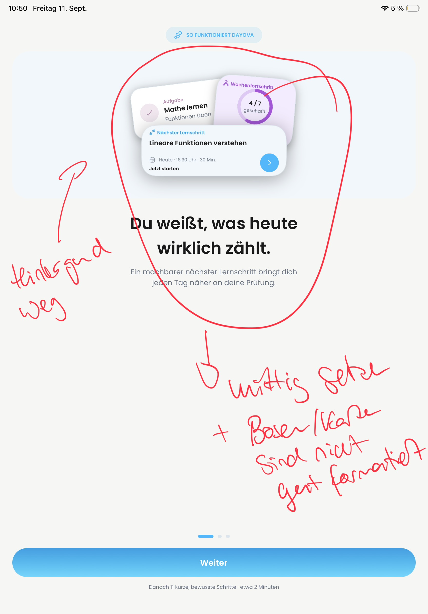</a>

### 03 intro material hintergrund schatten weg zentrieren

[Original in Linear](https://uploads.linear.app/25636614-9b48-4853-ae2c-f1d96a015b4e/c6188d1d-d428-4cf1-91c5-f5507856227c/22af798b-adb8-4fc1-a07d-cfb281e58abd) · Quelle: DAY-402

<a href="day-402-df679e1b.jpg">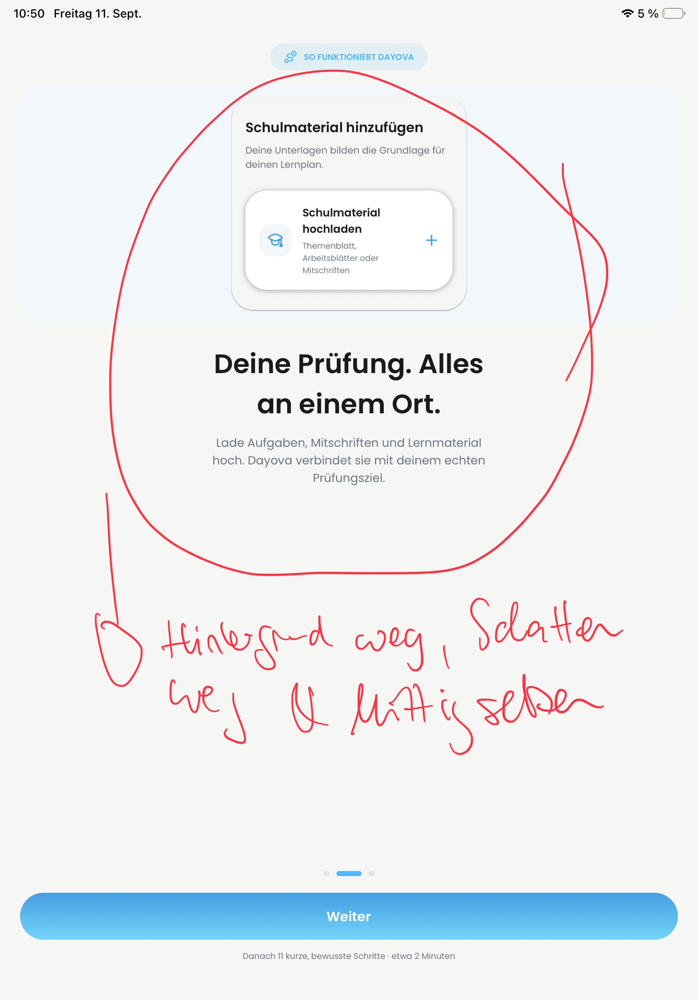</a>

### 04 intro lernweg mittig hintergrund weg

[Original in Linear](https://uploads.linear.app/25636614-9b48-4853-ae2c-f1d96a015b4e/e9b516ff-26f6-4094-a096-825b8c0af792/7ba34524-dacd-4243-bc43-1f924b6e6314) · Quelle: DAY-402

<a href="day-402-087fa4b7.jpg">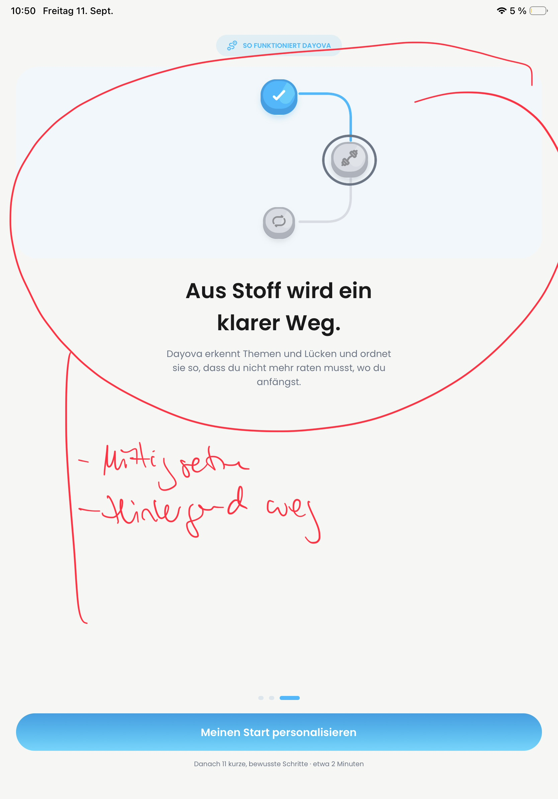</a>

## DAY-403

### 04 unterlagen koennen nicht gelesen werden

[Original in Linear](https://uploads.linear.app/25636614-9b48-4853-ae2c-f1d96a015b4e/e66119b8-200e-4d0d-a259-b55d3e66e269/a230062c-40bd-4764-8112-d20508d24456) · Quelle: DAY-403

<a href="day-403-f4e7c322.jpg">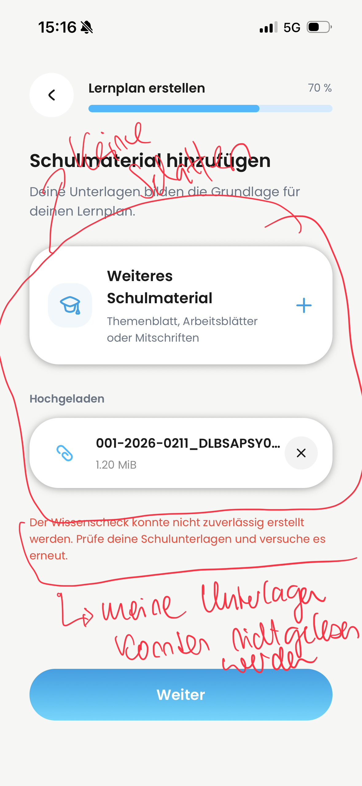</a>

### 03 dateigroesse 7 MiB zu klein

[Original in Linear](https://uploads.linear.app/25636614-9b48-4853-ae2c-f1d96a015b4e/63a39298-b718-4711-a1a9-51efe200028c/25176b32-381b-478e-8631-3863924c2b1e) · Quelle: DAY-403

<a href="day-403-75378400.jpg">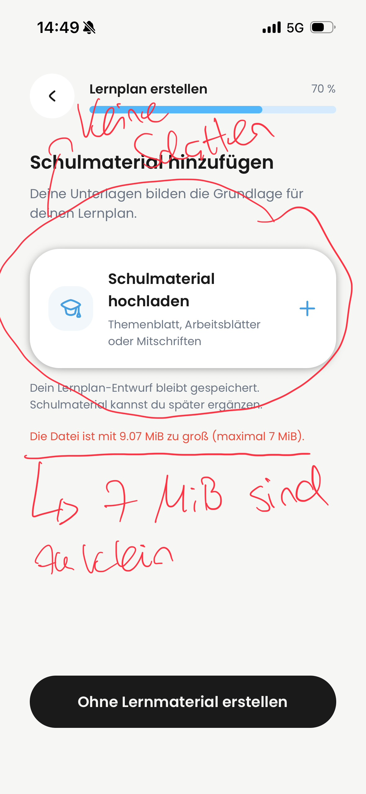</a>

### 02 upload picker schatten und schliessen button

[Original in Linear](https://uploads.linear.app/25636614-9b48-4853-ae2c-f1d96a015b4e/1e69d536-91c0-4119-b3c2-e562ac511452/0f88ecf5-6427-4bbd-aded-6d05af22936a) · Quelle: DAY-403

<a href="day-403-ce460299.jpg">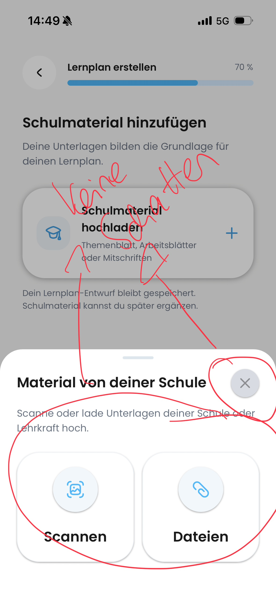</a>

### 01 material upload ausgangszustand

[Original in Linear](https://uploads.linear.app/25636614-9b48-4853-ae2c-f1d96a015b4e/dfd33d69-795b-497c-b80b-db434560522c/bb868cc8-7c03-4cb2-ab53-ac365c181882) · Quelle: DAY-403

<a href="day-403-a1f13c79.jpg">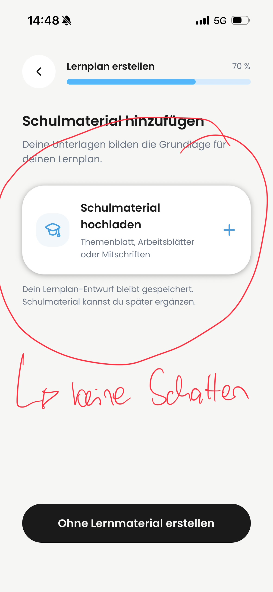</a>

## DAY-423

### Bug 1_15.09.jpeg

[Original in Linear](https://uploads.linear.app/25636614-9b48-4853-ae2c-f1d96a015b4e/0d56fa43-d859-4d15-87fd-7ef97b15126b/5638e48b-b555-45e0-ad0e-8dee037d4a7a) · Quelle: DAY-423

<a href="day-423-ead74cad.jpg">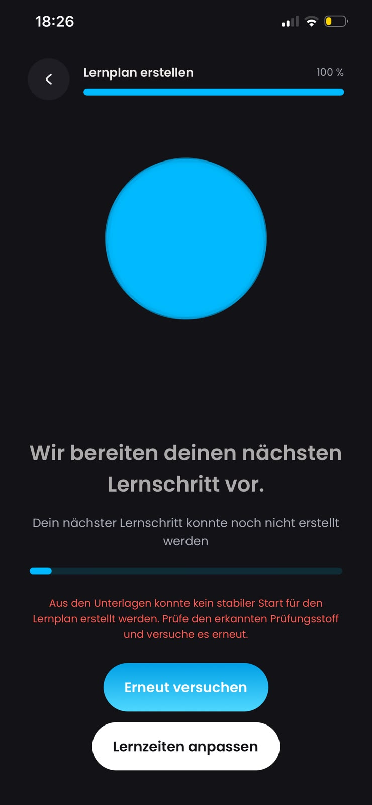</a>

## DAY-393

### Mitteilungen Dark Mode – Schatten entfernen

[Original in Linear](https://uploads.linear.app/25636614-9b48-4853-ae2c-f1d96a015b4e/e8b2cdf3-ca7f-439a-9485-16fbcd0b79fb/a4245d60-5b5f-4f28-b69f-01b23ed6f478) · Quelle: DAY-393

<a href="day-393-68fa665c.jpg">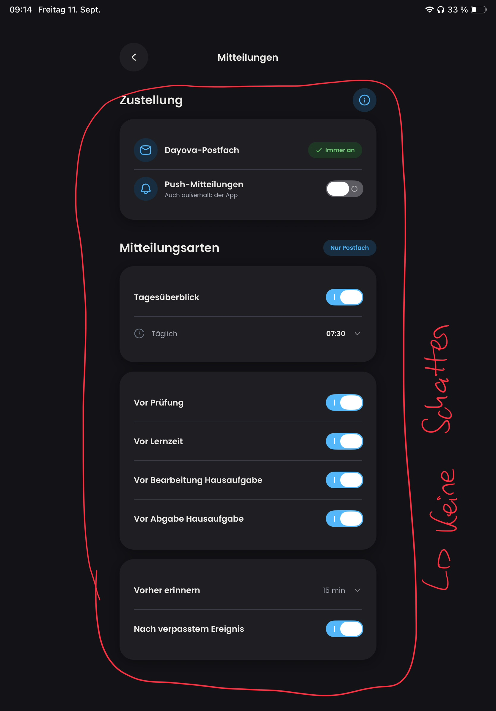</a>

### 13 dashboard mobile

[Original in Linear](https://uploads.linear.app/25636614-9b48-4853-ae2c-f1d96a015b4e/ea8df61e-0933-4aa8-ab77-834ec0e86ad3/100dfc04-0aea-462a-8206-065df445ce6a) · Quelle: DAY-393

<a href="day-393-2c9440c8.jpg">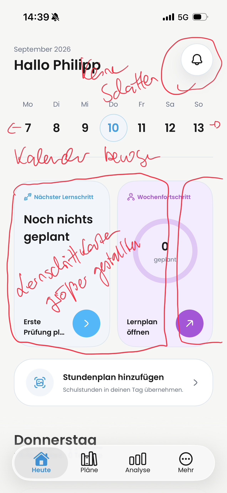</a>

### 01 dashboard navigation benachrichtigung

[Original in Linear](https://uploads.linear.app/25636614-9b48-4853-ae2c-f1d96a015b4e/84d81a1e-d2c3-4701-a7e0-5dbea21fc210/f9628bc4-7c77-4fa3-a337-f0584b9bd816) · Quelle: DAY-393

<a href="day-393-1f60d521.jpg">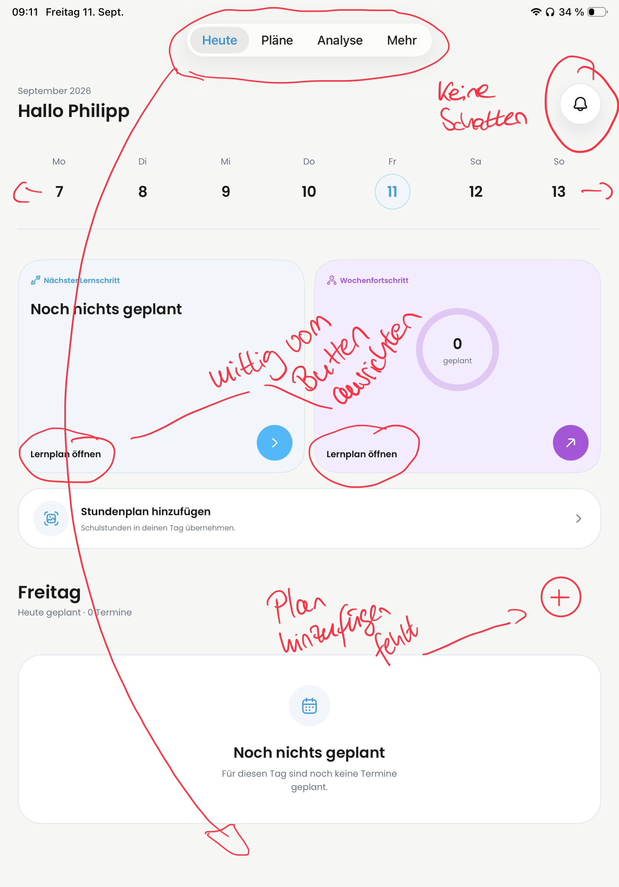</a>

### 20 material picker mobile

[Original in Linear](https://uploads.linear.app/25636614-9b48-4853-ae2c-f1d96a015b4e/c021e1f8-2e5b-44b0-8469-5a8ce1363ae7/8dfb250f-b921-4b73-911f-6e8bce7e207c) · Quelle: DAY-393

### 08 fachauswahl tablet

[Original in Linear](https://uploads.linear.app/25636614-9b48-4853-ae2c-f1d96a015b4e/e6a46384-b1aa-43a3-9d4f-c0e2483f1ce2/64b29819-1962-4ca2-bd9f-3292391bea51) · Quelle: DAY-393

<a href="day-393-baf2fa2f.jpg">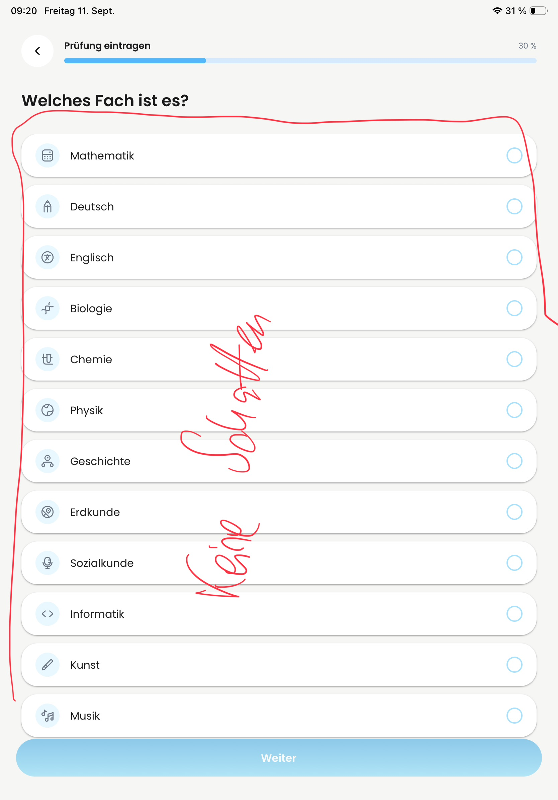</a>

### 02 lernzeiten dark

[Original in Linear](https://uploads.linear.app/25636614-9b48-4853-ae2c-f1d96a015b4e/bf128929-08e3-425c-8aa5-3873d83ca7a9/a842a14a-e855-4673-946c-d75e7d7d0e97) · Quelle: DAY-393

<a href="day-393-2dde77ba.jpg">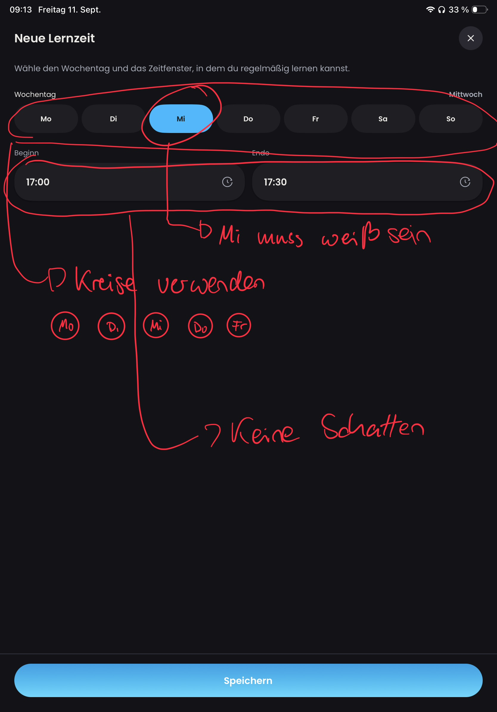</a>

### 14 dashboard mobile leerzustand

[Original in Linear](https://uploads.linear.app/25636614-9b48-4853-ae2c-f1d96a015b4e/61f60c01-d53f-412d-b3ce-f1fcbcab39e8/029e10b5-24cd-4d3c-b344-5c652b08481e) · Quelle: DAY-393

<a href="day-393-8be06357.jpg">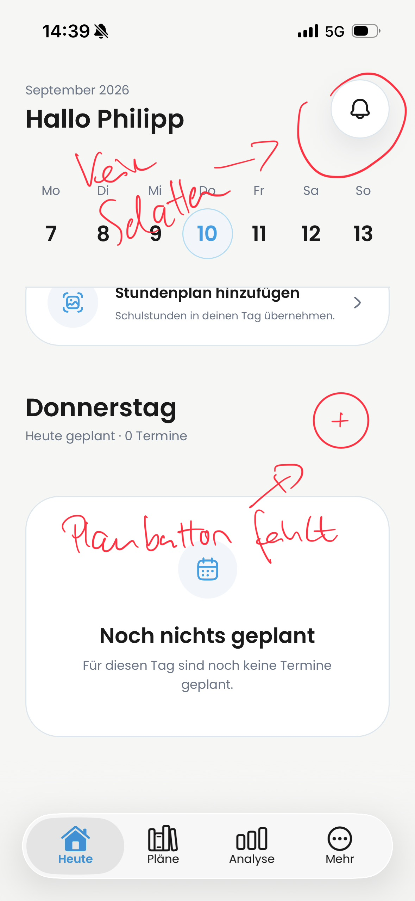</a>

### 15 pruefungsart mobile

[Original in Linear](https://uploads.linear.app/25636614-9b48-4853-ae2c-f1d96a015b4e/2b46606b-7d3a-4014-b8cc-a658f6fd29d9/db268235-3e05-4a11-b18c-4b1a87d25fff) · Quelle: DAY-393

<a href="day-393-8d8b79a4.jpg">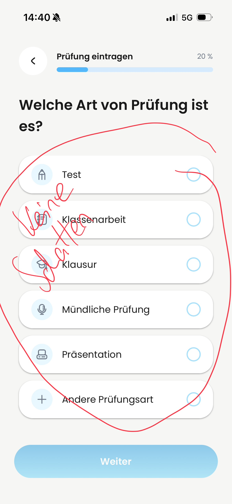</a>

### 04 lernzeiten light

[Original in Linear](https://uploads.linear.app/25636614-9b48-4853-ae2c-f1d96a015b4e/f33ee84c-80e6-4c42-adb5-f6a99524d763/b4c9c7b8-0c11-47bd-8260-80463dcc8cc2) · Quelle: DAY-393

<a href="day-393-2b3a77a8.jpg">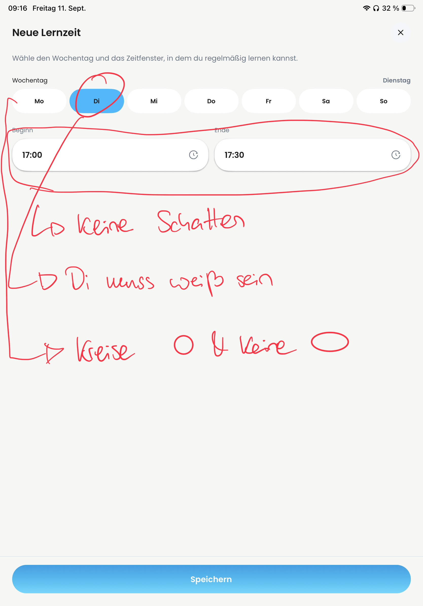</a>

### 19 material upload mobile

[Original in Linear](https://uploads.linear.app/25636614-9b48-4853-ae2c-f1d96a015b4e/3d47b135-97ff-4209-9a8d-97ee25111169/62d4e898-23a1-4449-ae9b-296cc02afa4b) · Quelle: DAY-393

### 05 mitteilungen light

[Original in Linear](https://uploads.linear.app/25636614-9b48-4853-ae2c-f1d96a015b4e/4be7115b-6331-4a24-95de-0bbd3c2f0f9c/7368d3f2-58d6-4aaa-b2d2-2475c2f6c3a3) · Quelle: DAY-393

<a href="day-393-ccc3352f.jpg">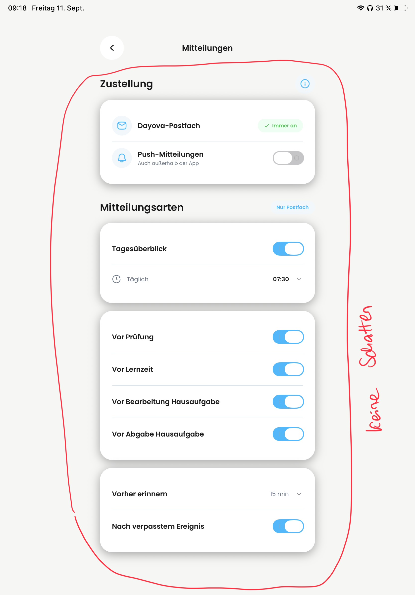</a>

### 16 fachauswahl mobile

[Original in Linear](https://uploads.linear.app/25636614-9b48-4853-ae2c-f1d96a015b4e/931e2954-1673-4a9f-8255-6a55472b3e98/632120b1-5626-4f48-82d9-1aa009b35b2e) · Quelle: DAY-393

<a href="day-393-e76425e5.jpg">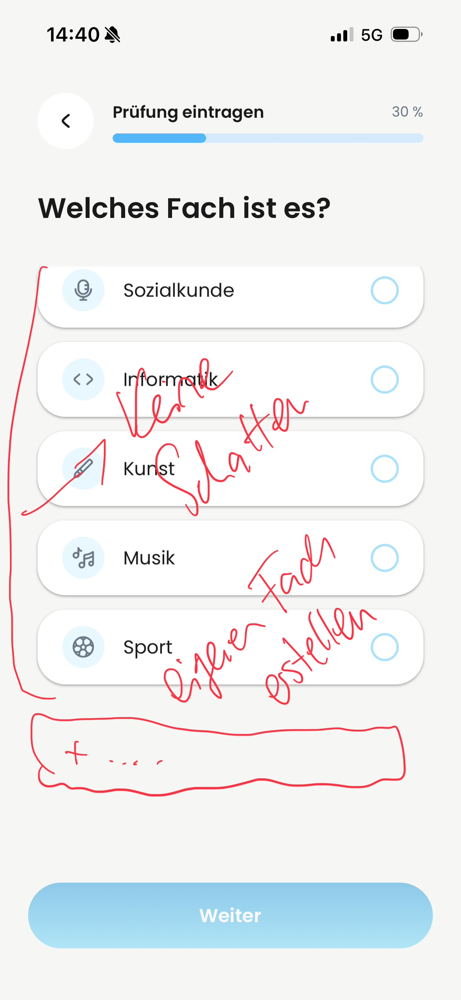</a>

### 07 pruefungsart tablet

[Original in Linear](https://uploads.linear.app/25636614-9b48-4853-ae2c-f1d96a015b4e/c79be6d6-ab28-4202-b026-ab274b610018/2e249a04-05a6-4562-9229-a8d6bc3bd401) · Quelle: DAY-393

<a href="day-393-86aec1b9.jpg">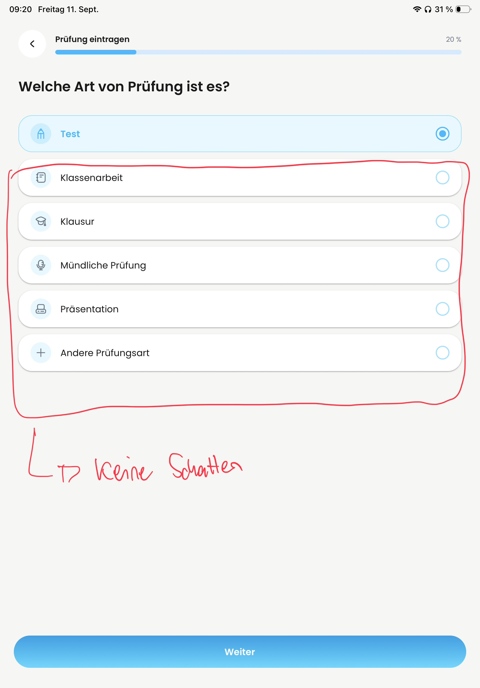</a>

### 18 lernzeit hinweis mobile

[Original in Linear](https://uploads.linear.app/25636614-9b48-4853-ae2c-f1d96a015b4e/ce124ee0-bc97-4780-9b54-6248161f95cc/0ec646c5-05b3-4846-89ae-9a82886902d0) · Quelle: DAY-393

<a href="day-393-45ba7ff6.jpg">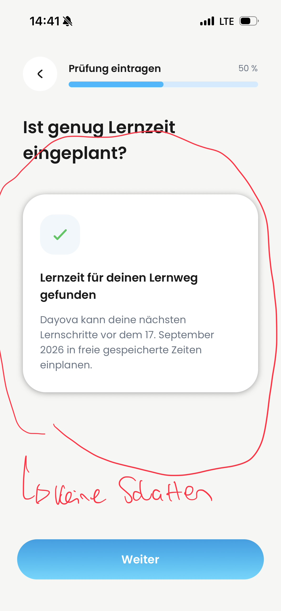</a>

### 10 lernzeit hinweis tablet

[Original in Linear](https://uploads.linear.app/25636614-9b48-4853-ae2c-f1d96a015b4e/1cbe8b2c-bda5-4800-81d4-07d3fe8f67f7/8534a252-594e-433a-b610-85cffcd80f58) · Quelle: DAY-393

<a href="day-393-c5c9b5fc.jpg">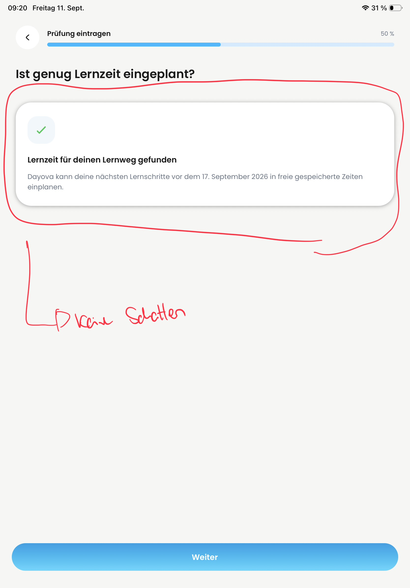</a>

### 06 analyse karte und glocke

[Original in Linear](https://uploads.linear.app/25636614-9b48-4853-ae2c-f1d96a015b4e/df80084c-f1b8-458f-8817-43f881b160ea/7ad51889-583d-40ef-b205-43db15b63065) · Quelle: DAY-393

<a href="day-393-cd47ac82.jpg">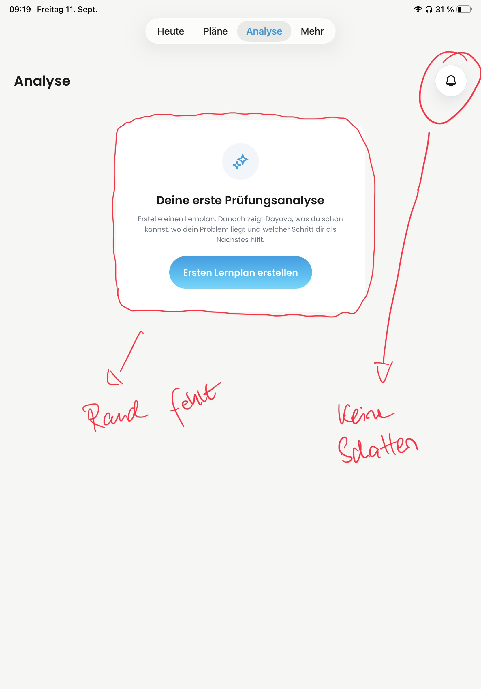</a>

### 11 material upload tablet

[Original in Linear](https://uploads.linear.app/25636614-9b48-4853-ae2c-f1d96a015b4e/60ef4c07-ddea-497d-9092-247dbcac3a23/dc19f093-f477-4ea3-ad4e-27139380a2eb) · Quelle: DAY-393

<a href="day-393-e2998448.jpg">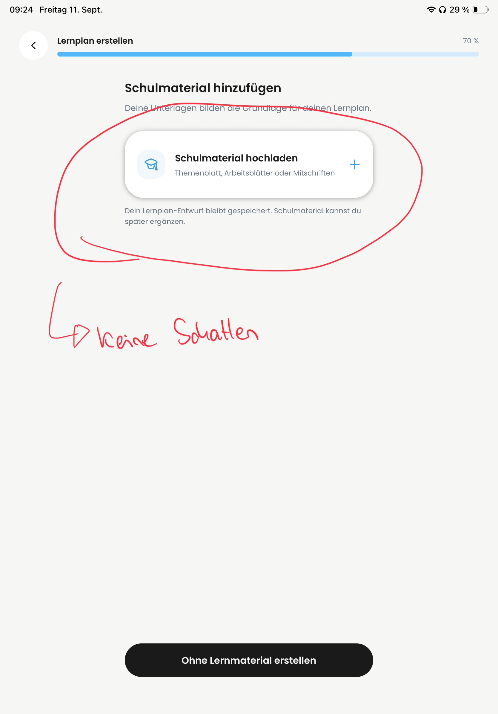</a>

### 17 pruefungsdatum mobile

[Original in Linear](https://uploads.linear.app/25636614-9b48-4853-ae2c-f1d96a015b4e/20eb3ea9-80b1-44fd-839d-81e7c143aa1e/0f1d58f8-3a13-4a4d-b065-2e0b8cab0657) · Quelle: DAY-393

<a href="day-393-0c7a693a.jpg">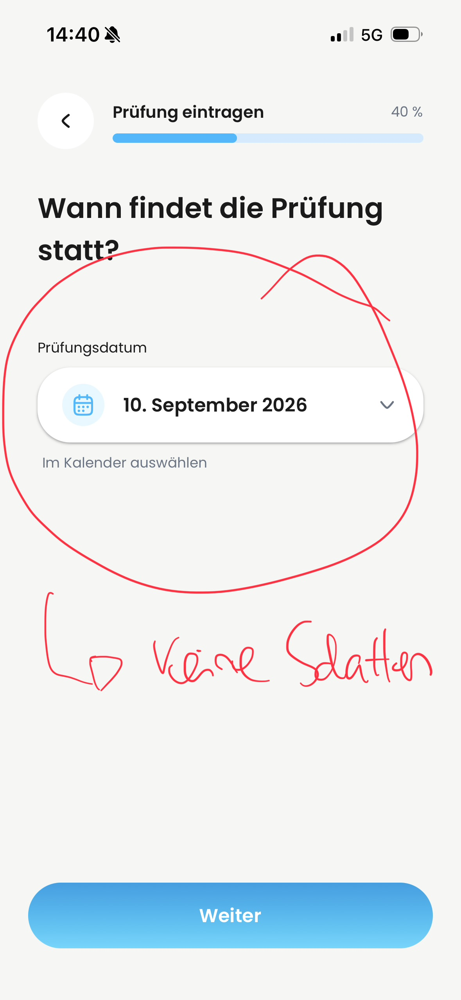</a>

### 09 pruefungsdatum tablet

[Original in Linear](https://uploads.linear.app/25636614-9b48-4853-ae2c-f1d96a015b4e/90b5ddd8-3964-4eff-b39f-60e0d729d787/3526de68-7aa3-4e50-96a4-a3bf752c7136) · Quelle: DAY-393

<a href="day-393-c962666b.jpg">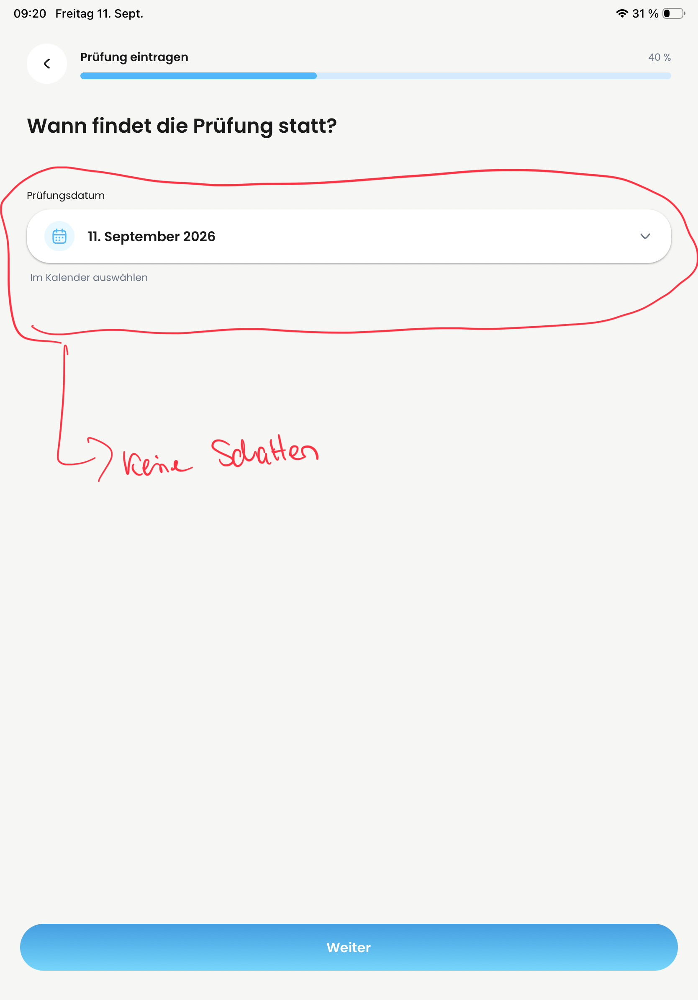</a>

## DAY-390

### 01 dark wochentage kreise auswahltext weiss

[Original in Linear](https://uploads.linear.app/25636614-9b48-4853-ae2c-f1d96a015b4e/1748da4a-b44e-44a4-997f-f07bacb315e4/ff9f81ed-071a-4cf8-86d1-98ec35a12d9b) · Quelle: DAY-390

### 02 light wochentage kreise auswahltext weiss

[Original in Linear](https://uploads.linear.app/25636614-9b48-4853-ae2c-f1d96a015b4e/41f78009-80a4-4428-9af9-f838087339de/82b816b1-97cf-46ca-80a3-679d87ec11c3) · Quelle: DAY-390

### 03 onboarding auswahl icons und text weiss

[Original in Linear](https://uploads.linear.app/25636614-9b48-4853-ae2c-f1d96a015b4e/05068f8f-1c54-42f8-872e-9accd03874b9/131cbde8-e0a8-4acb-a8d6-2cea6daf355f) · Quelle: DAY-390

<a href="day-390-e30c019c.jpg">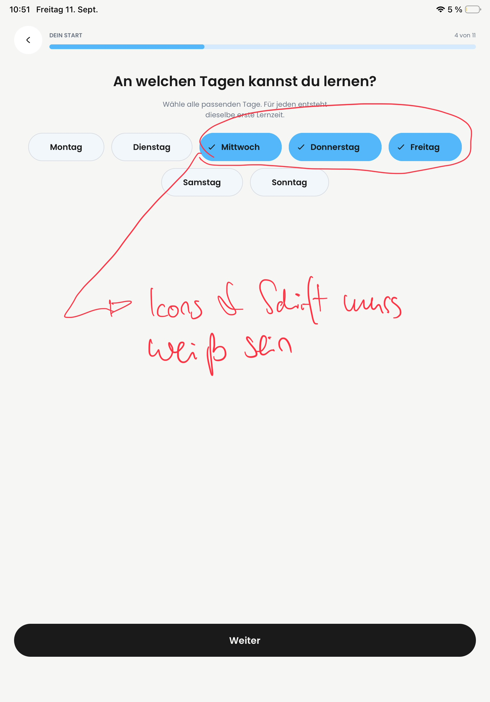</a>

## DAY-391

### 02 mobile dashboard kalender verschieben karten inhalt ueberlauf

[Original in Linear](https://uploads.linear.app/25636614-9b48-4853-ae2c-f1d96a015b4e/5f431de2-d607-41a6-9527-bd4f5166d1f9/08b60690-21a2-4a73-a518-40f4dc873e3e) · Quelle: DAY-391

### 03 mobile dashboard plan button fehlt

[Original in Linear](https://uploads.linear.app/25636614-9b48-4853-ae2c-f1d96a015b4e/93882079-8758-4766-ac1a-6de8c02c9a14/7c4cbded-638a-4923-b56d-55e8d7a7ab71) · Quelle: DAY-391

### Tablet: Dashboard, Navigation, Kalender und Plan-Aktion

[Original in Linear](https://uploads.linear.app/25636614-9b48-4853-ae2c-f1d96a015b4e/5321eda6-e865-4e59-bcf4-36961e1ea3a3/766c0e0f-751d-450c-9778-69a801023668) · Quelle: DAY-391

## DAY-392

### 01 querformat modal breiter und scrollbar

[Original in Linear](https://uploads.linear.app/25636614-9b48-4853-ae2c-f1d96a015b4e/2b4e67a2-fc20-4f73-8931-c039e673d321/5cf85e30-9f3a-4d8b-9f9c-8e312a9c04fa) · Quelle: DAY-392

<a href="day-392-3a4833ed.jpg">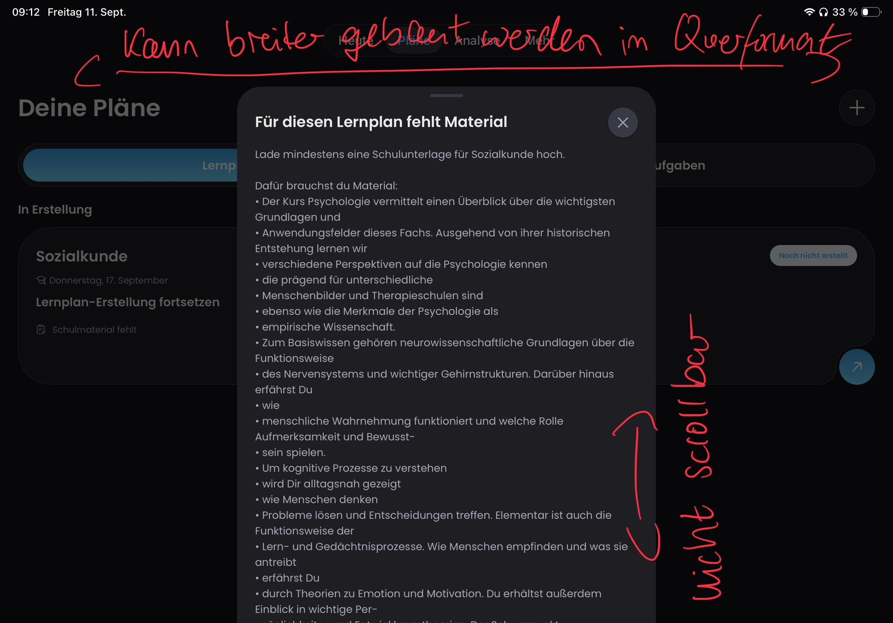</a>

### 02 hochformat modal nicht scrollbar

[Original in Linear](https://uploads.linear.app/25636614-9b48-4853-ae2c-f1d96a015b4e/7ebf4fad-4c90-4803-a7c4-841d45d4fbdc/73c1abd4-ca93-4967-87a1-f4ad20ee2604) · Quelle: DAY-392

<a href="day-392-84f041f7.jpg">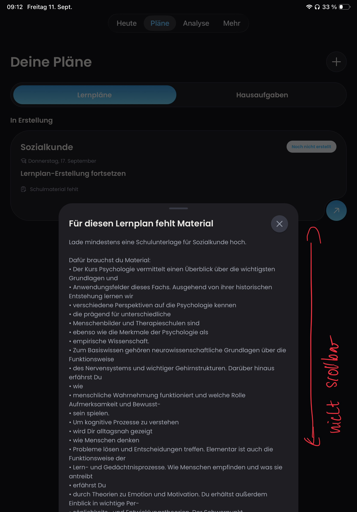</a>

## DAY-394

### 01 dashboard karten und navigation

[Original in Linear](https://uploads.linear.app/25636614-9b48-4853-ae2c-f1d96a015b4e/6095fa65-c9a8-4cab-a5db-8c0fb742a5cc/267dfed4-3671-4f36-8e28-26b43ed0108b) · Quelle: DAY-394

### 05 onboarding intro karten rahmen formatierung

[Original in Linear](https://uploads.linear.app/25636614-9b48-4853-ae2c-f1d96a015b4e/5d7881eb-0d8e-4de9-a09b-dc518fa90d8b/6b507d5f-aa67-435b-b2f1-b1325ba5bf5b) · Quelle: DAY-394

### 02 mehr dashboard gruppenumrandung fehlt

[Original in Linear](https://uploads.linear.app/25636614-9b48-4853-ae2c-f1d96a015b4e/85fe0bd5-b995-4a18-82bb-e8e687741e52/8c3a66e9-a316-4cac-820e-1b2c362c3a3d) · Quelle: DAY-394

<a href="day-394-383d226d.jpg">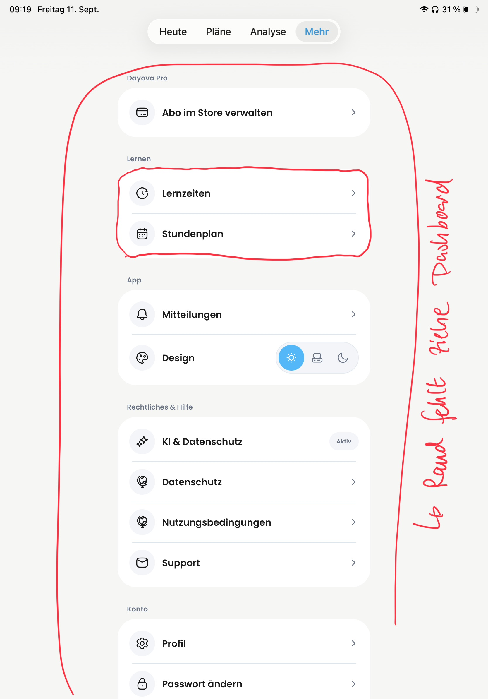</a>

### 03 analyse karte rand fehlt

[Original in Linear](https://uploads.linear.app/25636614-9b48-4853-ae2c-f1d96a015b4e/d170d4d4-f18e-4835-b18d-ef3c95675235/565fc5d4-00a3-40cd-b406-e82ca3413a1d) · Quelle: DAY-394

### 04 themen textfeld rand fehlt

[Original in Linear](https://uploads.linear.app/25636614-9b48-4853-ae2c-f1d96a015b4e/73c72a56-191d-462a-920a-c7af812c558f/62f7aba6-4c0c-483b-997c-f379513dda07) · Quelle: DAY-394

<a href="day-394-4e085ca9.jpg">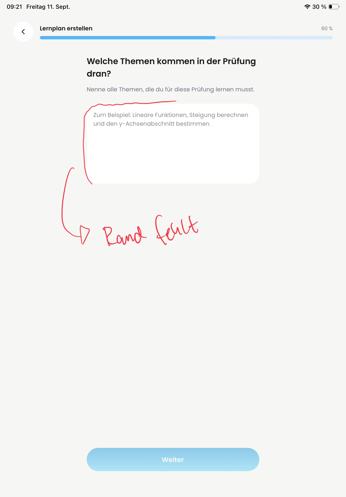</a>

## DAY-395

### 01 aktiver wochentag schwer erkennbar

[Original in Linear](https://uploads.linear.app/25636614-9b48-4853-ae2c-f1d96a015b4e/9e0e3be5-1227-47b6-8eae-d7c310df285b/c1d52ff8-f0f2-440c-babc-3309cb362cc7) · Quelle: DAY-395

<a href="day-395-9a24c052.jpg">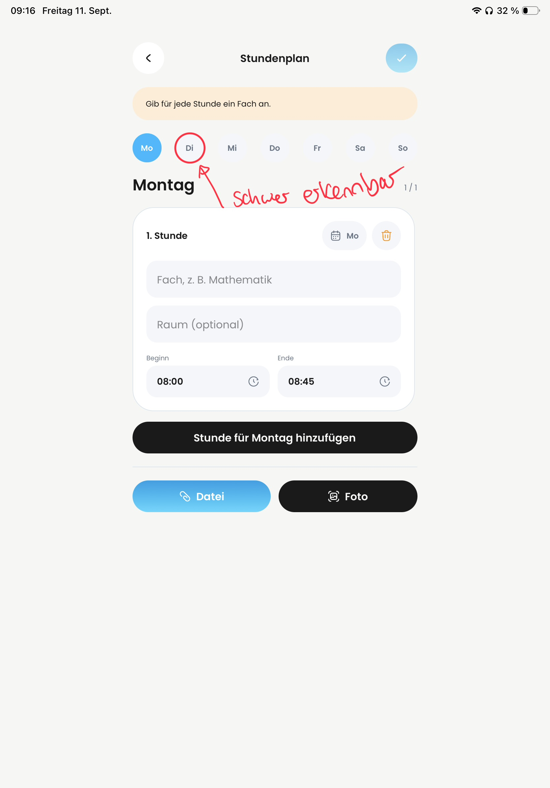</a>

## DAY-396

### 01 datenschutz link 404

[Original in Linear](https://uploads.linear.app/25636614-9b48-4853-ae2c-f1d96a015b4e/333779cc-f4d0-49c5-8d68-4994e5f630ba/d4ee3f47-564a-407e-ac36-6e10f90cc2f1) · Quelle: DAY-396

<a href="day-396-be3aa047.jpg">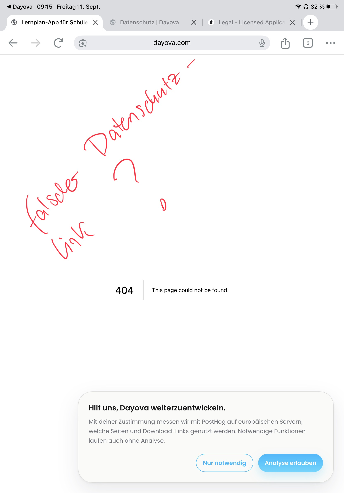</a>

### 02 supportseite 404

[Original in Linear](https://uploads.linear.app/25636614-9b48-4853-ae2c-f1d96a015b4e/2168ce40-eb65-4217-af3f-d3392c0636b6/d8f69d54-43d9-4665-8859-e37923398482) · Quelle: DAY-396

<a href="day-396-fd04e9f5.jpg">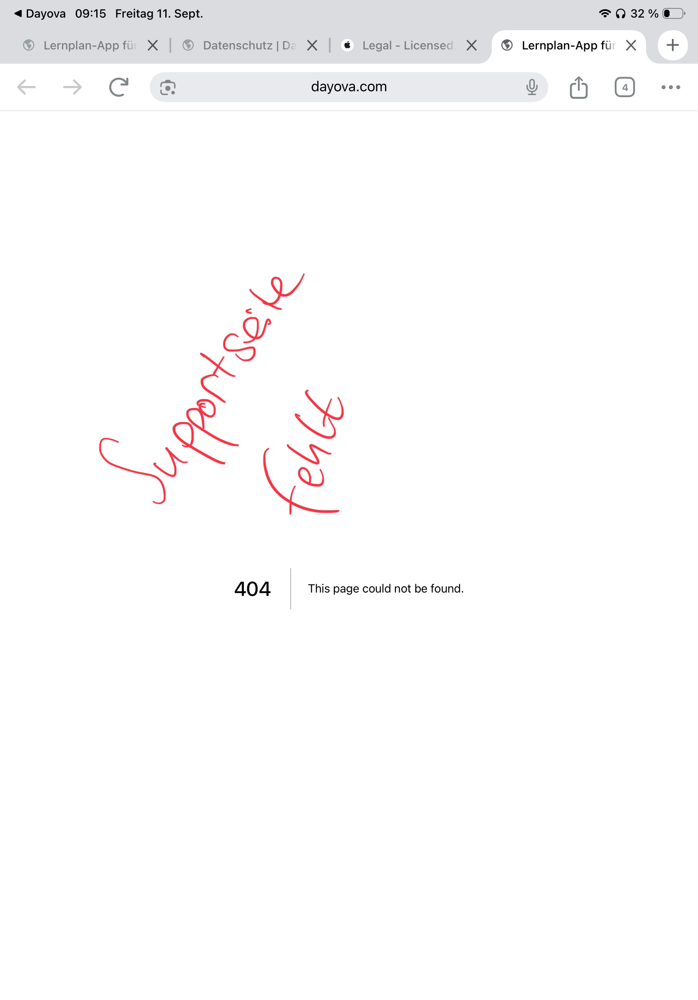</a>

## DAY-397

### 07 schritt 06 mehr abstand oben

[Original in Linear](https://uploads.linear.app/25636614-9b48-4853-ae2c-f1d96a015b4e/80122fcc-9875-478a-8390-48a25aaa630d/08f67e7c-e22a-49a3-a4b5-83e2243c845f) · Quelle: DAY-397

<a href="day-397-28042a01.jpg">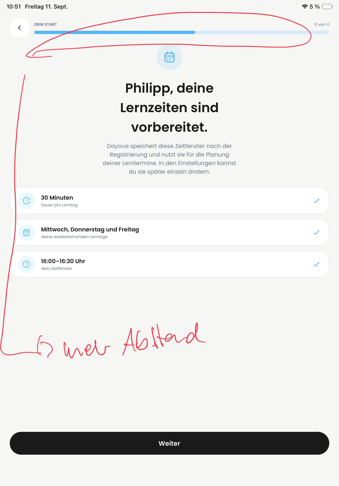</a>

### 09 schritt 08 mehr abstand dropdown zentrieren

[Original in Linear](https://uploads.linear.app/25636614-9b48-4853-ae2c-f1d96a015b4e/50b5729f-8a03-49f7-9dae-00338d06b770/b0080bac-81a7-42b2-91ed-85425a6fc597) · Quelle: DAY-397

<a href="day-397-2b91bbe7.jpg">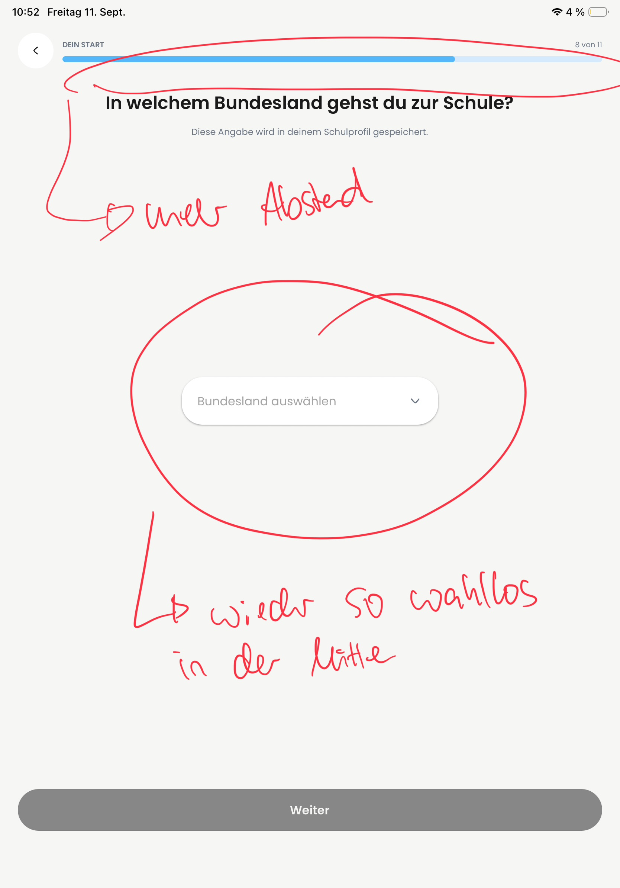</a>

### 02 schritt 02 mehr abstand und kreis spacing

[Original in Linear](https://uploads.linear.app/25636614-9b48-4853-ae2c-f1d96a015b4e/b28ee6bb-970f-4ca2-a9c7-e42efc35772b/579d6bf1-3335-4568-92e0-aa74746ad47e) · Quelle: DAY-397

<a href="day-397-c8f23be8.jpg">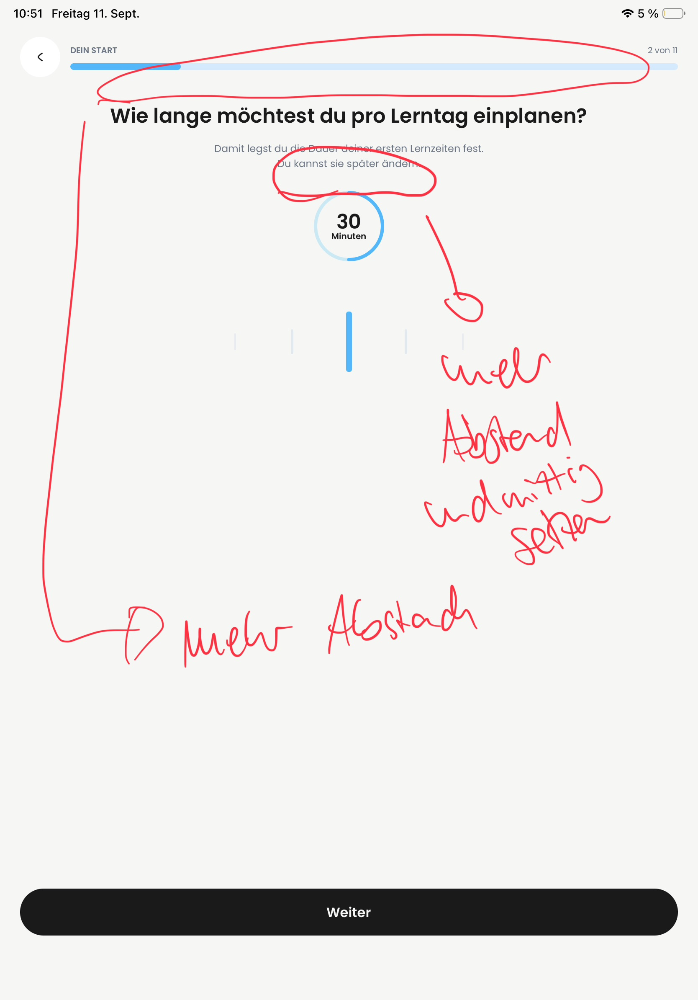</a>

### 10 schritt 09 mehr abstand dropdown zentrieren

[Original in Linear](https://uploads.linear.app/25636614-9b48-4853-ae2c-f1d96a015b4e/5c0e48f9-0f33-4ba5-887a-c2e85e7725fc/5064b4f3-0b34-4053-8985-9312f8145781) · Quelle: DAY-397

<a href="day-397-5bb755de.jpg">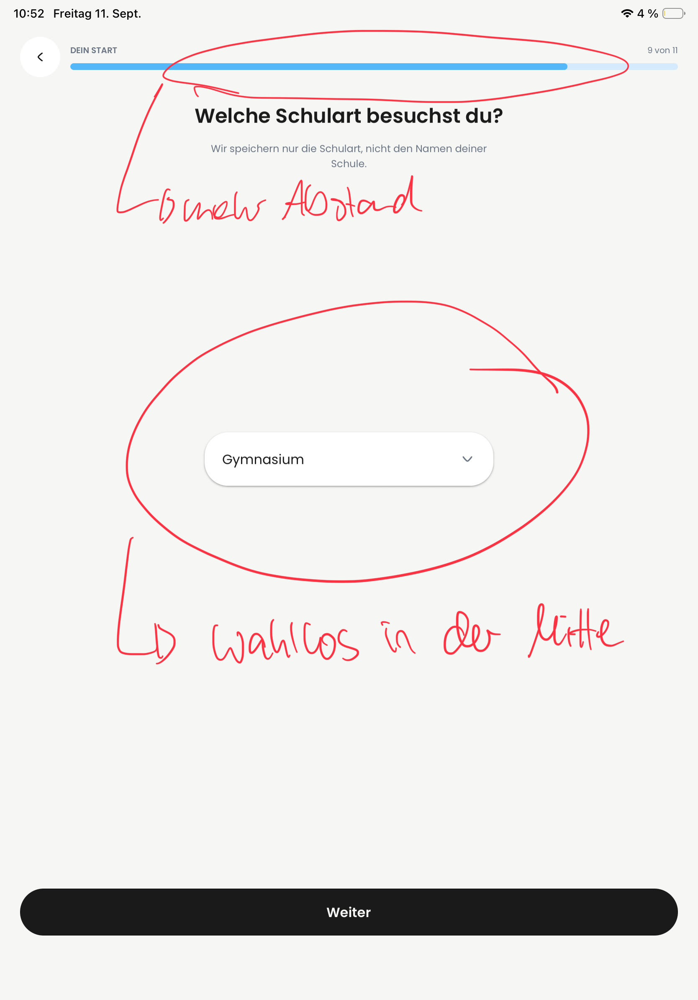</a>

### 05 schritt 04 auswahl icons text weiss

[Original in Linear](https://uploads.linear.app/25636614-9b48-4853-ae2c-f1d96a015b4e/6580248d-052b-4759-a13a-445258bf2cec/888639b6-9a48-45c5-a61f-1da297ca857d) · Quelle: DAY-397

### 08 schritt 07 mehr abstand dropdown position

[Original in Linear](https://uploads.linear.app/25636614-9b48-4853-ae2c-f1d96a015b4e/f5db2f95-26df-42d6-8a40-75c0607c0c11/45f1b9bc-f96c-48f4-8f25-fe99cf725a57) · Quelle: DAY-397

<a href="day-397-895239d9.jpg">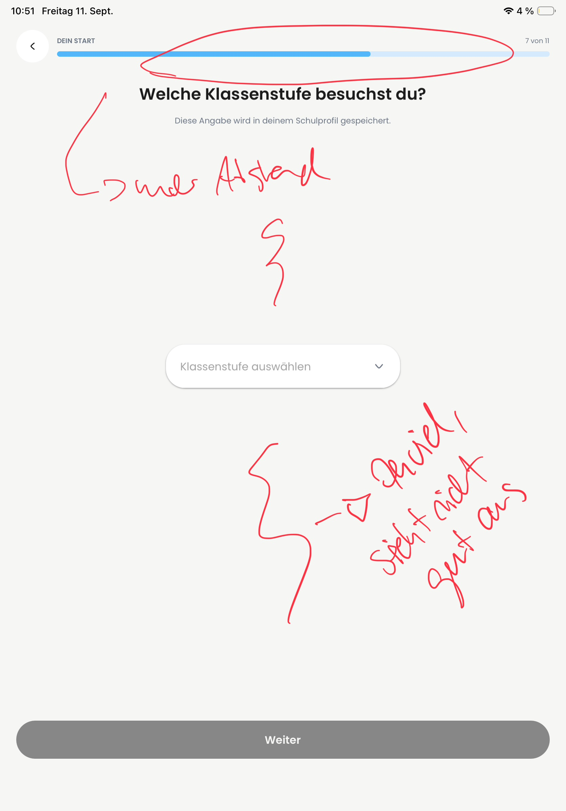</a>

### 03 schritt 03 mehr abstand oben

[Original in Linear](https://uploads.linear.app/25636614-9b48-4853-ae2c-f1d96a015b4e/ba539b80-0ced-4c3a-8256-512db0a328e7/d7695650-00ba-4c59-b045-7f95bd86c654) · Quelle: DAY-397

<a href="day-397-3beabf4e.jpg">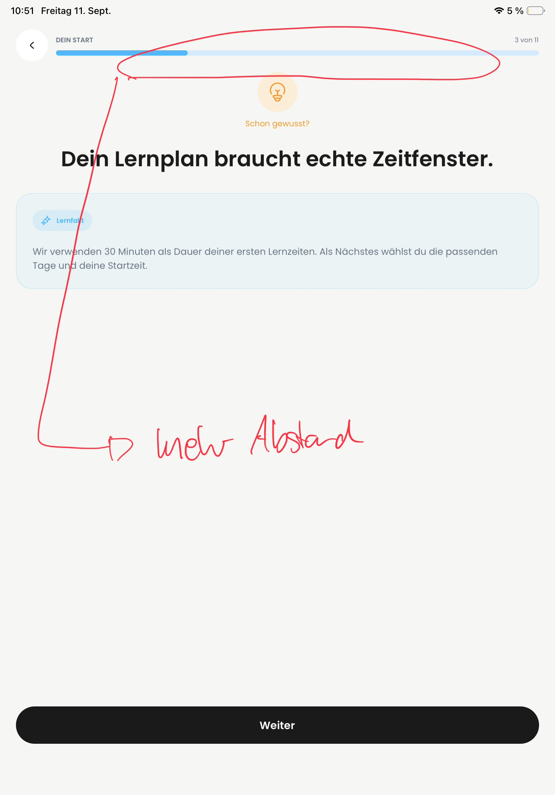</a>

### 04 schritt 04 mehr abstand oben

[Original in Linear](https://uploads.linear.app/25636614-9b48-4853-ae2c-f1d96a015b4e/aa63489a-0cbd-4774-84d5-d76dadca6f43/d0bd4fbc-a44e-41cd-b226-d48a2c4749df) · Quelle: DAY-397

<a href="day-397-0473942a.jpg">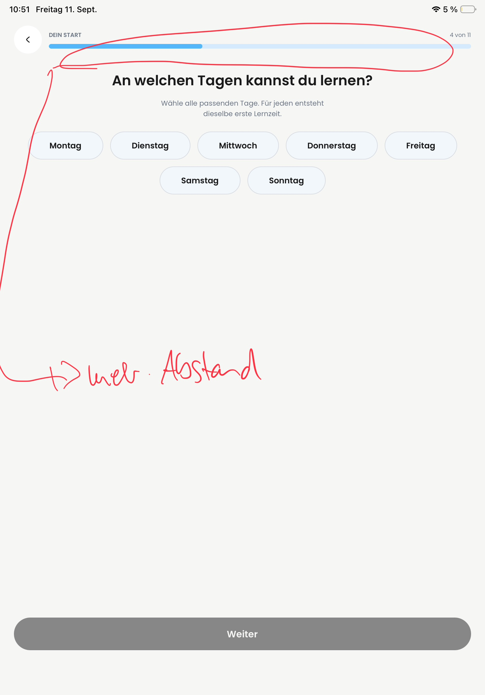</a>

### 01 schritt 01 mehr abstand oben

[Original in Linear](https://uploads.linear.app/25636614-9b48-4853-ae2c-f1d96a015b4e/b60a29fa-98f8-4566-82ef-31eb8b475428/941986c6-f9c8-46f8-bcea-5412f01c4b38) · Quelle: DAY-397

<a href="day-397-c1467c97.jpg">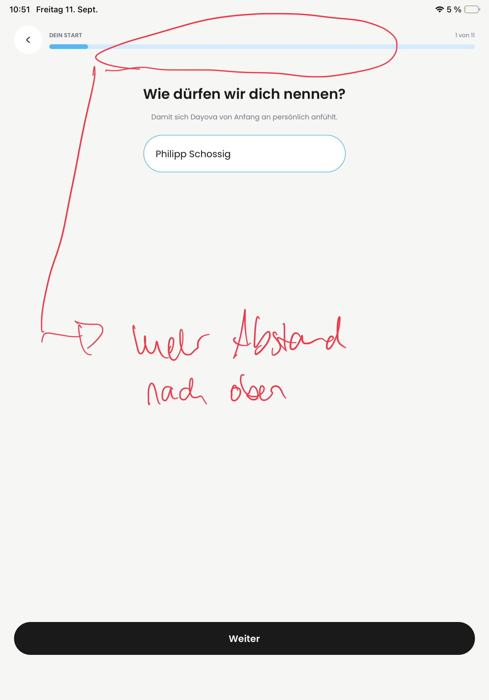</a>

### 06 schritt 05 mehr abstand oben

[Original in Linear](https://uploads.linear.app/25636614-9b48-4853-ae2c-f1d96a015b4e/fdf2e239-81af-4b90-8816-7fdeb0e989f9/f7179b04-0626-4464-938d-2d0f7873d031) · Quelle: DAY-397

<a href="day-397-c97b0225.jpg">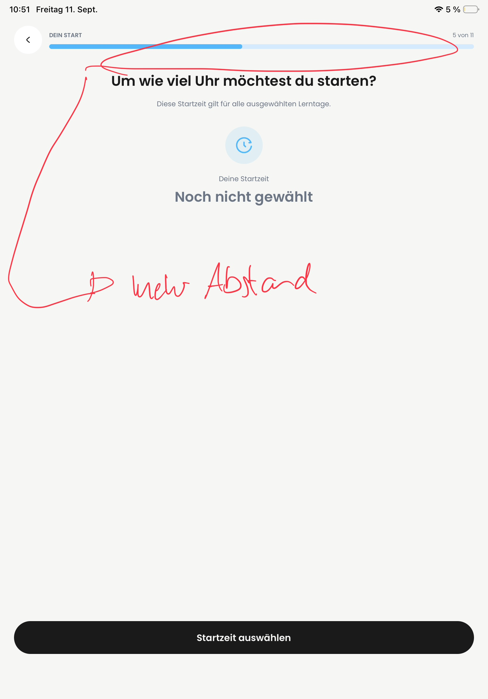</a>

### 11 schritt 11 mehr abstand oben

[Original in Linear](https://uploads.linear.app/25636614-9b48-4853-ae2c-f1d96a015b4e/45cfece2-c899-4407-97f5-471a4118ad84/aefcc768-4fff-4519-b27b-f864161d7252) · Quelle: DAY-397

<a href="day-397-26a67efe.jpg">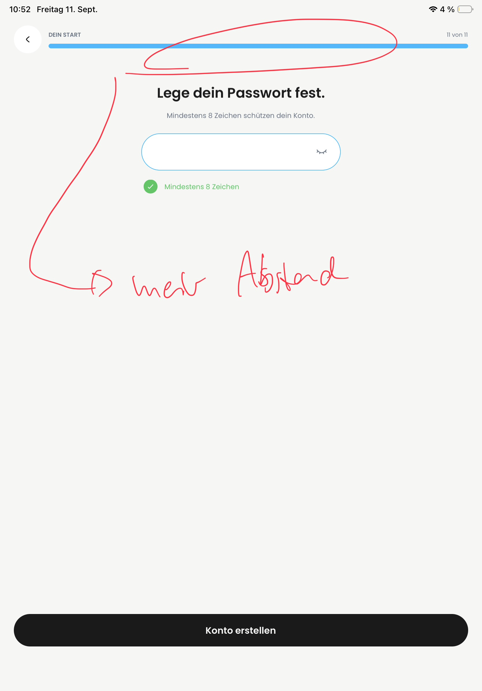</a>

## DAY-398

### 03 fachauswahl schatten entfernen tablet

[Original in Linear](https://uploads.linear.app/25636614-9b48-4853-ae2c-f1d96a015b4e/d33f655f-2a24-4f55-a6e4-b67b412288bb/c38330f3-4e0a-40c8-90c4-b90509090bee) · Quelle: DAY-398

### 02 pruefungsart schatten entfernen mobile

[Original in Linear](https://uploads.linear.app/25636614-9b48-4853-ae2c-f1d96a015b4e/ed02f6a8-feda-42d9-9e74-1def898b70e0/9c33c0a3-d296-4dcd-8711-ca884deed9e0) · Quelle: DAY-398

### 12 material upload schatten entfernen mobile

[Original in Linear](https://uploads.linear.app/25636614-9b48-4853-ae2c-f1d96a015b4e/64511bcb-9937-4eec-814e-1ca3c5d3e53f/f8ea831b-41b9-489c-a77a-4d2d34e4caa8) · Quelle: DAY-398

### 04 fachauswahl eigenes fach erstellen mobile

[Original in Linear](https://uploads.linear.app/25636614-9b48-4853-ae2c-f1d96a015b4e/b3317c9a-3505-42a9-957f-3408dab5789c/16bdd8e9-a18a-4ec6-b55f-8bd070a4648a) · Quelle: DAY-398

### 01 pruefungsart schatten entfernen tablet

[Original in Linear](https://uploads.linear.app/25636614-9b48-4853-ae2c-f1d96a015b4e/80d55b0b-f063-4b66-ac37-5e19fe1128b2/a238e785-d97c-4f52-9c0c-c7a0a4da201c) · Quelle: DAY-398

### 09 lernzeit hinweiskarte schatten entfernen mobile

[Original in Linear](https://uploads.linear.app/25636614-9b48-4853-ae2c-f1d96a015b4e/4b054bfd-47c3-45a1-a108-5b4d1593c7a5/a2c4dfcf-54f6-43b6-b94e-fba78bb5d909) · Quelle: DAY-398

### 08 lernzeit hinweiskarte schatten entfernen tablet

[Original in Linear](https://uploads.linear.app/25636614-9b48-4853-ae2c-f1d96a015b4e/ffb1425a-03b8-43d4-b806-db7cdf52eead/0793752d-020d-4978-b8cf-d741eff58e39) · Quelle: DAY-398

### 11 material upload schatten entfernen tablet

[Original in Linear](https://uploads.linear.app/25636614-9b48-4853-ae2c-f1d96a015b4e/1ef4cd88-477d-42b2-a7dc-68ed855fd769/19d790ec-8a1d-48be-a453-0aa1969c50c0) · Quelle: DAY-398

### 06 pruefungsdatum schatten entfernen mobile

[Original in Linear](https://uploads.linear.app/25636614-9b48-4853-ae2c-f1d96a015b4e/384e9864-5dfb-4028-a64b-d9b0e224fd54/f53906db-bca9-4f69-95cf-a196ed8daf10) · Quelle: DAY-398

### 05 pruefungsdatum schatten entfernen tablet

[Original in Linear](https://uploads.linear.app/25636614-9b48-4853-ae2c-f1d96a015b4e/07a9038f-637a-492c-9bee-01cbe31075dd/2bc18ca9-6271-41d5-8ea2-b4e24c77e75e) · Quelle: DAY-398

### 07 pruefungsdatum kalender sheet mobile

[Original in Linear](https://uploads.linear.app/25636614-9b48-4853-ae2c-f1d96a015b4e/287d29b6-5b22-494e-a77a-4e9873433b40/f24cd3e8-9090-440d-b9d3-8f05c84e7671) · Quelle: DAY-398

<a href="day-398-364a0bc8.jpg">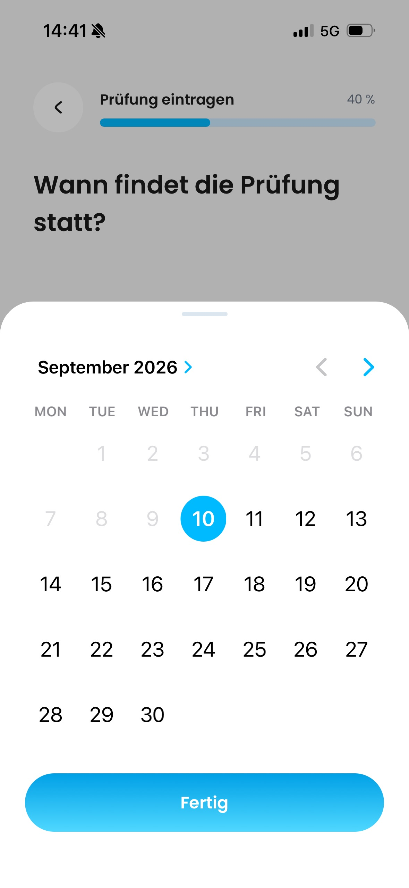</a>

### 10 themen textfeld rand fehlt

[Original in Linear](https://uploads.linear.app/25636614-9b48-4853-ae2c-f1d96a015b4e/cbbeecc8-c922-410d-859e-4d97d4032036/76a157fc-8a8d-4df1-a192-b122b67f72b4) · Quelle: DAY-398

## DAY-399

### 01 mehr dashboard rand fehlend

[Original in Linear](https://uploads.linear.app/25636614-9b48-4853-ae2c-f1d96a015b4e/018f874f-66f6-4995-89fb-8f0a4f082edc/e6c80d34-2231-4285-9870-8b7b5555fc41) · Quelle: DAY-399

### 02 analyse leerzustand rand und glocke

[Original in Linear](https://uploads.linear.app/25636614-9b48-4853-ae2c-f1d96a015b4e/8ba2f74e-1194-4434-b9cc-6668695fcdbe/5dfa3427-3bbe-4fa6-9f2c-91125ae157bc) · Quelle: DAY-399

## DAY-401

### 01 testphase gesamten inhalt mittig setzen

[Original in Linear](https://uploads.linear.app/25636614-9b48-4853-ae2c-f1d96a015b4e/06b7f0cd-5761-41ca-8e49-ba4cf0f25d2f/42896714-2b6c-4748-a369-67886c995e1b) · Quelle: DAY-401

<a href="day-401-12d64177.jpg">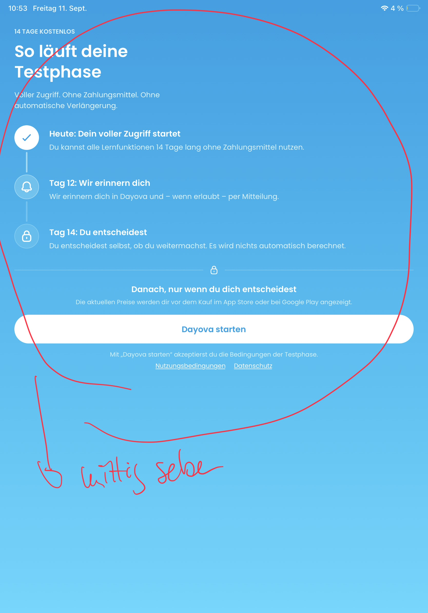</a>

## DAY-422

### 02 upload picker schatten und schliessen button

[Original in Linear](https://uploads.linear.app/25636614-9b48-4853-ae2c-f1d96a015b4e/1e69d536-91c0-4119-b3c2-e562ac511452/0f88ecf5-6427-4bbd-aded-6d05af22936a) · Quelle: DAY-403

## DAY-187

### 08 fachauswahl tablet

[Original in Linear](https://uploads.linear.app/25636614-9b48-4853-ae2c-f1d96a015b4e/e6a46384-b1aa-43a3-9d4f-c0e2483f1ce2/64b29819-1962-4ca2-bd9f-3292391bea51) · Quelle: DAY-393

### 16 fachauswahl mobile

[Original in Linear](https://uploads.linear.app/25636614-9b48-4853-ae2c-f1d96a015b4e/931e2954-1673-4a9f-8255-6a55472b3e98/632120b1-5626-4f48-82d9-1aa009b35b2e) · Quelle: DAY-393

## DAY-445

### IMG_1800.PNG — historischer iPhone-Löschdialog

Quelle: DAY-445

<a href="day-445-IMG_1800.png">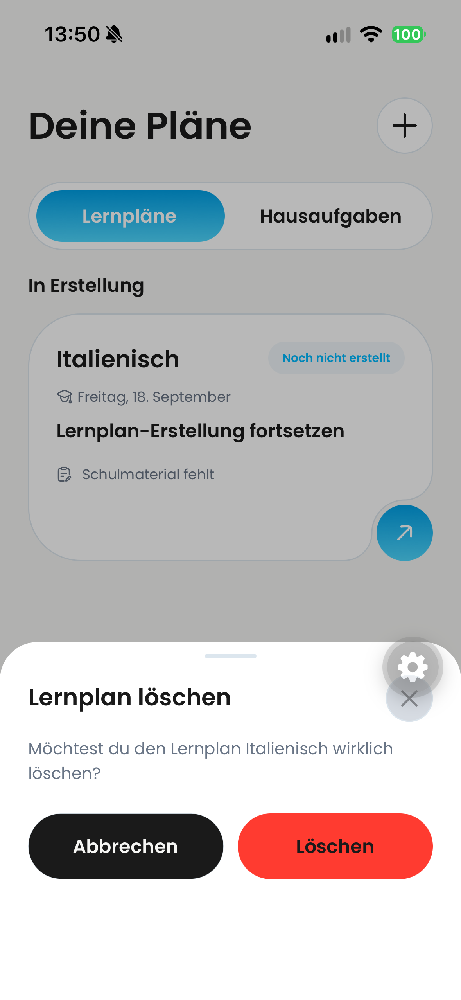</a>

### IMG_1804.PNG — historischer iPhone-Löschdialog (Zwischenstand, kein finales Nachher)

Quelle: DAY-445

<a href="day-445-IMG_1804.png">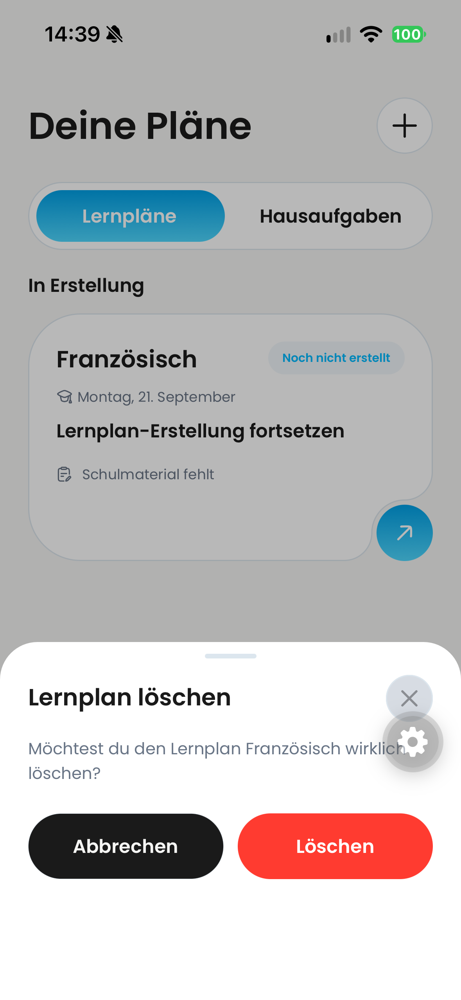</a>

## Bewusst nicht erneut veröffentlicht

DAY-393/DAY-399: Profilaufnahme mit privater E-Mail; DAY-400: E-Mail-Verifizierung mit privater E-Mail. Originalanhänge bleiben in Linear. DAY-377 enthält Video statt Vorher-Standbild; hier nicht als Bewegungsnachweis ausgewertet. DAY-402 enthält auch Intro-Bilder außerhalb des Welcome-PR-Scopes.

