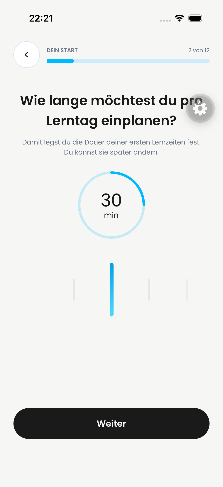
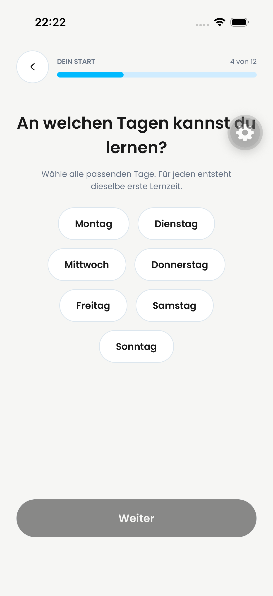
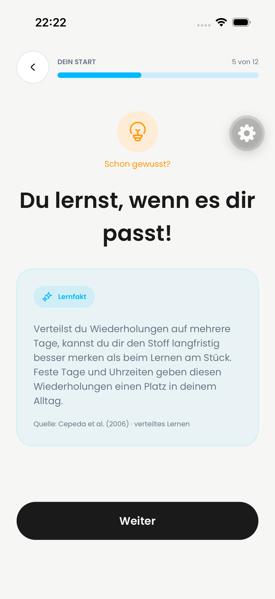

# Onboarding: Lerndauer und Wochentage

Stand: 3. Oktober 2026. Folgeänderungen für PR #825.

## Umsetzung

- Darstellung der vom bestehenden Modell gelieferten Dauerwerte im neuen Kreis/Slider; kompakte min/h-Beschriftung mit deutschem Dezimalkomma. Die Auswahlgrenzen werden in dieser PR nicht verändert. Weiter bestätigt den angezeigten Ausgangswert; das Öffnen allein speichert keine Auswahl.
- Der Infotext zur Dauer passt sich dem gewählten Wert an.
- Lerntage: keine initiale Vorauswahl, 48pt Mindesthöhe, semibold body-3, 2/2/2/1 angeordnet. Auswahl mit blauem Verlauf und weißer Schrift; zugänglicher Checkbox-Zustand bleibt erhalten.
- Ein zusätzlicher Lernfakt erklärt verteiltes Wiederholen zwischen Tages- und Startzeitauswahl. Zwölf Profil-/Kontoschritte führen bis zur Verifikation.
- Der echte Einstieg verwendet `expo-router/entry`. Die lokale Vier-Seiten-Vorschau, die den gemeldeten Rücksprung ausgelöst hatte, ist entfernt.
- Abgrenzung zu #813: keine Änderung an Daueroptionen, Backend, Validierung, Outbox oder Planungslogik. Diese Dateien entsprechen unverändert der gemeinsamen Basis `0f15a796`. #813 bleibt für die fachlichen Zeitvorgaben zuständig.

## Native Bildbelege

| Dauer | Tage ohne Auswahl |
| --- | --- |
|  |  |

| Lernfakt | Startzeit |
| --- | --- |
|  |  |

Die Aufnahmen stammen aus dem echten Router auf „Dayova Jakob Review iPhone“.
Die zusätzlichen Nutzeraufnahmen unter `../onboarding-review-2026-10-03/`
zeigen den Ablauf bis zur Zusammenfassung bei Schritt 7.

## Validierung

- Nach Scope-Korrektur: 66 gezielte Unit-/Backend-Tests bestanden; die Fachlogik entspricht wieder unverändert der Basis.
- UI-Regressionsprüfung: 56 Tests für Auth-Screens, Lernfakt und Slider. Ein zusätzlicher Test betätigt Weiter auf jedem der zwölf Schritte und prüft den jeweiligen Folgerouten-Aufruf bis zur Verifikation. Auth-Dienste sind dabei gemockt.
- Vor Scope-Korrektur: vollständige Testsuiten mit 968 Vitest- und 393 Jest-UI-Tests bestanden. Danach gezielte Unit-/UI-Prüfung erneut ausgeführt.
- TypeScript, gezieltes ESLint/Biome und Diff-Review bestanden.
- Maestro prüfte im echten Router Intro → Name → Dauer → Erklärung → leere Tagesauswahl → Lernfakt → Startzeitauswahl sowie Zurücknavigation und erhaltene Antworten.
- Scope-Diff bestätigt: keine Backend- oder Persistenzänderung gegenüber der Basis. Der zuvor erfolgreiche isolierte Backend-Deploy gehört zum Stand vor dieser bewussten Herausnahme und ist keine zusätzliche Backend-Änderung dieser PR.

Die echte Kontoanlage mit E-Mail-Code und anschließender Dashboard-Anmeldung wurde nicht erneut durchgeführt; die vorhandenen Auth-Tests prüfen diese Übergänge mit Testdiensten. Es wurde kein neues Nutzerkonto angelegt und kein Produktionsdeploy ausgeführt.

## Grundlage des Lernfakts

[Cepeda et al. (2006), Distributed practice in verbal recall tasks](https://www.yorku.ca/ncepeda/publications/CPVWR2006.html).
Die Aussage zur Gedächtnisleistung bezieht sich auf verteiltes Lernen; feste
Wochentage und Uhrzeiten sind die praktische Umsetzung, keine in dieser Studie
isoliert bewiesene Wirkung identischer Uhrzeiten.
