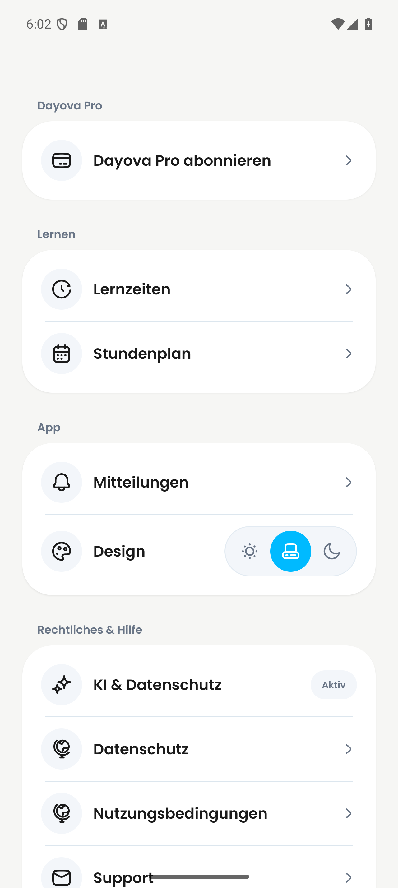
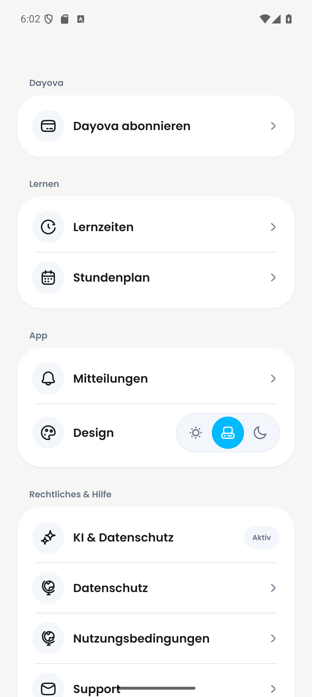
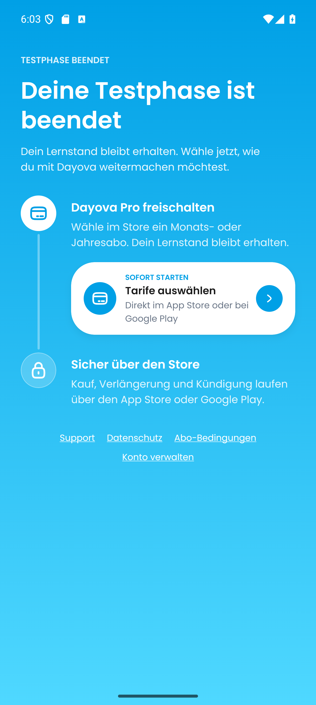
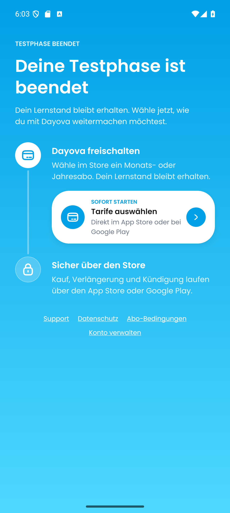
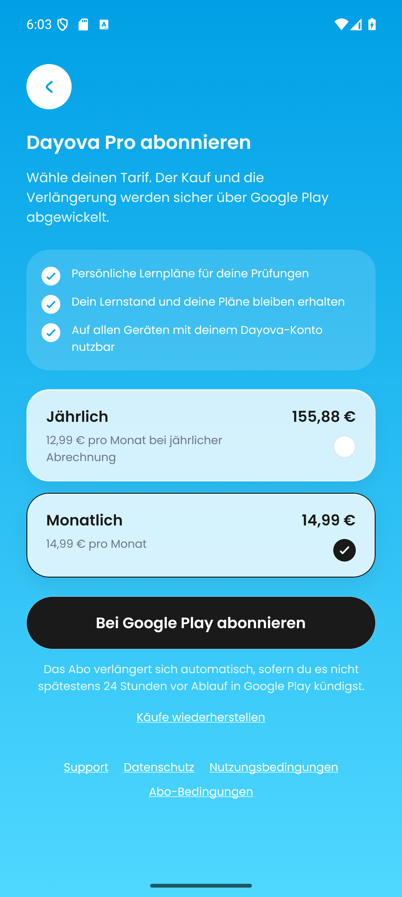
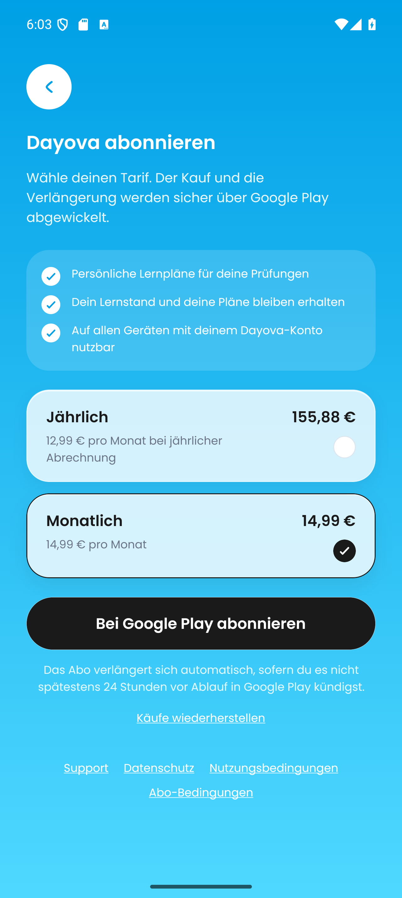
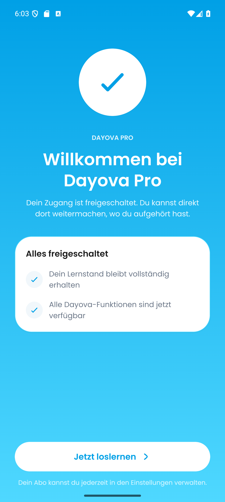
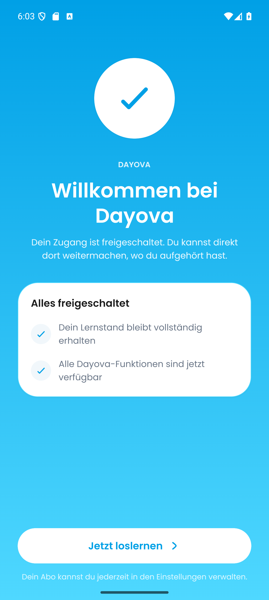

# PR #548: Product-name screenshots

Captured and visually reviewed on 8 September 2026 for
[PR #548](https://github.com/Dayova/dayova-mvp/pull/548).
The naming decision lives in
[Notion](https://app.notion.com/p/3d52e87228bf811d9060e7cd264a9d2a).

## Comparison

| Screen | Before | After |
| --- | --- | --- |
| Settings |  |  |
| Paywall |  |  |
| Subscription selection |  |  |
| Confirmation |  |  |

## Sources and capture method

- Before: the four screen modules from base commit
  `e027014b4d4b053f9fc54364ab90388722e5c526`, retrieved with `git show`.
- After: the corresponding production screen modules at
  `fbb2b4d71e8b88b0d8cd811733ee89d0b0410a9c`.
- Both versions used the same shared UI components, fonts, styles and native
  providers from the PR checkout. No shared visual styles changed in this PR.
- Device: local `Pixel_9_Pro` Android emulator, Android 16 / API 36,
  1280 × 2856 pixels, density 480, font scale 1.0, light appearance.
- Runtime: reused installed development app `com.dayova.dev`, version 1.0.2,
  version code 1, loading the current JavaScript through Metro. No new native
  binary or app release was built for these screenshots.
- A temporary entry point rendered the actual screen components with
  `GestureHandlerRootView`, `SafeAreaProvider`, `KeyboardProvider`,
  `DayovaThemeProvider`, `SheetAccessibilityProvider` and
  `BottomSheetModalProvider`. A temporary resolver supplied deterministic
  account, access, AI-consent and RevenueCat fixtures and a screen selector.
- Fixtures: trial access for settings, AI-consent label `Aktiv`, monthly
  14,99 €, annual 155,88 € / 12,99 € per month. Monthly billing was selected
  in both subscription screenshots. Store actions were simulated; no real
  account or Store transaction was used.
- Screens were selected through a local `dayova://evidence` deep link. Each
  screenshot is an unedited `adb shell screencap -p` PNG. Matching UIAutomator
  XML snapshots are stored alongside the images.
- The temporary entry point and Metro resolver were restored after capture,
  and the emulator and Metro process started for this task were stopped.

## Verification and coverage

All eight images were inspected. The corrected product name is visible in
each after image without clipping. The paired subscription screenshots show
the same prices and selection. The XML snapshots corroborate the visible
labels, including the confirmation's uppercase label and heading.

These are native, isolated screen captures with fixed test data. The settings
screen is rendered without the surrounding tab navigator. The confirmation
screen is opened directly; these images do not establish a successful purchase,
authentication, full navigation flow, or Store/backend integration. No iOS or
physical-device screenshot was captured in this run. The old wording in the
before evidence is retained only to document the regression being removed.

The implementation was already validated with `pnpm check`, 19 access-policy
tests, 19 UI tests across the four affected suites, and formatting checks for
the 12 affected source files. CodeRabbit CLI review reported zero findings.
This evidence-only follow-up does not change application code.
