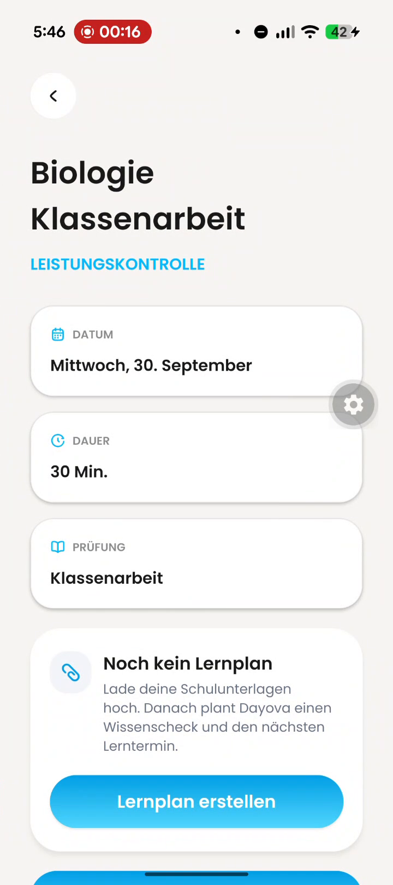
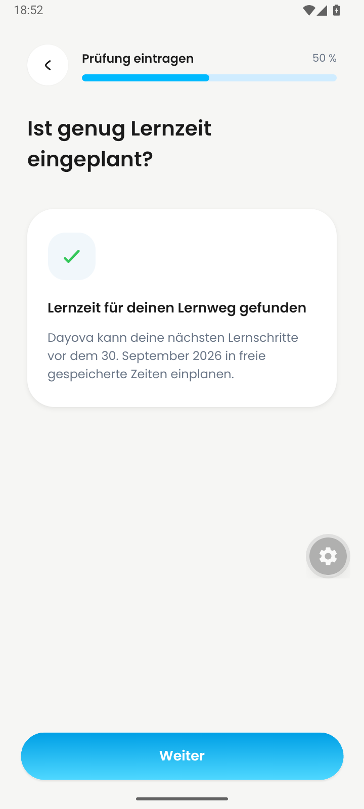
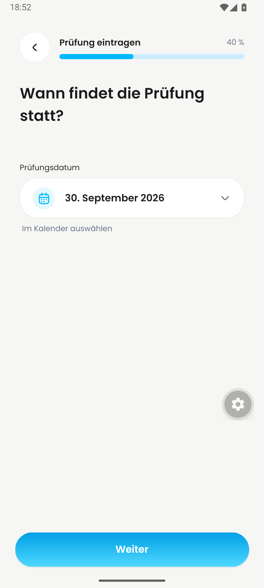
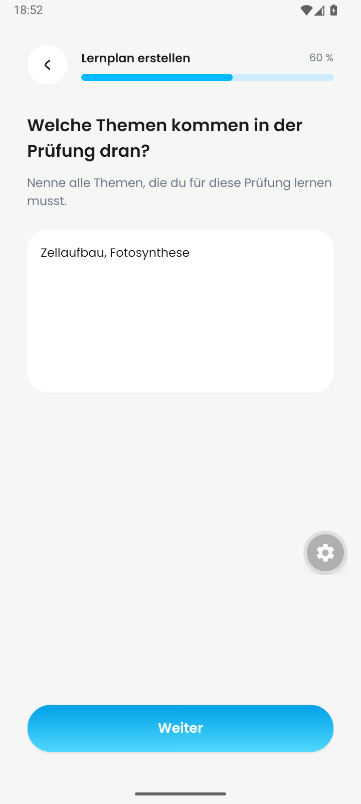
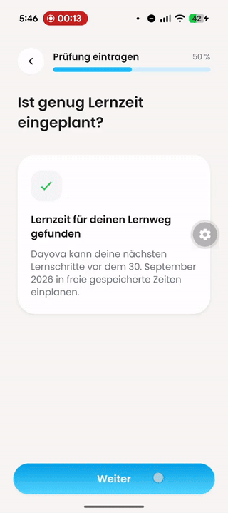
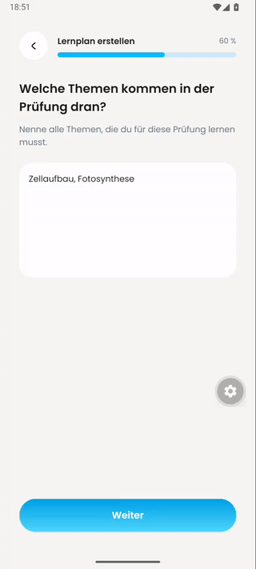

# Back from learning-plan topics

Visual evidence for [PR #585](https://github.com/Dayova/dayova-mvp/pull/585).
The reported Back action opened the saved exam overview. With the fix, it
returns to the preceding learning-time step at 50%.

| Before: unexpected exam overview | After: preceding setup step |
| --- | --- |
|  |  |

| After: topics before Back | After: selected date retained | After: topics restored by Continue |
| --- | --- | --- |
|  |  |  |

**Screen recordings** — the previews animate; each links to its MP4.

| Reported behavior | Fixed native flow |
| --- | --- |
|  |  |
| [Play/download before MP4](reported-before.mp4) | [Play/download after MP4](android-after.mp4) |

The before excerpt comes from the user-supplied
`signal-2026-09-13-17-47-26-609.mp4`; its source revision and device model
are unknown. It shows the 50% step, 60% topics, Back, and the unexpected
overview. In the delivered excerpt, the Back touch is visible at 1.0 s and
the overview at 1.4 s. The [topics screenshot](before-topics.png) also shows
the original Back touch. Only the relevant excerpt is published; the full
original recording remains local.

The after recording uses the real Android development client (`com.dayova.dev`,
version 1.0.4) with JavaScript at `bdd02aa18069f8e0d98e3898ee1eb0d466dce910`,
served from an isolated checkout. Device: dedicated `Dayova_PR585` Android 16
/ API 36 x86_64 emulator, 720×1600, German locale. A synthetic account was
registered through the app against development Clerk and Convex. Its learning
times are Monday, Wednesday and Friday, 16:00–16:30. Setup was opened from
Plans for a Biologie Klassenarbeit on 30 September 2026. No navigation,
authentication or backend responses were mocked for this recording.

| After video time | Observed state |
| --- | --- |
| 0–4 s | Topics at 60%, containing “Zellaufbau, Fotosynthese” |
| 5.2–6 s | Back returns to 50%; the availability check finishes |
| 10–14 s | Another Back shows 40% with 30 September 2026 retained |
| 15–19 s | Continue returns to the learning-time check at 50% |
| 22–24 s | Continue restores topics at 60% with the same text |
| 26–30 s | A second Back returns to 50% |
| 31–32 s | Continue again restores the same topics at 60% |

Each settled state was also asserted against Android's accessibility hierarchy
during capture. The recording verifies the visible route sequence, date and
topic retention; duplicate-exam prevention and ownership checks have automated
regression coverage in the PR. It does not establish physical-device or iOS
after-fix behavior.

Both delivered recordings were inspected across their complete timelines,
including all contact sheets and focused transition samples. Audio is absent;
there is nothing to transcribe. Sampling does not establish exact animation
timing. The floating gear is development-client tooling. The MP4s are resized
to 480 px wide; the after MP4 is normalized to 30 fps. GIFs are 320 px wide at
10 fps (before) and 8 fps (after). Playback speed and action order are unchanged;
the after recording is continuous and uncut.

Before excerpt:

Coverage: 3.62-second video; 7 full-timeline frames sampled at 2 fps (0.5-second interval); 1 contact sheet(s); 6 additional frames from 00:00:01.000 to 00:00:02.000 at 5 fps; no audio stream.

After recording:

Coverage: 32.97-second video; 33 full-timeline frames sampled at 1 fps (1-second interval); 3 contact sheet(s); 10 additional frames from 00:00:04.000 to 00:00:06.000 at 5 fps; no audio stream.

Full original recording, reviewed locally:

Coverage: 46.16-second video; 46 full-timeline frames sampled at 1 fps (1-second interval); 3 contact sheet(s); 11 additional frames from 00:00:13.500 to 00:00:15.500 at 5 fps; no audio stream.
