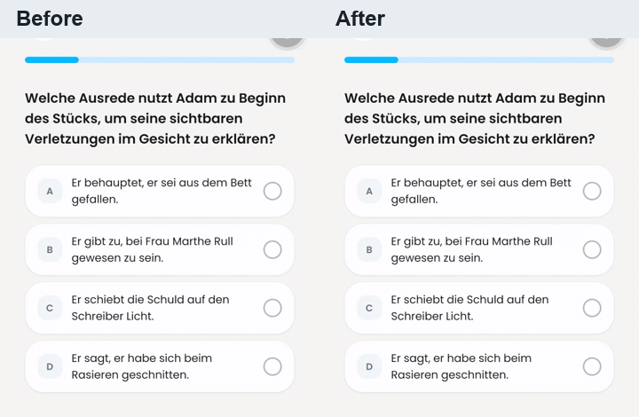
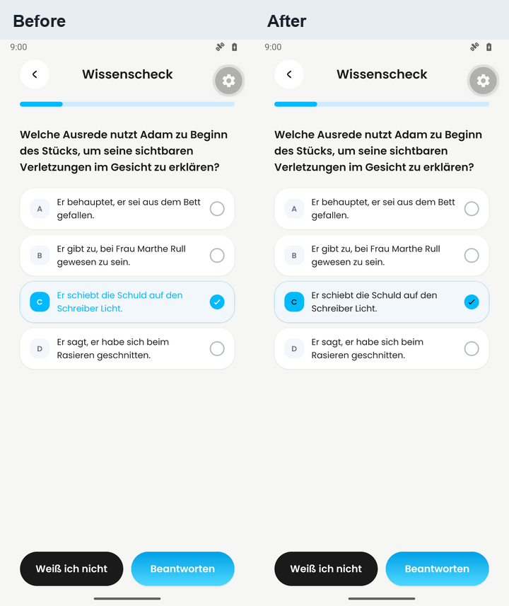
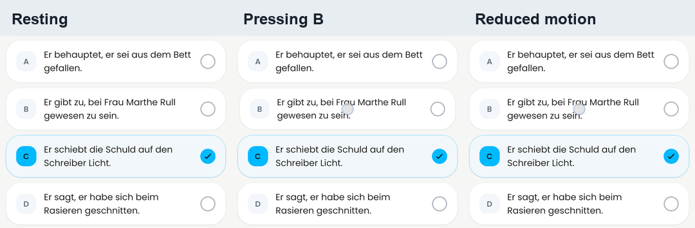
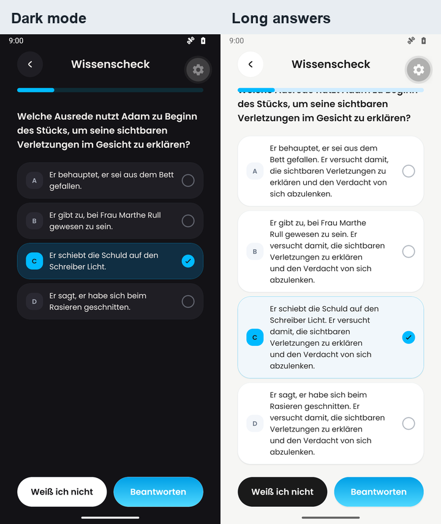

# Answer selection: native visual evidence

Captured on 2026-09-13 for [PR #586](https://github.com/Dayova/dayova-mvp/pull/586).

## Before and after

Full screen recordings: [before](before.mp4), [after](after.mp4),
[after in dark mode](after-dark.mp4), [reduced motion](reduced-motion.mp4).
Each is a ten-second MP4. The GIF is a cropped, resized, 20 fps preview at
the original speed; it contains the complete ten-second comparison.

The original 1080×2400 PNGs are included alongside these labeled comparisons.
`after-unselected.png` shows the initial state; `after-pressed.png` holds B
while C is selected; `after-selected.png` shows the final C selection.
The long-answer screenshot is scrolled to reveal the fourth answer.

## Capture provenance

- Before: the inline `ChoiceList` function from
  `src/app/learning-plans/[planId]/sessions/[sessionId]/index.tsx` at
  `8eea8204a92c526a9d0a4b997b11f2fda57d6875`, extracted verbatim apart from its
  exported name and imports.
- After: the actual `src/features/learning-plans/choice-list.tsx` at
  `2994195accd92c858ad688485763d84257bcf5ad`, imported directly from this checkout.
- Both run in the same isolated native component fixture with the same question,
  shared screen header, progress bar, buttons, Poppins fonts, spacing, and real
  Dayova theme tokens. Selection uses React state. The theme hook is supplied
  the selected real palette. Navigation and submission buttons are no-ops.
- Dedicated Android 16 / API 36 Google Play x86_64 emulator `Dayova_PR586`,
  1080×2400, density 420, font scale 1.0; Dayova development client 1.0.4,
  Expo SDK 57. Other agents' emulators and the physical phone were left alone.
- Native frames were captured through the Android Emulator screenshot API at
  540×1200, encoded as H.264 at 24 fps. Capture delays hold the previous frame;
  no motion interpolation, retiming, or synthetic UI frames were added.
  Actual samples per ten-second clip: before 198, after 177, dark 184,
  reduced motion 187. See [capture-log.json](capture-log.json) for per-frame
  timestamps, capture latency, input events, and video SHA-256 hashes.
- Reduced motion: Android `transition_animation_scale=0` and
  `animator_duration_scale=0`, with the application restarted before capture.
  Reanimated's Android reduced-motion query reads the transition scale.
  Both settings were restored to 1 afterward.
- These are native component captures. They do not exercise login, server
  content fetching, answer submission, or route navigation. This is not an
  iOS capture or a release-build frame-pacing benchmark. Emulator capture
  overhead introduces visible delays, so do not infer device latency or
  60 fps smoothness from these recordings.

## Interaction and inspection

The scheduled sequence is C, B, A, D at 1.0, 2.3, 3.6, and 4.7 seconds;
then C, B, A, D at 6.0, 6.35, 6.7, and 7.05 seconds; finally C at 8.0 seconds.
Actual down/up timestamps are in the capture log. All four recordings end
with only C selected at 9.0–9.5 seconds.

Observed in the before recording: B is faded while held at 2.500 seconds,
and selection changes from C at 2.833 to B at 2.875 seconds. The after
recording shows B compressed during the hold (2.417–2.708 seconds); at
4.000 seconds A and B have intermediate badge/check colors during the
selection transition, settling to A by 4.500 seconds. Dark mode shows the
same A/B color transition at 4.000 seconds with readable answer text.
The reduced-motion held-press PNG keeps B at its resting dimensions,
and the recording shows the final selected state without a lingering check.
The still comparisons support layout and color observations, not timing.

Every full-timeline contact sheet was inspected, plus all focused sheets for
the light before/after interval. The original private report video and its
notification shade were not republished. No published clip has an audio
stream, so transcription is not applicable. Sub-frame timing and intervals
between samples remain unverified.

Before and after, each:

> Coverage: 10.00-second video; 20 full-timeline frames sampled at 2 fps (0.5-second interval); 2 contact sheet(s); 18 additional frames from 00:00:02.250 to 00:00:03.000 at 24 fps; no audio stream.

Dark mode and reduced motion, each:

> Coverage: 10.00-second video; 20 full-timeline frames sampled at 2 fps (0.5-second interval); 2 contact sheet(s); no audio stream.
