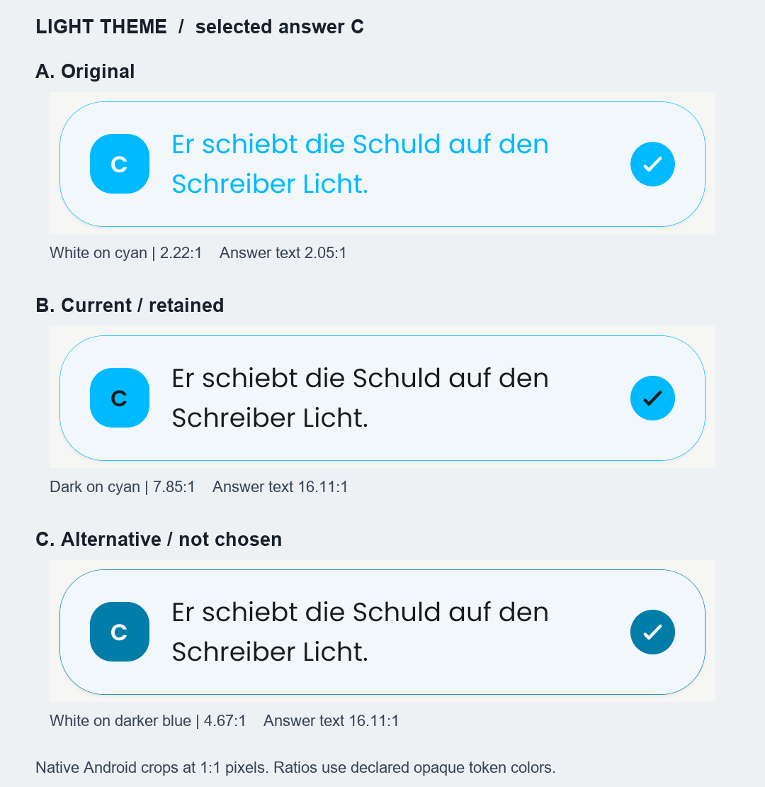
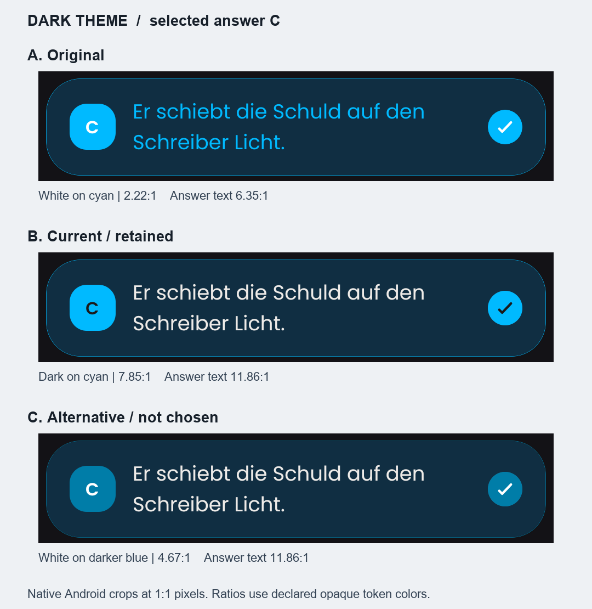
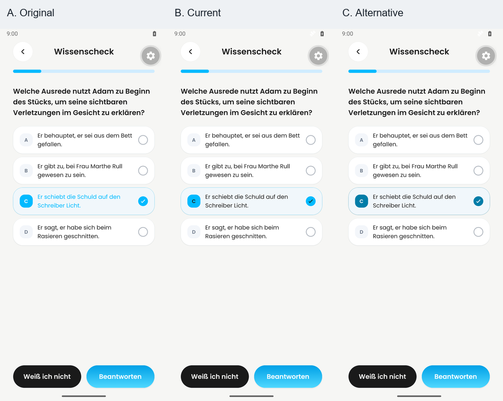
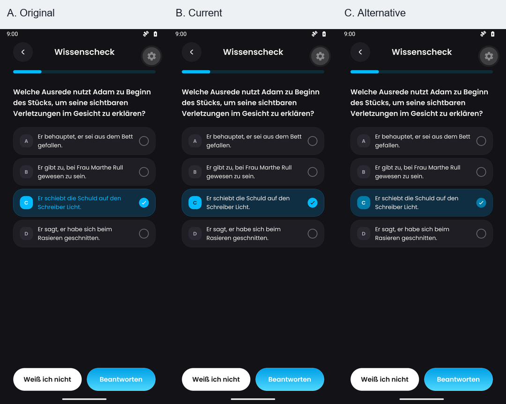

# Selected answer color comparison

Captured 2026-09-13 for [PR #586](https://github.com/Dayova/dayova-mvp/pull/586)
and [DAY-408](https://linear.app/dayova/issue/DAY-408/polish-answer-selection-motion-and-document-the-selected-color).
The [Notion decision record](https://app.notion.com/p/3da2e87228bf8173b2adddaab6e3f5e6)
contains the rationale, alternatives, tradeoffs, and reversal conditions.

**Retained: B, dark glyphs on the existing cyan with normal theme answer text.**
Production code is unchanged by this evidence follow-up. This is evidence for
selected-state legibility and consistency, not a learner-preference study.

## Compare the same selected state

<a href="light-comparison.png"></a>

<a href="dark-comparison.png"></a>

The selected-row crops preserve native pixels at 1:1 before the viewer scales
the image. A/B/C identify design options; each screenshot selects answer C.
Original full-resolution 1080×2400 screenshots:

| Theme | A — original | B — retained | C — alternative |
| --- | --- | --- | --- |
| Light | [A](A-light.png) | [B](B-light.png) | [C](C-light.png) |
| Dark | [A](A-dark.png) | [B](B-dark.png) | [C](C-dark.png) |

Full-screen context, resized equally to 360 pixels per screen:

<a href="light-full-context.png"></a>

<a href="dark-full-context.png"></a>

## Recordings

Enlarged, labeled answer-card comparisons at the original speed:
[light](light-before-after.mp4) · [dark](dark-before-after.mp4).
The PR embeds GitHub-hosted players for both. Each is the complete ten seconds;
each source is cropped to x=20, y=300, width=500, height=420 and placed beneath
a 58-pixel label. No source frames are removed or retimed.

Full-screen source clips: [new dark before](before-dark.mp4),
[new dark after](after-dark.mp4), [existing light before](../before.mp4),
[existing light after](../after.mp4). The [earlier evidence](../README.md) also
covers held press, reduced motion, and long answers.

New dark source observations: no choice is selected in the 0.0-second sample;
C is selected in the 1.5-second sample; B is selected at 3.0 seconds; A at
4.5 seconds; D at 5.5 seconds. At the verified 9.5-second frame, only C is
selected in both. The old selection uses white glyphs and cyan answer text;
the retained selection uses dark glyphs and theme text. Stills support color
and layout observations, not timing. The complete full-timeline contact sheets
were inspected for each source, plus individual final-state frames.

Coverage for each new dark source:

> Coverage: 10.00-second video; 20 full-timeline frames sampled at 2 fps (0.5-second interval); 2 contact sheet(s); no audio stream.

Sampling timestamps are nominal; events between samples and sub-frame timing
remain unverified. The light sources retain their earlier full-timeline and
focused inspection coverage. Paired previews are deterministic crops of those
inspected sources. Their final composition was additionally checked at rest.

## Provenance and reproduction

- A: inline `ChoiceList` from base `8eea8204a92c526a9d0a4b997b11f2fda57d6875`,
  extracted with only imports and the exported name changed.
- B: actual `src/features/learning-plans/choice-list.tsx` at
  `2994195accd92c858ad688485763d84257bcf5ad`, imported from this checkout.
- C: B with only the changes in [candidate.patch](candidate.patch): badge,
  check background and selected outline use `#007DA8`; glyphs use white.
  Body text and motion remain B's. This temporary comparison is not shipped.
- All options use the same isolated native fixture, German question, actual
  Poppins fonts, shared header/progress/buttons, real Dayova palettes and
  React selection state described in the [original capture method](../README.md).
  Seed choice `c` for stills; seed null before each recording. Wait for fonts
  and the requested theme/selected state to render before capturing.
- Dedicated `Dayova_PR586` Android 16 / API 36 emulator, 1080×2400, density 420,
  font scale 1.0; Expo SDK 57 development client 1.0.4. System animation scales
  are 1. Screenshots use `adb -s emulator-5584 exec-out screencap -p`; a native
  development-menu gear remains visible in full-screen context.
- Videos use authenticated emulator screenshot capture at 540×1200, encoded
  H.264 at 24 fps, holding the previous frame across capture delays. New dark
  before: 231 native samples; after: 239. [capture-log.json](capture-log.json)
  records input events, capture timings, hashes and coverage. No synthetic
  motion or UI repainting was added.
- The same scheduled sequence is C/B/A/D at 1.0/2.3/3.6/4.7 seconds,
  C/B/A/D at 6.0/6.35/6.7/7.05, then C at 8.0; actual input times are logged.
- Navigation and submission are no-ops in this component fixture. Captures do
  not establish server integration, release frame pacing, physical-device
  latency, iOS, assistive-technology behavior or maximum text-size behavior.

Reproduce the numerical evidence from this checkout, using only Python stdlib:

```sh
python docs/evidence/pr-586/color-decision/contrast.py
```

The script reads light and dark repository tokens, matches the runtime's HSL
rounding, checks black/white and equal-color reference values, and writes
[contrast.json](contrast.json). It measures opaque settled token colors,
not antialiased edge pixels or animated intermediate colors. Compare unrounded
ratios to thresholds. The selected letter is small text; the checkmark is a
meaningful shape. The light cyan outline is below 3:1 and is supplementary to
the high-contrast check shape, not the sole state cue. These measurements are
not a whole-control or app-wide WCAG conformance claim.

Method sources: [WCAG contrast minimum](https://www.w3.org/WAI/WCAG22/Understanding/contrast-minimum.html)
and [non-text contrast](https://www.w3.org/WAI/WCAG22/Understanding/non-text-contrast.html).
