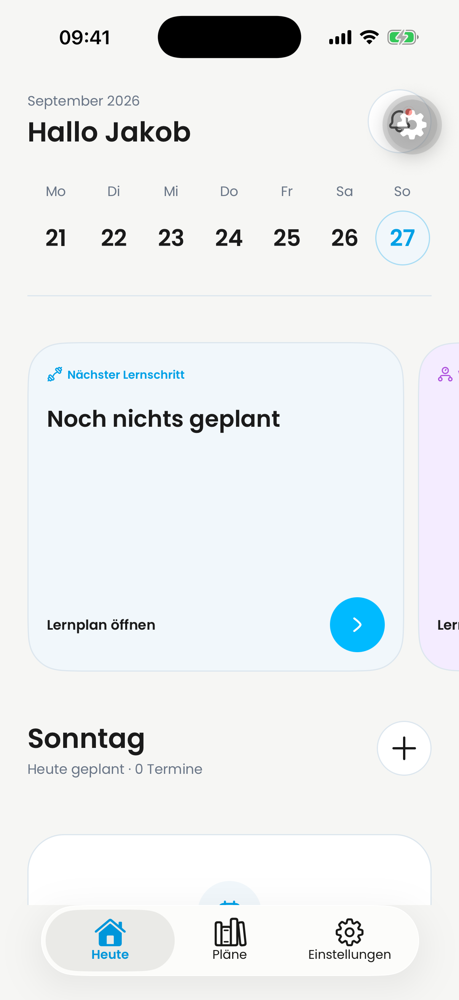
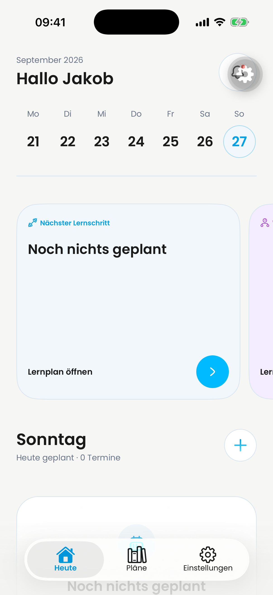

# PR #693: verifizierter iOS-Dashboard-Vergleich

Am 27. September 2026 wurden der aktuelle `main` und der aktuelle PR-Quellstand getrennt gestartet und auf **demselben iPhone 17 Pro / iOS 26.5 (23F77)** aufgenommen. Das Dashboard zeigt auf main ein dunkles Plus und im PR ein blaues Verlaufs-Plus im weißen, umrandeten Kreis. Beide öffnen den Eintragsdialog und kehren nach dessen Schließen zum Dashboard zurück.

| Lauf | Vollständiger Quell-Commit | Metro-Port |
| --- | --- | --- |
| Vorher / main | `8c9ed0cecddf60ad971cd3d5a61821b8271a5e33` | 8093 |
| Nachher / PR #693 | `246e2e8e90f5622ff9128a0a716e3c041d2332ab` | 8094 |

Die SHAs wurden über `git ls-remote` vor den Aufnahmen und erneut vor der Veröffentlichung bestätigt. Der spätere Evidenz-Commit ändert ausschließlich diesen Dokumentationsordner; er ist nicht der aufgenommene App-Quellstand.

## Unveränderte Originale

| main | PR #693 |
| --- | --- |
|  |  |

- [Originalaufnahme main, 22,63 s](before-dashboard.mp4)
- [Originalaufnahme PR, 9,82 s](after-dashboard.mp4)
- [Gerät, SHAs, Bundle- und Datenzuordnung](provenance.json)
- [Prüfsummen aller Evidenzdateien](SHA256SUMS)

PNG: 1206 × 2622, direkt mit `xcrun simctl io <UDID> screenshot` aufgenommen. MP4: H.264, direkt mit `recordVideo --codec=h264`, mit SIGINT beendet. Keine Retusche, Ausschnitte, Montage, Videokürzung oder Nachbearbeitung dieser vier Originaldateien. Kontaktbögen und Einzelbilder sind ausdrücklich abgeleitete Prüfmaterialien.

## Saubere Checkouts und frische Bundles

Getrennte, verwaltete Checkouts:

- main: `/Users/jakobroessner/.codex/worktrees/pr693-ios-main/dayova-mvp`
- PR: `/Users/jakobroessner/.codex/worktrees/pr693-ios-head/dayova-mvp`

Beide standen bei der Aufnahme exakt auf den oben genannten Commits; `git status --porcelain` war leer. Nur historische `docs/evidence` waren per Sparse Checkout ausgespart. Der gesamte App-Quellcode blieb unverändert. Ignorierte `.env.local` waren identisch und verwiesen auf dasselbe Convex-Development-Backend und Clerk-Testsystem. Analytics war in beiden Läufen deaktiviert; die entsprechende Entwicklungswarnung wurde vor der Aufnahme geschlossen.

Wegen begrenzten lokalen Speicherplatzes wurden die Abhängigkeiten des identischen Lockfiles wiederverwendet: ein echtes `node_modules`-Verzeichnis, zunächst im main-Checkout, danach nach Beendigung seines Metro-Prozesses in den PR-Checkout verschoben. Kein Symlink auf den App-Quellcode eines anderen Checkouts. Der SHA-256 des Lockfiles ist in beiden Läufen `a152db42a2f9628160812544d2336325a7d114fd28a6d5ab60534725db24f94c`.

Start jeweils im betreffenden Checkout:

```sh
DAYOVA_METRO_USE_WATCHMAN=true APP_VARIANT=development \
  node node_modules/expo/bin/cli start --dev-client --clear \
  --port <8093-oder-8094> --max-workers 1
```

Vor dem Wechsel wurde die App terminiert und der main-Metro-Prozess beendet. Der native Client wurde ausdrücklich über einen `expo-development-client`-Deep-Link zum neuen Port geöffnet. Damit wurde ein neuer JS-Prozess aus dem zweiten Bundle gestartet, kein bloßer Bildschirmwechsel oder Fast Refresh.

Die Zuordnung ist über mehrere unabhängige Prüfungen dokumentiert:

1. Der Expo-Manifest-Endpunkt meldete den jeweiligen absoluten `projectRoot` und die `launchAsset.url` auf dem exklusiven Port.
2. Das frisch von diesem Server geladene iOS-Bundle wurde gehasht: main `57b2f7c0728d469397943709c735c6ab10e78d351020cd4f3baa8eecd355d2e2`, PR `d7dbb75e1a50d5089231498b1e2bd546c951433fd31a81da1c24ad577fad04c8`.
3. Der **laufende Hermes-Prozess** meldete über den Inspector `NativeSourceCode.getConstants().scriptURL` mit 8093 bzw. 8094. [runtime-proof.js](runtime-proof.js) beschreibt die ausgelesenen Werte; die Ergebnisse stehen in `provenance.json`.
4. Im laufenden main waren `dashboard-screen.tsx` und `create-entry-button.tsx` initialisiert; der Button hing von `ui/icon.tsx` ab. Im laufenden PR hing derselbe Button von `ui/add-icon.tsx` ab, und **AddIcon war initialisiert**. Die Quell-Dateien wurden zusätzlich über ihre Git-Blob-IDs zugeordnet.
5. Die Originalbilder wurden direkt geprüft: ROI `(990,1888)–(1136,2038)` im 1206×2622-Bild enthält 920 unterschiedliche Pixel. main: 684 dunkle, 0 blaue Pixel; PR: 0 dunkle, 604 blaue Pixel. Die Farbkriterien stehen im Manifest. Der Inhaltsbereich `(0,400)–(1206,1800)` oberhalb des Buttons ist pixelidentisch.

Der tatsächlich sichtbare Dashboard-Button ist `CreateEntryButton`, eingebunden in `dashboard-screen.tsx`. Die ebenfalls im PR geänderte `dashboard-day-header.tsx` war kein Ersatz für die Prüfung des sichtbaren Buttons.

## Gleicher Simulator, gleicher Zustand und gleiche Daten

- Simulator-UDID: `A8BB438B-B4B0-4EF8-85DE-A701AC8EFEE6`.
- Hochformat, helle Darstellung, deutsche App, Statusleiste 09:41 / WLAN / voller Akku.
- Identischer installierter nativer Development-Client `de.dayova.app-dev`, Version 1.0.5, installierte Bundle-Version 1, React Native 0.86.3. Existierender EAS-Simulator-Build `9efabeef-8d3b-41cd-8c81-b186bb57ed34`, native Quelle `e2beb20ad67513dfc58796a865ac61e015205722`.
- `package.json`, Lockfile, `app.config.cts`, `modules` und `plugins` stimmen zwischen dieser nativen Quelle und beiden geprüften JS-Commits überein. Hashes der installierten nativen ausführbaren Dateien stehen im Manifest. Während der beiden Aufnahmen wurde derselbe Client verwendet.
- Tab „Heute“, September 2026, Sonntag 27.09.2026 ausgewählt, identische horizontale Kartenposition und vertikale Scrollposition; „Noch nichts geplant“, „Lernplan öffnen“, „Heute geplant · 0 Termine“.
- Derselbe bereits angemeldete Testnutzer im Development-Backend. Keine Seed-, Nutzer- oder Backend-Mutation. Plus öffnen und Auswahl schließen erzeugt keine Einträge.
- [data-proof.js](data-proof.js) liest mit der vorhandenen Testsitzung `dayEntries.listByDayKeys` für 21.09.–21.10.2026 sowie `learningPlans.listOverview`. Beide Ergebnisse einschließlich Nutzerbindung und ausgewähltem Tag waren **exakt gleich**: 31 Tageslisten, insgesamt 2 Einträge, 0 am ausgewählten Tag, 4 Planübersichten.
- Kanonischer JSON-SHA-256 beider vollständigen Abfrageergebnisse: `643539564ac15b4220d423c1f2059fc5e86c0d39af48993f071d24ae875ad2e0`. Rohdaten, Nutzer-ID und Sitzungstoken werden nicht veröffentlicht. Kanonisierung: Python `json.dumps(value, sort_keys=True, separators=(',', ':'), ensure_ascii=False)`, UTF-8, SHA-256. Bei der Inspector-Abfrage wurde das Promise-Ergebnis zunächst in einer temporären JS-Variablen abgelegt und anschließend ausgelesen.

Der anfänglich installierte ältere Client 1.0.3 stürzte beim aktuellen Bundle mit einer JSI-Assertion ab. Die hier veröffentlichten Aufnahmen entstanden erst nach Installation des bestehenden, kompatiblen Clients 1.0.5 und erfolgreicher Runtime-Prüfung. Fehlgeschlagene Startversuche sind kein Bestandteil der Evidenz.

## Vollständige Video-Prüfung

`inspect-video-evidence` wurde angewendet: Metadatenprüfung mit ffprobe, Stichproben über die **gesamte Timeline**, Sichtprüfung sämtlicher Kontaktbögen und zusätzliche 5-fps-Prüfung der Übergänge. Keine Audiospur. Die Sampling-Auflösung begrenzt Aussagen über Vorgänge zwischen den Einzelbildern; daraus werden keine Aussagen über genaue Latenzen oder Frame-Performance abgeleitet.

| Video | Zeitstempel | Beobachtung |
| --- | --- | --- |
| main | 00:00.0–00:04.2 | Dashboard, schwarzes Plus, Sonntag / 0 Termine |
| main | 00:04.4–00:04.8 | Eintragsauswahl fährt hoch; „Neue Prüfung“ und „Neue Hausaufgabe“ werden sichtbar |
| main | 00:05.0–00:21.6 | Auswahl geöffnet, keine Option abgesendet |
| main | 00:21.8–00:22.2 | Auswahl schließt; Dashboard mit schwarzem Plus wieder sichtbar |
| PR | 00:00.0–00:04.4 | Derselbe Dashboard-Zustand, blaues Verlaufs-Plus |
| PR | 00:04.6–00:05.2 | Eintragsauswahl fährt hoch, dieselben beiden Optionen |
| PR | 00:05.4–00:08.6 | Auswahl geöffnet, keine Option abgesendet |
| PR | 00:08.8–00:09.2 | Auswahl schließt; Dashboard mit blauem Plus wieder sichtbar |
| PR | 00:09.4–00:09.6 | Dashboard stabil |

**main:** Coverage: 22.63-second video; 45 full-timeline frames sampled at 2 fps (0.5-second interval); 3 contact sheet(s); 8 additional frames from 00:00:04.000 to 00:00:05.600 at 5 fps; 8 additional frames from 00:00:21.000 to 00:00:22.600 at 5 fps; no audio stream.

**PR:** Coverage: 9.82-second video; 20 full-timeline frames sampled at 2 fps (0.5-second interval); 2 contact sheet(s); 8 additional frames from 00:00:04.000 to 00:00:05.600 at 5 fps; 9 additional frames from 00:00:08.000 to 00:00:09.800 at 5 fps; no audio stream.

[main: Manifest und Bildindex](before-inspection/frame-index.md) · [PR: Manifest und Bildindex](after-inspection/frame-index.md). Die jeweiligen Ordner enthalten alle Einzelbilder und Kontaktbögen; JPEG-Kopien der Kontaktbögen erlauben eine zusätzliche Sichtprüfung bei PNG-Vorschauproblemen.

Bei der variablen Bildrate dieser Simulator-Videos erzeugte die ursprüngliche Fokus-Filterfolge `trim,setpts,fps` falsche Fokus-Bildzahlen/verschobene Zeitbezüge. Für die hier archivierte Prüfung wurde ausschließlich im temporären Analyse-Skript die Reihenfolge zu `fps,trim,setpts` geändert, damit das Sampling auf der originalen globalen Timeline erfolgt. Danach: 8 statt irrtümlich 89 Bilder im 1,6-Sekunden-main-Intervall. Die vollständigen 2-fps-Einzelbilder sind bytegleich zur ersten Auswertung. Die Videos selbst wurden nicht umkodiert oder verändert. Die fehlerhafte Fokus-Auswertung wird nicht als Evidenz veröffentlicht.

## Grenzen und Abgrenzung

Der Vergleich belegt die sichtbare **Dashboard-Plus-Aktion auf iOS** und ihre Öffnen-/Schließen-Interaktion. Der native Entwickler-Werkzeugknopf rechts oben ist in beiden Originalen sichtbar und überdeckt den Dashboard-Plusbutton nicht. Am unteren Bildschirmrand gibt es weitere Layout-Unterschiede zwischen aktuellem main und dem PR-Quellstand; nicht jeder Bildunterschied wird diesem PR zugeschrieben.

Der zurückgezogene iOS-Vergleich wird nicht wiederverwendet. Vorhandene Android-Bilder von „Deine Pläne“ bleiben ausschließlich **Pläne-Evidenz** und kein Dashboard- oder iOS-Nachweis. Die separat vorhandene Android-Dashboard-Evidenz wird durch diese Prüfung weder ersetzt noch neu bewertet. Es wurden keine neuen iOS-Pläne-Aufnahmen benötigt.
