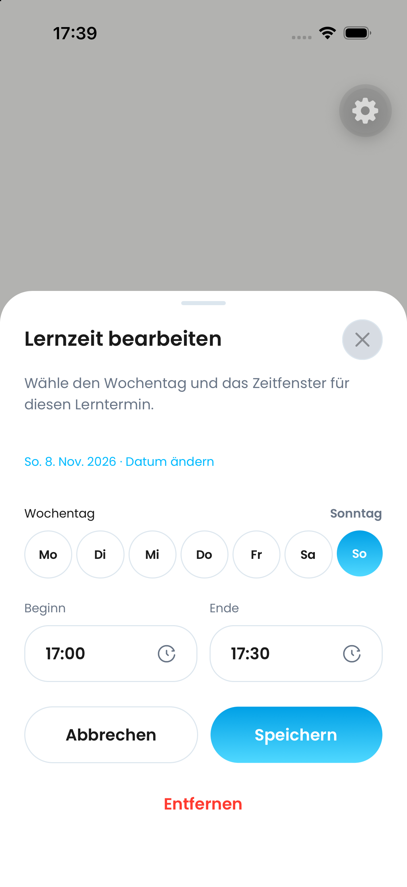

# Native UI-Belege, 03.10.2026

Der korrigierte Editor verwendet die Tageskreise und Beginn/Ende-Felder der Lernzeiten. Die unveränderte Aufnahme zeigt die echte Komponente im separaten iOS-Simulator mit festen Beispieldaten über eine ausschließlich lokale, danach entfernte Vorschau-Route. Keine vollständige Ende-zu-Ende-Abnahme. Das Entwickler-Zahnrad gehört zur Entwicklungs-App.

## Frühere Aufnahmen

Übersicht und Zeitwähler wurden im vorherigen Review-Simulator dargestellt und bedient. `editor-intermediate.png` ist historisch und zeigt ein verworfenes Layout; deshalb wird es nicht mehr eingebettet.

Details und offene Prüfungen: [Testblatt](../../qa/pr-813-learning-planning.md).
