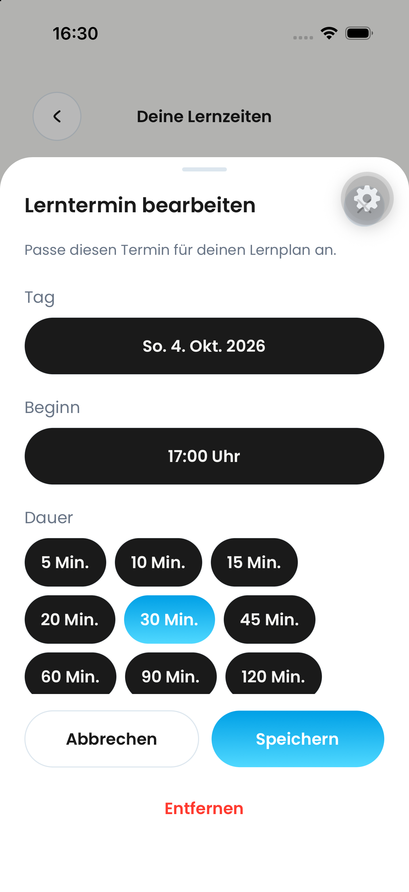

# Native Zwischenstände, 03.10.2026

Diese unveränderten Simulatoraufnahmen zeigen die neue Übersicht, den später noch auf Tag/Beginn/Ende vereinfachten Bearbeitungsdialog und den gemeinsamen nativen Zeitwähler. Die Bilder belegen sichtbare Zwischenstände, keine vollständige Abnahme des finalen Builds. Debug-Zahnrad und alte Benachrichtigungsfehler gehören zum vorhandenen Dev-Simulator. Details und offene Prüfungen: [Testblatt](../../qa/pr-813-learning-planning.md).

