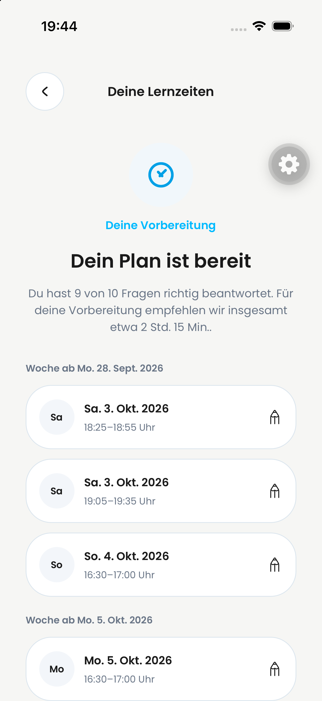
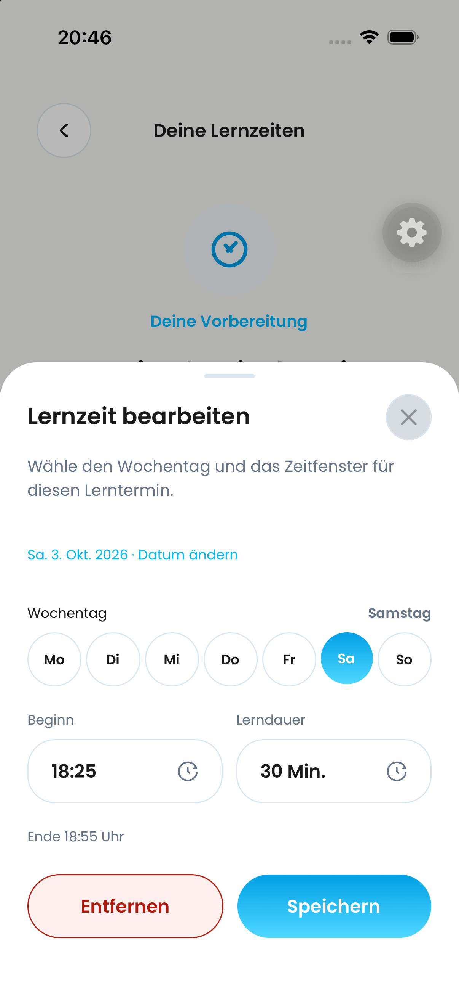
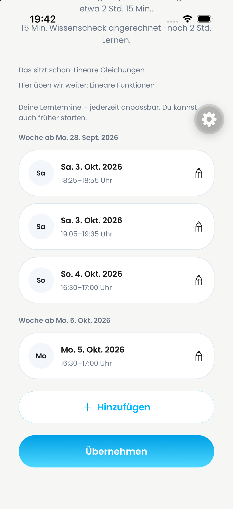
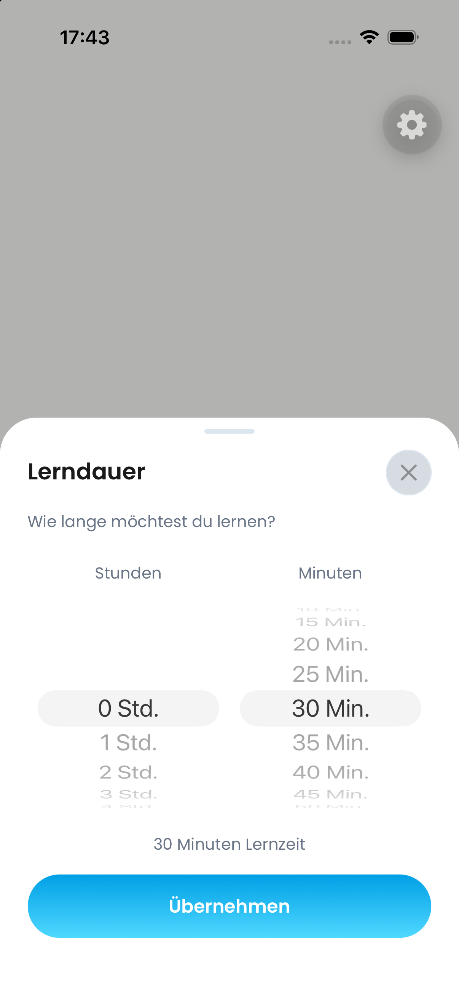
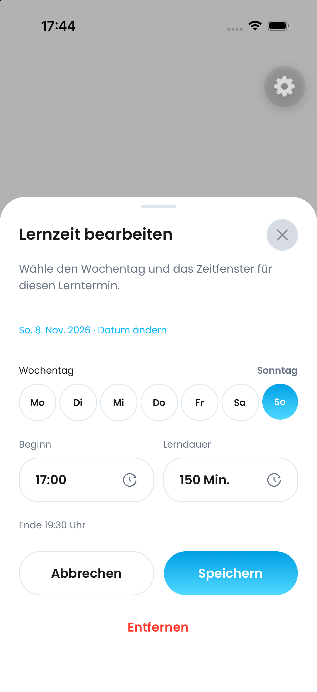
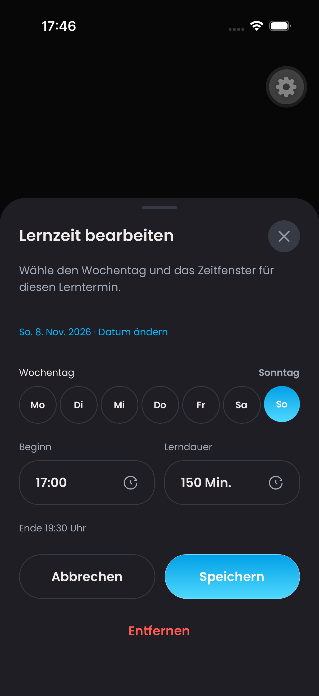
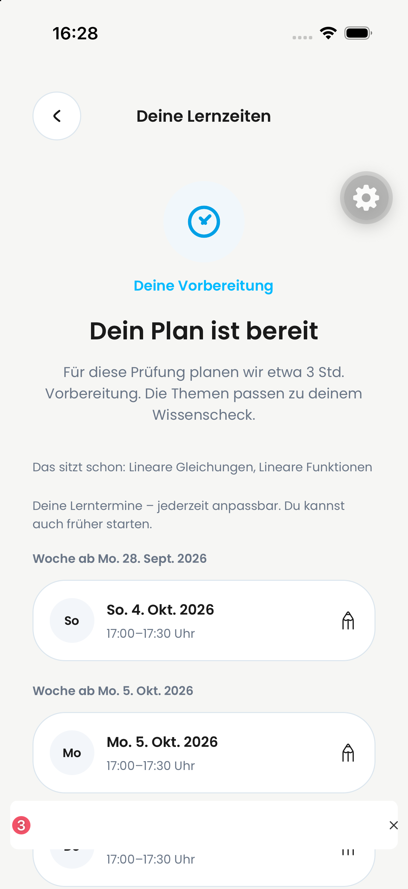
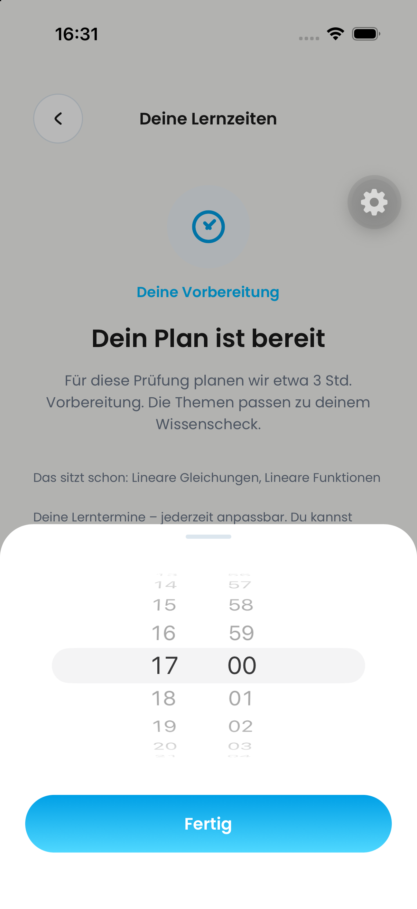
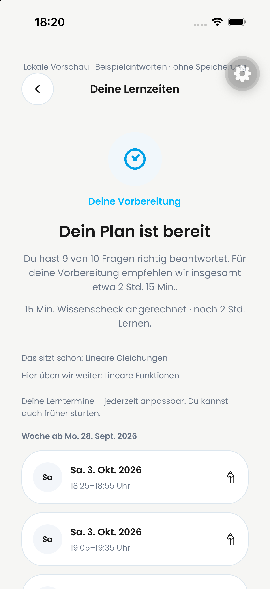

## Gekürzte Auswertung

Lokale Simulatorvorschau ohne Backend-Speicherung. Die markierten Zusatztexte sind entfernt; Anrechnung und Planung bleiben unverändert. Native Sichtbarkeitsprüfung bestanden.

## Aktueller Editor: direkt wechselnde Auswahl

Datum, Beginn und Dauer wechseln innerhalb desselben Popups. [Videoauswertung und Prüfungen](popup-correction.md). Die folgenden Bilder dokumentieren frühere Zwischenstände.

# Native UI-Belege, 03.10.2026

Der aktuelle Editor verwendet Beginn und Lerndauer; Ende wird automatisch berechnet. Die Lerndauer öffnet native Stunden-/Minutenräder auf iOS. Unveränderte Aufnahmen der echten Komponenten mit festen lokalen Beispieldaten. Vorschau-Route danach entfernt; keine vollständige authentifizierte Ende-zu-Ende-Abnahme.

## Frühere Aufnahmen

Übersicht und Zeitwähler wurden im vorherigen Review-Simulator dargestellt und bedient. `editor-intermediate.png` und `editor-corrected.png` sind historisch und zeigen überholte Layouts; deshalb werden sie nicht mehr eingebettet.

Details und offene Prüfungen: [Testblatt](../../qa/pr-813-learning-planning.md).

## Ergebnisabhängige Auswertung

Native lokale Vorschau des neuen Auswertungsscreens mit einem aus dem Test-Backend gelesenen Ergebnis. Zehn vorbereitete Beispielantworten, davon neun richtig; 15 Minuten Check-Zeit als Testwert gesetzt. Authentifizierter Gesamtflow und echtes Speichern sind damit nicht belegt.

