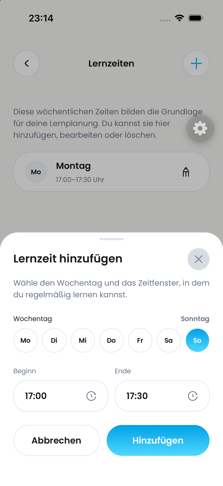
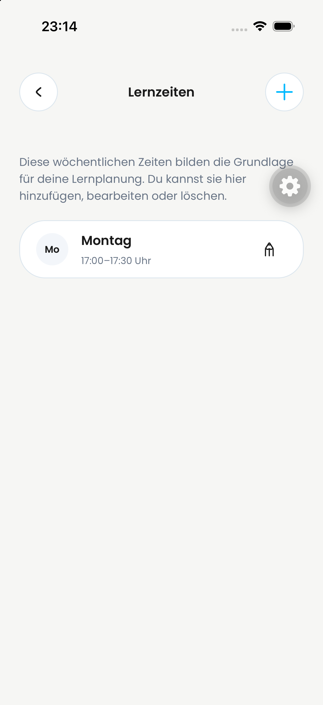
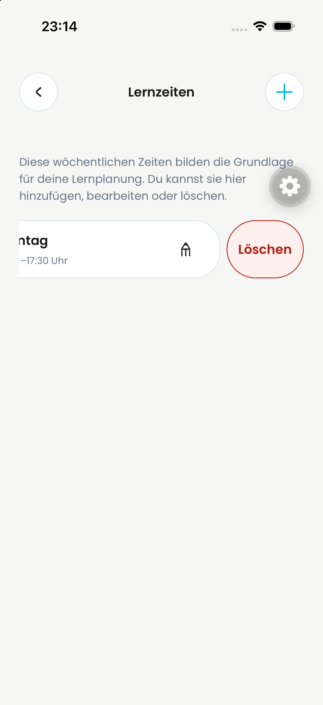
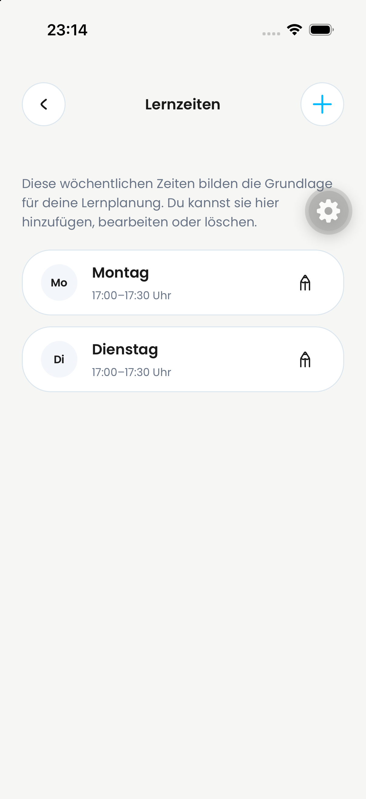
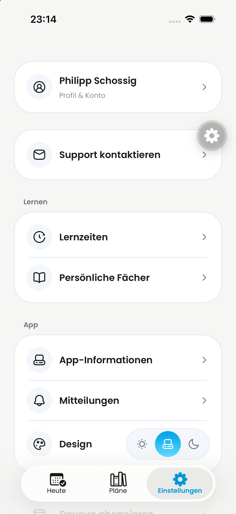
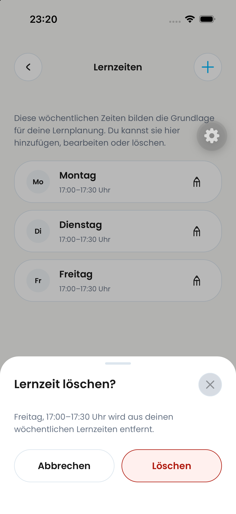

# PR #817 – Bildnachweise von Philipp

Sechs unveränderte iPhone-Simulator-Screenshots, von Philipp am 02.10.2026 als Nachweis seines manuellen Durchgangs bereitgestellt. Dateizeiten unten stammen aus den Originaldateinamen. Die Aufnahme um 23:20 zeigt die abschließende Buttonkorrektur; die fünf früheren Aufnahmen dokumentieren die übrigen UI-Zustände.

## 23:14:03 – Hinzufügen

Sieben Tage in einer gleichmäßig verteilten Zeile; Sonntag ausgewählt mit blauem Verlauf und weißer Schrift. Beginn/Ende sowie „Abbrechen“ und „Hinzufügen“ nebeneinander.

## 23:14:06 – Übersicht mit einem Eintrag

Montag, 17:00–17:30 Uhr, mit umrandeter Karte und Bearbeiten-Stift.

## 23:14:11 – Freigelegte Wischaktion

Die geöffnete Wischaktion zeigt den roten, umrandeten Button „Löschen“.

## 23:14:18 – Übersicht mit zwei Einträgen

Montag und Dienstag, jeweils 17:00–17:30 Uhr, in der Liste.

## 23:14:21 – Einstellungen

Einstellungsseite mit dem Einstieg „Lernzeiten“ neben „Persönliche Fächer“. Aufnahme aus dem kombinierten Review-Build; andere sichtbare Einstellungsänderungen gehören nicht automatisch zu #817.

## 23:20:29 – Finale Löschbestätigung

Bestätigung für Freitag, 17:00–17:30 Uhr, mit „Abbrechen“ und dem korrigierten, einzeiligen Button „Löschen“.

## Aussagekraft

Philipp meldet den manuellen Durchgang als funktionierend. Die Bilder belegen die sichtbaren Zustände; sie sind keine lückenlose Aufzeichnung der Aktionen, kein Nachweis von Neustart-Persistenz und keine unabhängige vollständige End-to-End-Prüfung. Insbesondere zeigt die Löschbestätigung noch nicht das Ergebnis einer bestätigten Löschung. Android, Dunkelmodus und Bedienung mit assistiven Technologien werden hier nicht belegt. Bestehende automatisierte Prüfergebnisse stehen im [QA-Protokoll](../../qa/learning-times-settings-restoration-2026-10-02.md).
