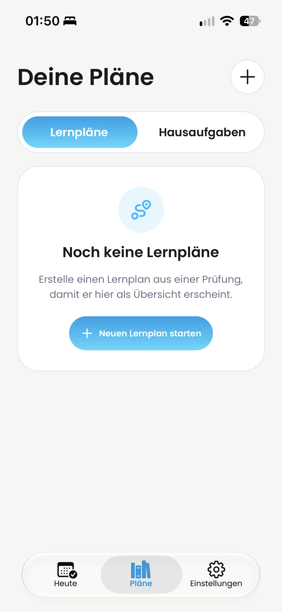
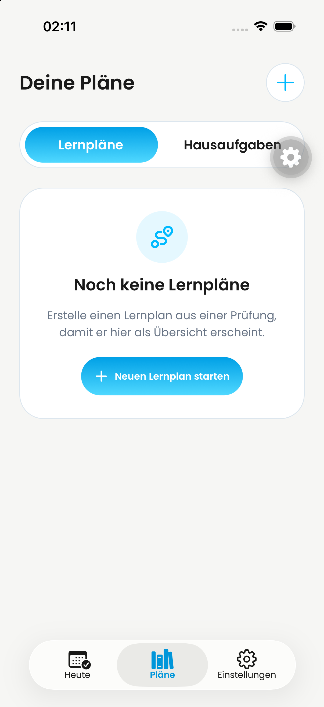

# PR #820 – Vorher / Nachher

Unveränderte, von Philipp bereitgestellte Screenshots vom 03.10.2026.

| Vorher | Nachher |
| --- | --- |
|  |  |

- Vorher: `IMG_1937.PNG`, 1179 × 2556 Pixel, Geräteuhr 01:50.
- Nachher: `Screenshot Dayova Jakob Review iPhone 03.10.2026 at 02.11.48.png`,
  1206 × 2622 Pixel, Geräteuhr 02:11.
- Die Aufnahmen zeigen den Leerzustand der Lernpläne-Seite. Unterschiede der
  Geräteauflösung, Statusleiste, Tabbar und des Simulator-Tools-Overlays sind
  kein Nachweis für Änderungen durch diesen PR.
- Belegt wird die gewünschte Header-Anpassung: kleinere Überschrift, oberer
  Abstand und blaues Plus entsprechend der neuen Heute-Seite.
- Der genaue Build des Vorher-Bildes wurde nicht unabhängig verifiziert. Der
  Nachher-Simulator enthielt zusätzlich #819; diese Aufnahme bestätigt weder
  dessen Kartenänderungen noch dessen Funktion. #820 enthält kein Kartenredesign.
- Statische Bilder belegen keine Navigation, Animation oder Fehlerfreiheit.
