# Von Philipp gelieferte Screenshots – 23.09.2026

21 unveränderte, kontodatenfreie Originalbilder aus der Nutzerübergabe.
Dateinamen bewahren Plattform und Aufnahmezeit; Android ist nach Ansicht benannt.
Die Bilder dokumentieren sichtbare Zustände, keine neuen automatisierten Tests.
Der genaue Commit der Nutzeraufnahmen ist nicht unabhängig verifiziert.

## Zuordnung

- DAY-417 / #651: iPhone 15.58.56 (leer), 15.58.59 (anlegen), 15.59.04 (gespeichert), 15.59.06 (Swipe-Aktion), 15.59.12 (bearbeiten). Kein Nachweis für Defaults oder Wissenscheck-Erinnerungen.
- DAY-187 / #655, #710: iPad 16.00.26 (Fach hinzufügen), 16.00.03/05 und Android subjects (Fachauswahl). Kein zusätzlicher CRUD-Erfolg aus diesen Stills ableitbar.
- #693, #698, #720, #722: Home, Erstellungsdialog, Prüfungsart und Entwürfe auf den jeweiligen Plattformen. Keine Aussage über zeitlichen Navigationsverlauf aus Einzelbildern.
- Registrierung: android-account-ready und iPad 08.12.51 zeigen Konto-bereit bzw. Erststart-Hinweis; kein Nachweis einer vollständigen Registrierung oder Kontolöschung.

Nicht öffentlich kopiert: Login-/Profilbilder mit E-Mail bzw. ausgefülltem Passwortfeld sowie ältere Löschfehlerbilder und die iPhone-Übergangsaufnahme um 05 Uhr. Diese sind keine Erfolgsnachweise. Originale bleiben unverändert auf Philipps Desktop.

## Übergabe

Philipp hat die verbleibenden funktionalen Tests und Zugangsblocker an Jakob übergeben. Podcast bleibt ausdrücklich außerhalb der Integration. Issues bleiben offen, Review-HOLDs bleiben bestehen. Dokumentationsabschluss bedeutet weder funktionale Vollabnahme noch main-Merge oder Production-OTA.

Die vollständige, differenzierte Zuordnung steht in [der Review-Matrix](../jakob-review-map-2026-09-23.md).

## Direkt sichtbare Originalbilder

Nach Bildschirm und Plattform benannte Nutzeraufnahmen; Build nicht unabhängig verifiziert.

### android-account-ready.png

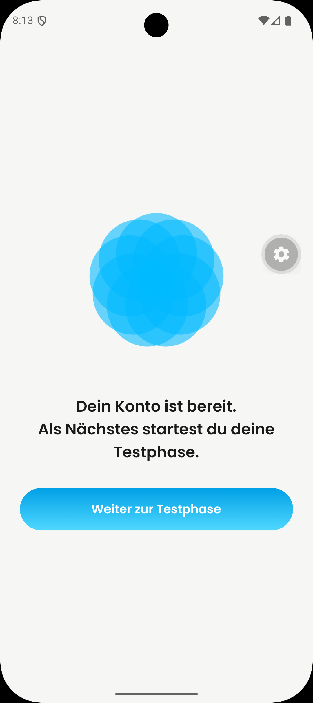

### android-create-dialog.png

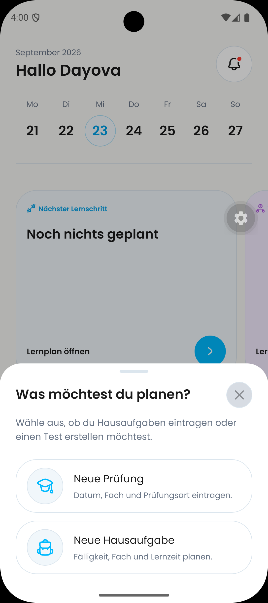

### android-exam-type.png

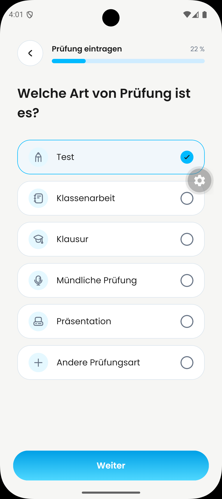

### android-home.png

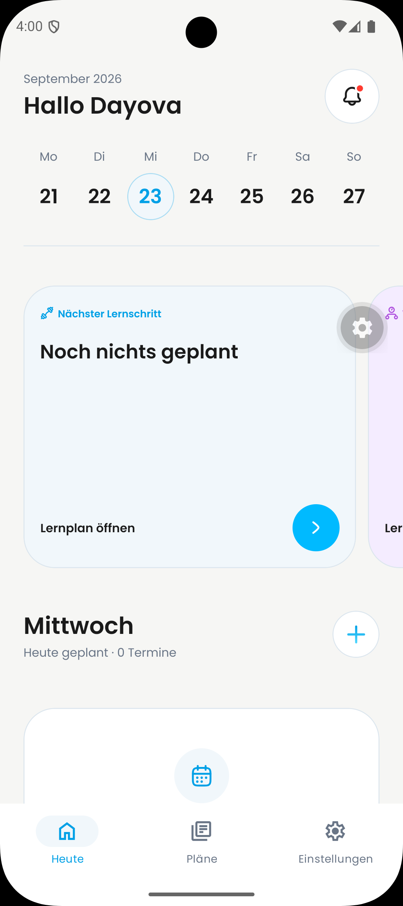

### android-subjects.png

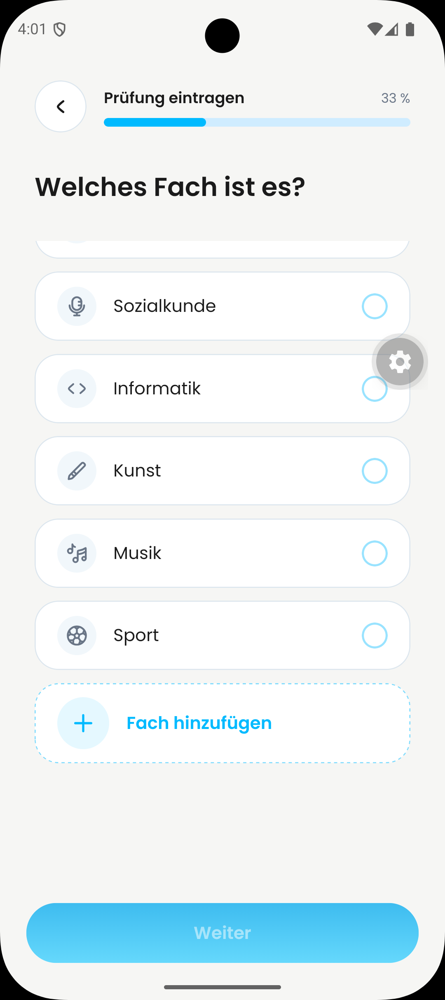

### ipad-08.12.51.png

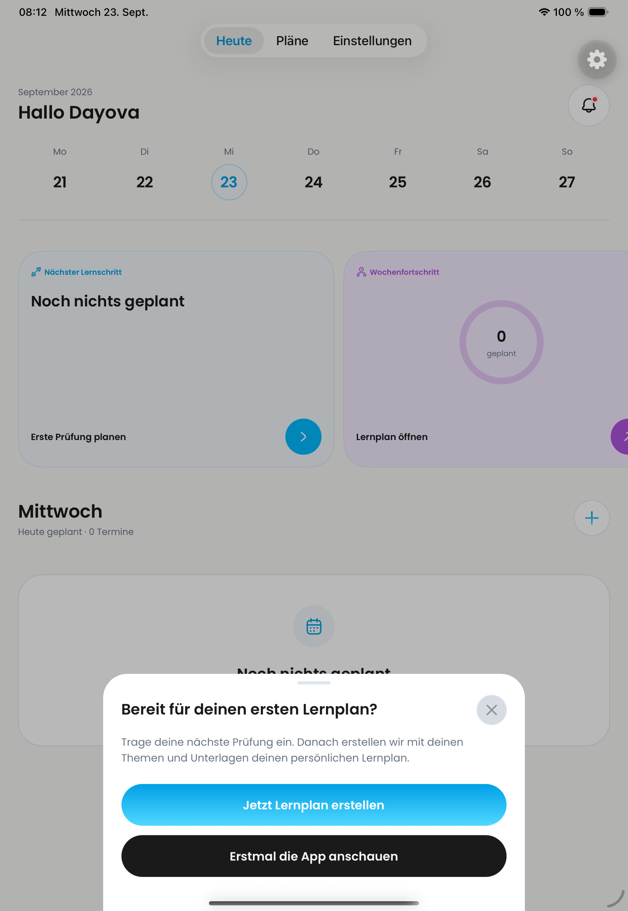

### ipad-16.00.03.png

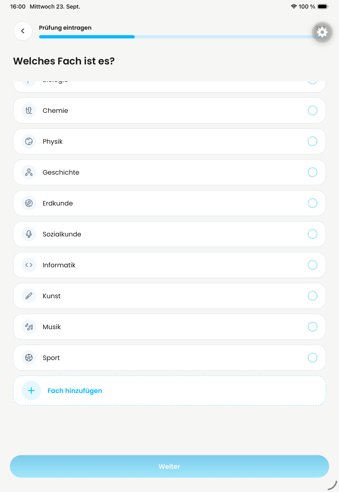

### ipad-16.00.05.png

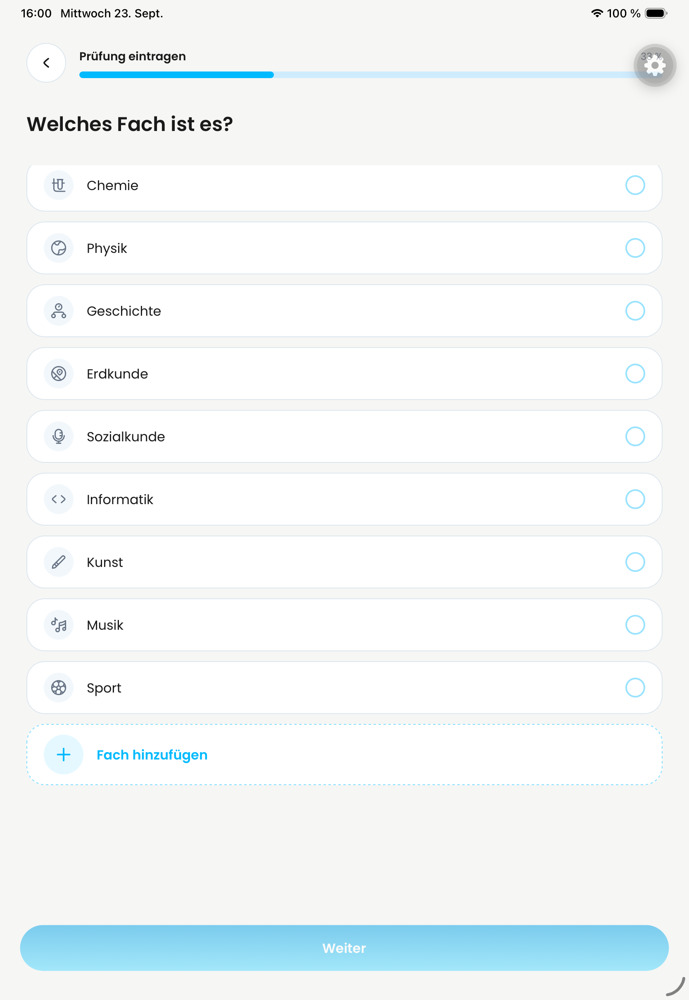

### ipad-16.00.18.png

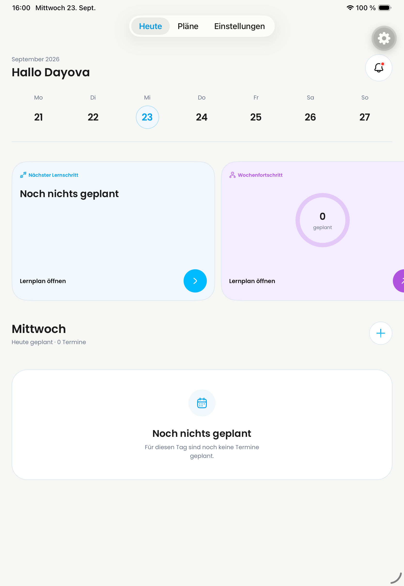

### ipad-16.00.26.png

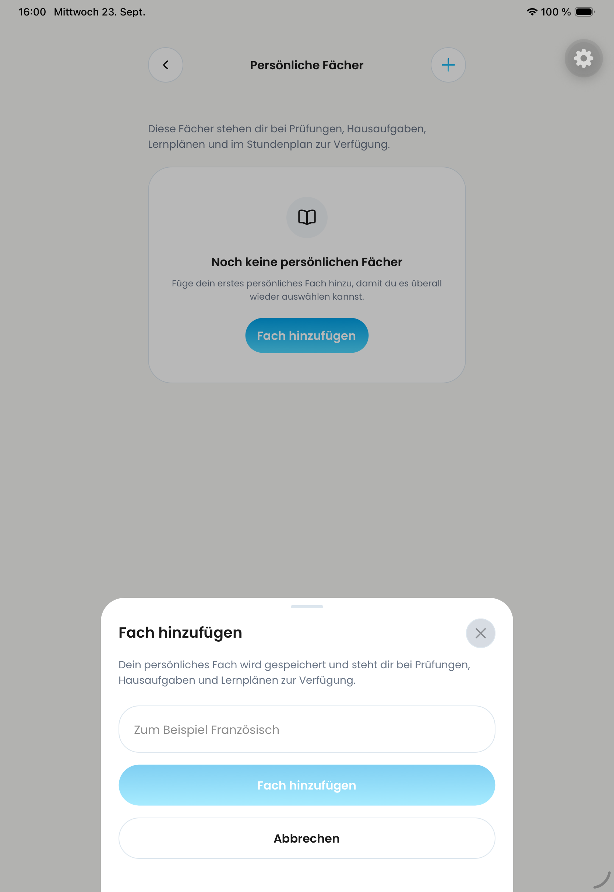

### iphone-15.58.46.png

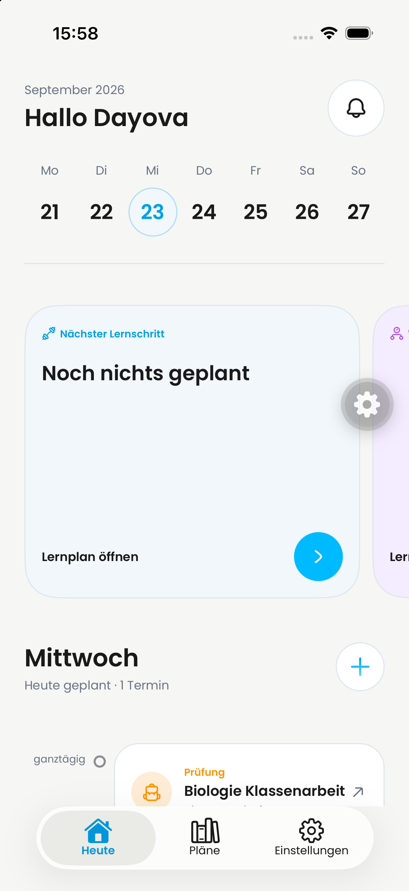

### iphone-15.58.47.png

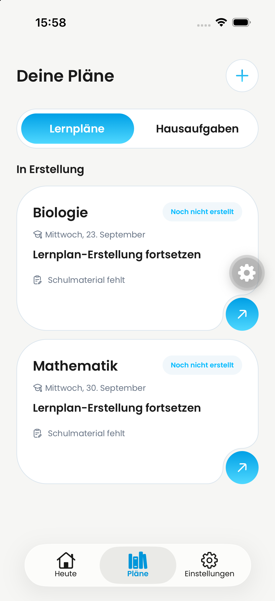

### iphone-15.58.49.png

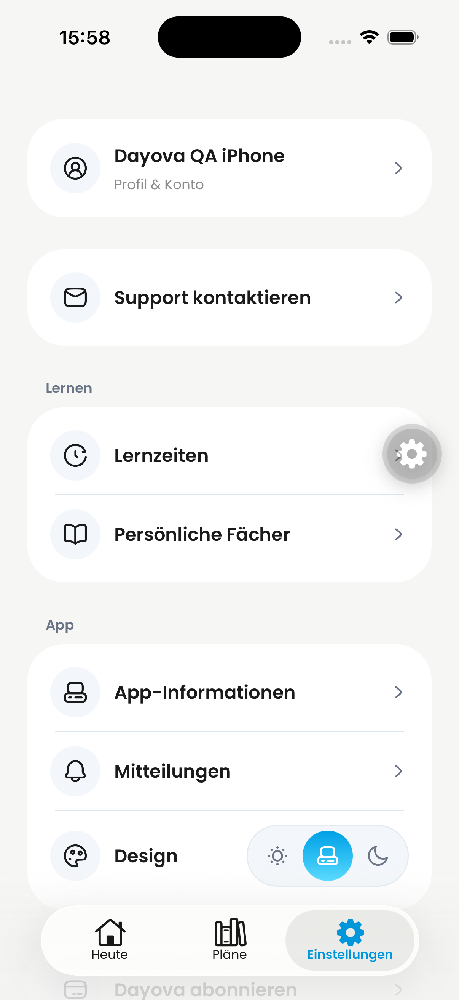

### iphone-15.58.56.png

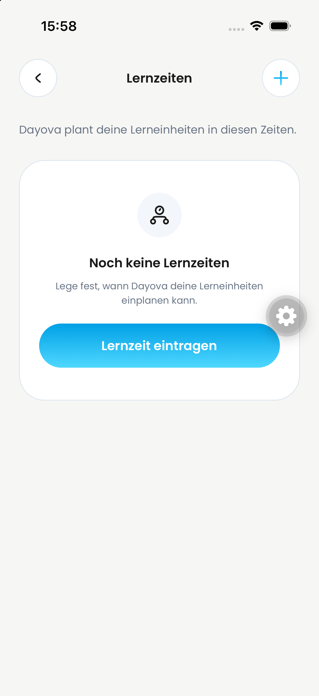

### iphone-15.58.59.png

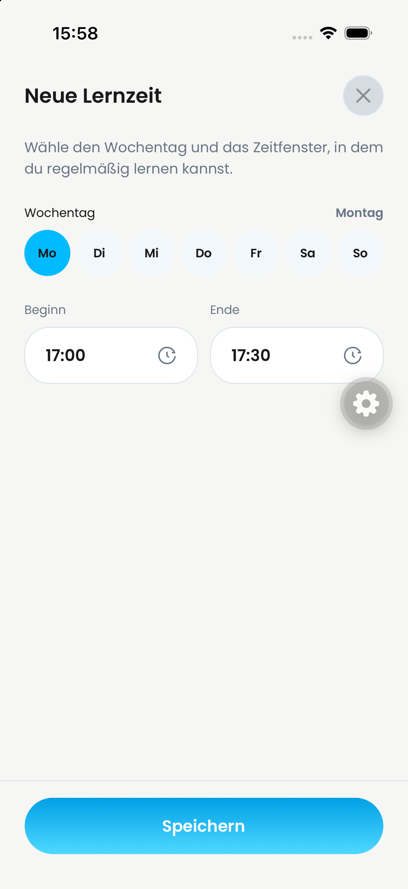

### iphone-15.59.04.png

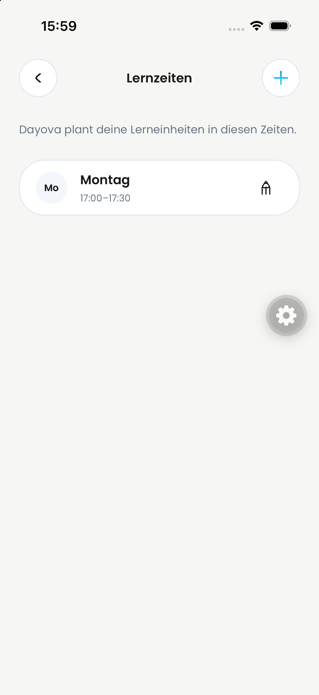

### iphone-15.59.06.png

### iphone-15.59.12.png

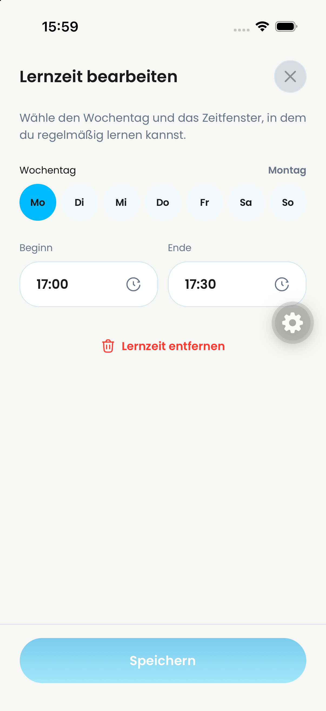

### iphone-15.59.19.png

### iphone-15.59.27.png

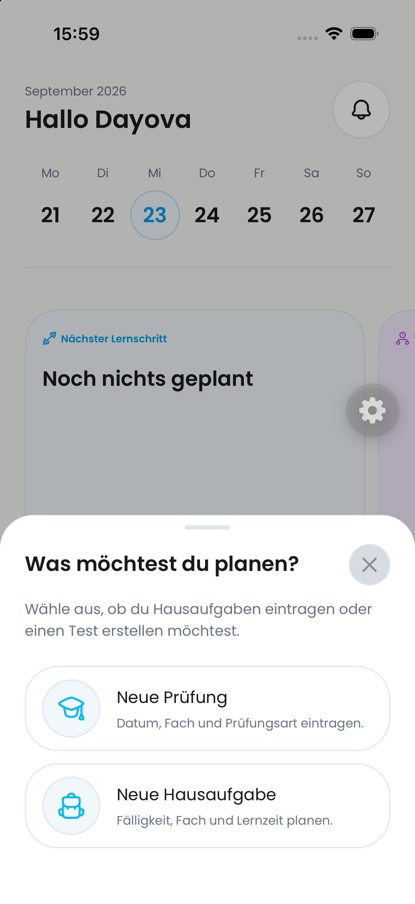

### iphone-15.59.39.png

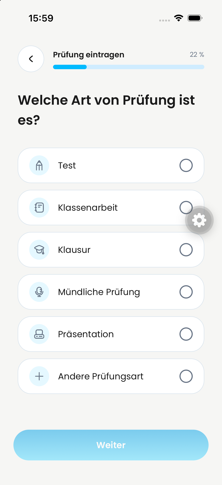
