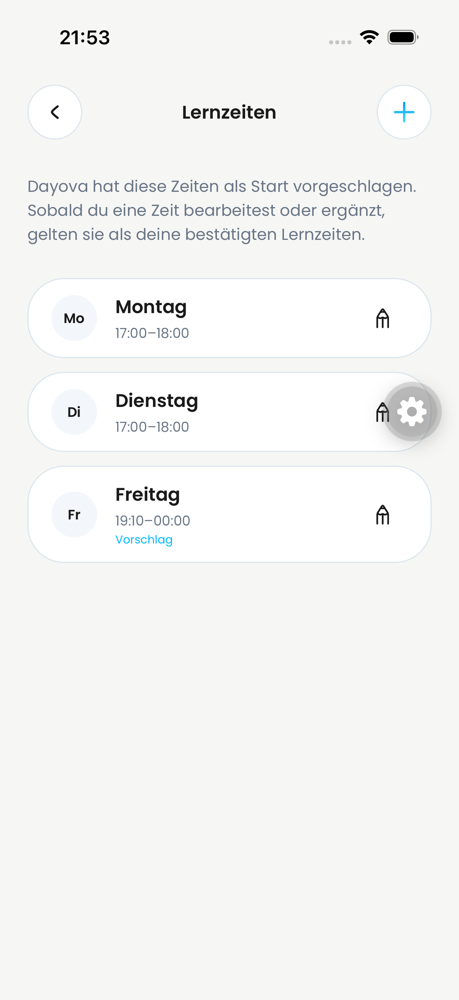
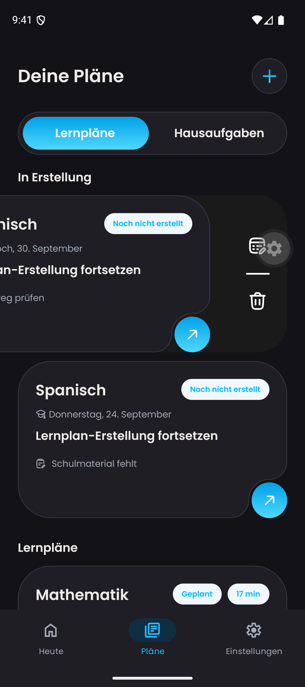
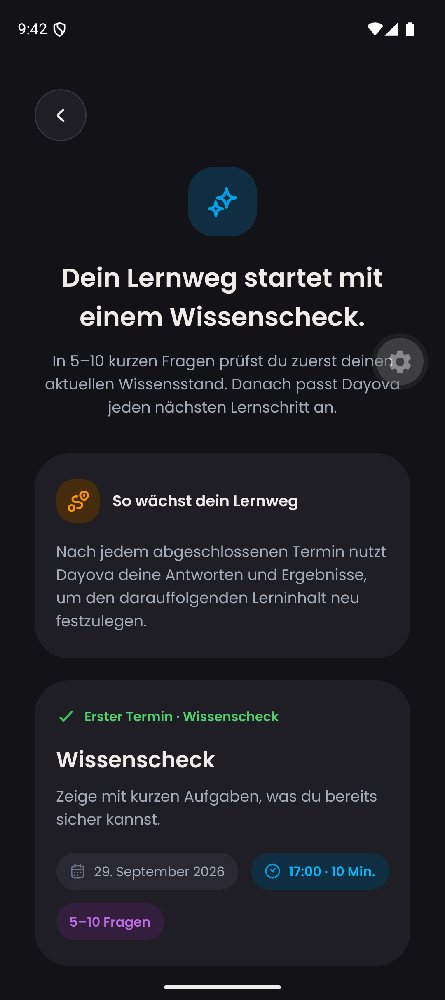
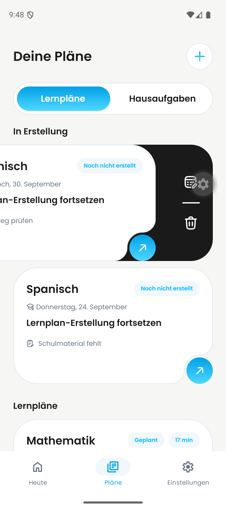
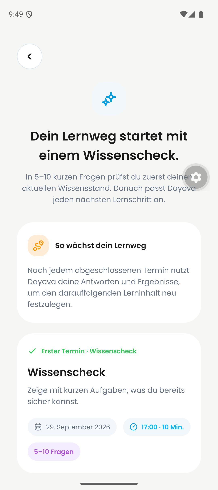

# Adaptive learning-time QA — 2026-09-25

## Observed regression

iPhone simulator (iOS 26.4), app commit `76f5bd4bd7f0b98f1298de0d6ec6341161f16986`, QA backend `dev:trustworthy-skunk-257`.

A designated grade-11 QA account has five **synthetic**, completed historical sessions over two weeks, plus two future sessions. These are controlled test data, not evidence of real multi-week usage. Existing diagnostic progress was not overwritten.

The Monday-only proposal displayed 17:00–18:00 → 18:00–19:00. Opening its impact preview incorrectly moved both Monday and Tuesday sessions into an available Friday window. A separate same-day exam correctly blocked applying the proposal. No change was accepted on the device.

## Correction and verification

- Preserve already-valid scheduled slots when calculating adaptive impact.
- Do not pull displaced sessions onto dates earlier than their original date.
- Reject an impact that would break ordering around retained sessions.
- Use the same bounded impact calculation when undoing an adaptive change, rather than rebuilding the calendar.
- Regression test runs the real preview, apply and undo mutations and checks that completed records are unchanged and both future dates/times are restored.
- 1,005 unit tests passed; TypeScript and targeted ESLint passed.
- Deployed only to the QA backend; no production release or merge.

## Initial native preview

Native preview rechecked after deploying backend commit `fb16fe6c`: exactly one change, Monday September 28, 17:00 → 18:00; Tuesday is no longer moved. Native successful apply/undo is **not yet passed**: the grade-11 account also contains a same-day exam conflict, so the device preview deliberately disables confirmation. Android acceptance is not claimed here. Screenshots establish the displayed previews, not successful mutation execution.

The paragraph above records the initial blocked run. The subsequent successful run below supersedes its apply/undo status.

## Successful iPhone apply and undo — 21:52–21:53 CEST

Same app commit and QA deployment as above. An internal, deployment-restricted, expiring QA helper moved only the designated QA account's Mathematics exam from September 25 to October 5 (including its linked calendar entry). This removes the independent deadline blocker without overwriting answers or sessions. The exam remains on October 5 for review; the helper can restore the September 25 conflict case.

1. Opened Home, selected `Zeiten übernehmen`, checked the impact sheet and selected `Änderungen übernehmen` in one native Maestro flow.
2. Learning times displayed Monday **18:00–19:00**, Tuesday **17:00–18:00**, and the unchanged Friday system default.
3. Opened the fixture plan, selected `Änderung rückgängig machen`, and verified Monday and Tuesday both **17:00–18:00** again.
4. Read the nine account-owned session records before apply, after apply and after undo. IDs, dates, start times, completion/execution state and start/outcome timestamps matched exactly at both checkpoints.

Important limitation: an earlier coordinate-based test accidentally started the synthetic Monday practice session. It was not reset. The successful native run therefore proves preference apply/undo and protection of started/completed work, **not a native reschedule of an untouched Monday session**. That pending-session change is covered by the initial native preview and automated regression test. The five historical observations are synthetic, not elapsed multi-week device usage.

Additional helper validation: seven fixture tests, TypeScript and targeted ESLint pass. No production deployment or OTA publication.

## Android swipe action spot-check (#719)

Pixel 9 emulator, Android 16/API 36, `com.dayova.dev`, combined QA app served from commit `76f5bd4bd7f0b98f1298de0d6ec6341161f16986`, podcasts excluded. Existing signed-in account; no synthetic adaptive data inserted into it.

In both dark and light themes, swiped the Italian learning-plan card and tapped its translated blue arrow. The arrow remained visible above the action panel without a drop shadow and opened the correct Italian diagnostic introduction. No delete action was invoked. A bounded latest-500-line ReactNativeJS/AndroidRuntime log check contained no warning/error/fatal match; this does not resolve every historical development warning.

Still not claimed: native adaptive apply/undo on Android, an action-only card variant without a production consumer, or full cross-platform acceptance of #651/#742 and the separate upload-size boundary matrix for #652/#656.
