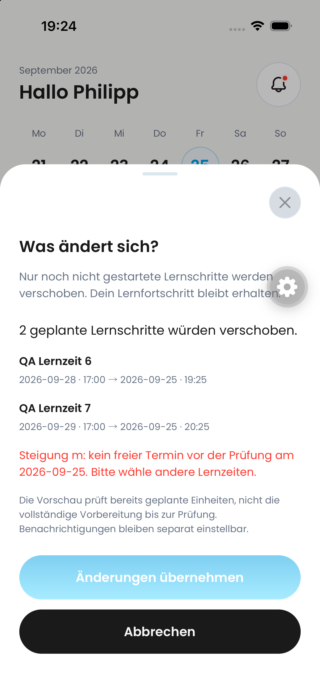
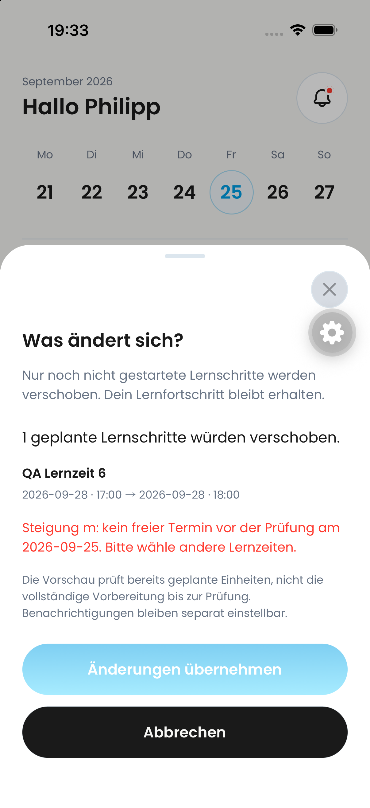

# Adaptive learning-time QA — 2026-09-25

## Observed regression

iPhone simulator (iOS 26.4), app commit `76f5bd4bd7f0b98f1298de0d6ec6341161f16986`, QA backend `dev:trustworthy-skunk-257`.

A designated grade-11 QA account has five **synthetic**, completed historical sessions over two weeks, plus two future sessions. These are controlled test data, not evidence of real multi-week usage. Existing diagnostic progress was not overwritten.

The Monday-only proposal displayed 17:00–18:00 → 18:00–19:00. Opening its impact preview incorrectly moved both Monday and Tuesday sessions into an available Friday window. A separate same-day exam correctly blocked applying the proposal. No change was accepted on the device.

## Correction and verification

- Preserve already-valid scheduled slots when calculating adaptive impact.
- Do not pull displaced sessions onto dates earlier than their original date.
- Reject an impact that would break ordering around retained sessions.
- Use the same bounded impact calculation when undoing an adaptive change, rather than rebuilding the calendar.
- Regression test runs the real preview, apply and undo mutations and checks that completed records are unchanged and both future dates/times are restored.
- 1,005 unit tests passed; TypeScript and targeted ESLint passed.
- Deployed only to the QA backend; no production release or merge.

## Remaining acceptance

Native preview rechecked after deploying backend commit `fb16fe6c`: exactly one change, Monday September 28, 17:00 → 18:00; Tuesday is no longer moved. Native successful apply/undo is **not yet passed**: the grade-11 account also contains a same-day exam conflict, so the device preview deliberately disables confirmation. Android acceptance is not claimed here. Screenshots establish the displayed previews, not successful mutation execution.

