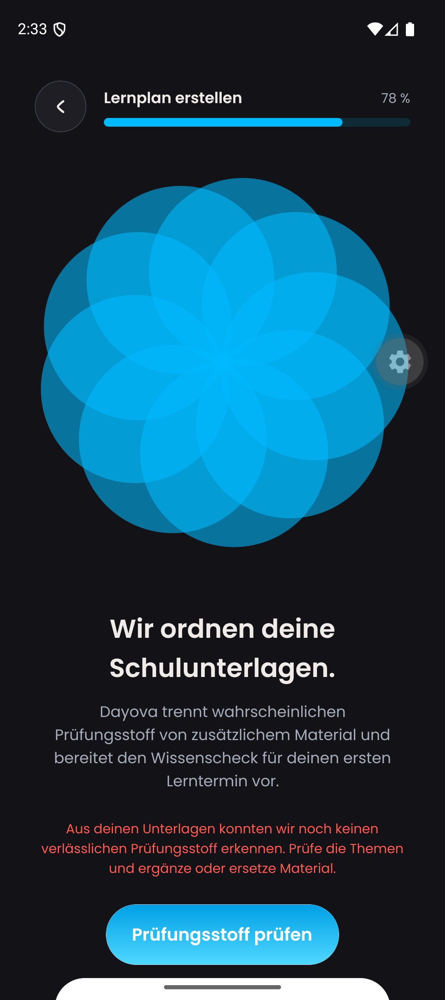
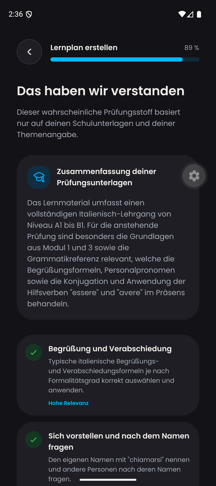
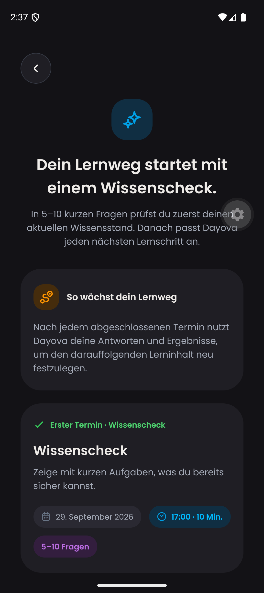

# DAY-403: metadata-heavy PDF memory regression

## Scope and build provenance

QA only, 2026-09-25. Frontend: `76f5bd4bd7f0b98f1298de0d6ec6341161f16986`
(combined simulator scope, excluding podcasts). Android: emulator-5554,
Pixel 9 / API 36, `com.dayova.dev`. Backend before: `724b63c3` (#748).
Backend after: the code in this PR, deployed to `dev:trustworthy-skunk-257`.
No production deployment, OTA, or merge was performed.

## Reproduction and fix

The uploaded Italian source PDF is 290,689 bytes / 52 pages. The exact-limit
fixture is a valid PDF containing the same lesson content with metadata padding
to **26,214,400 bytes**. This stresses metadata, not 25 MiB of lesson text.

Before: `learningPlanAi:generateKnowledgeQuestions` exhausted the 512 MiB action
budget (request `35d2785cf7820952`). The document remained processing and the UI
offered recovery rather than a usable scope. The local production-parser probe
peaked at 649,888 KiB RSS. The unpadded original peaked at 175,248 KiB.

Root cause: officeparser unconditionally reads the large PDF metadata dictionary,
which is not used by Dayova's text pipeline. A differential PDF.js probe peaked
at 618,144 KiB with `getMetadata()` versus 199,152 KiB without it.

PDF text now uses PDF.js directly, skips metadata and attachments, processes pages
sequentially, respects the existing text budget, and destroys resources even on
errors. Office formats retain officeparser. Empty/scanned or failed text extraction
retains the existing vision fallback. The 25 MiB upload limit is unchanged.
PDF.js is externalized for Convex so its worker and native runtime dependencies
remain available. The initial bundled deployment failed analysis; the corrected
externalized deployment succeeded.

## Validation

- Exact original 25 MiB fixture through the new helper: 86,450 characters,
  recognizable Italian text, peak **222,352 KiB RSS** (about 217 MiB).
- Committed real-parser regression generates a valid 25 MiB metadata-heavy PDF
  and checks extracted text plus peak RSS below 512 MiB in an isolated process.
- 991 unit tests / 144 files pass, including six new PDF tests.
- TypeScript, full lint, and diff whitespace checks pass.
- Android native recovery: reviewed the saved topics, advanced through existing
  uploads, regenerated scope, and confirmed the recognized Italian topics.
- Both original and exact-limit documents are `ready` in QA; no manual status
  patch, material deletion, or account reset was used.
- Scope/knowledge-question generation: request `a9a778e050f0b476`, 20.532 seconds,
  no error. Plan generation: `260e837cb01a445f`, 6.459 seconds, no error.
- Native result: Italian scope summary and generated first knowledge-check session.

## Visual evidence (click to enlarge)

| Before: blocked analysis | After: recognized scope | After: generated plan |
| --- | --- | --- |
|  |  |  |

These are still screenshots, not proof of the complete interaction timeline.
Before/after screen recordings for this fix and the distinct Dayova product-quality
review are still missing; keep this PR draft. This result does not certify all
possible PDF layouts, iOS PDF processing, grade 10/11 onboarding, adaptive consent,
or the remaining Android touch/display matrix.
