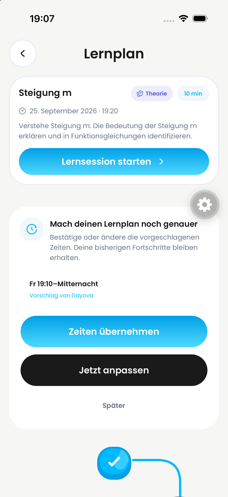
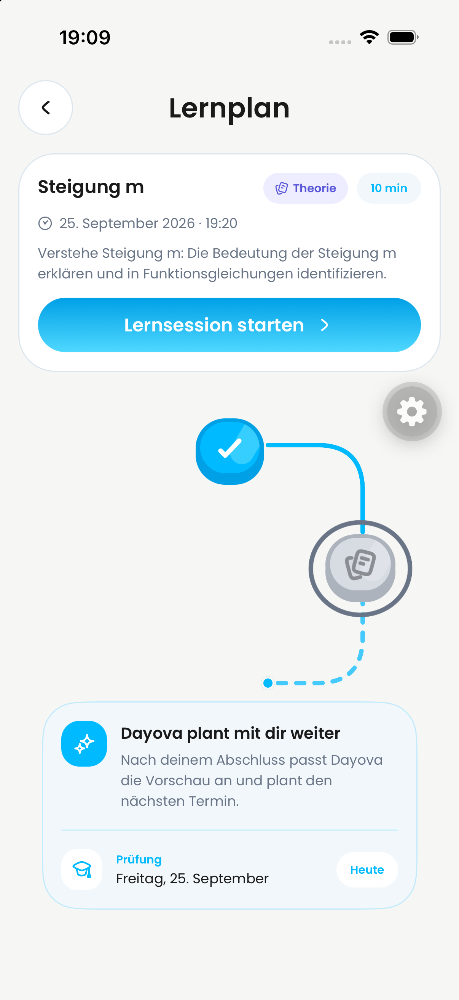
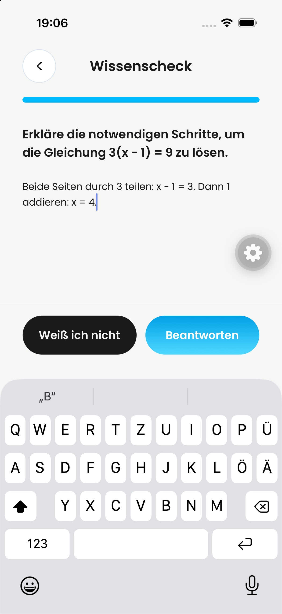
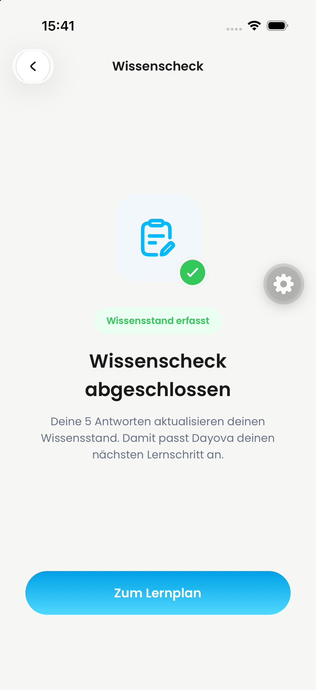
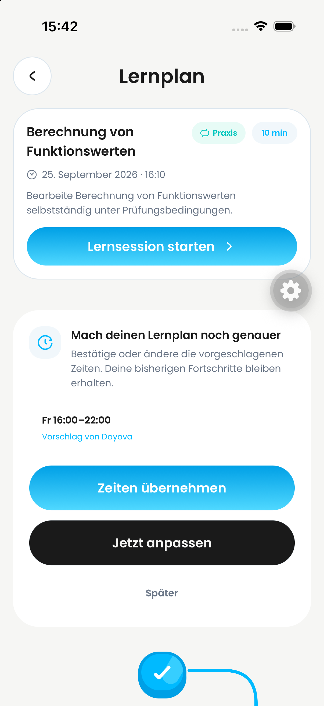
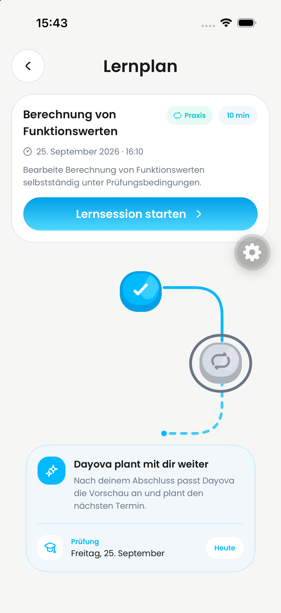
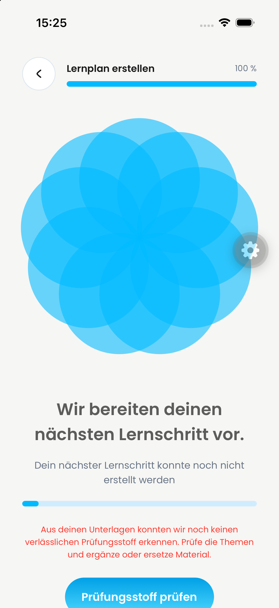
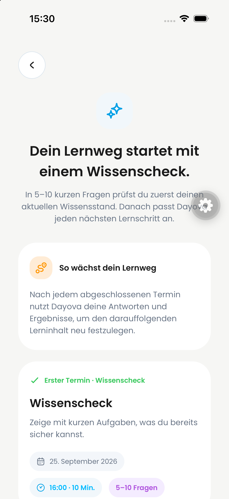

# Ten-minute learning-plan generation contract

## Defect and fix

The generation prompt permits ten-minute units and the scheduler supports them,
but the generated-plan schema required at least fifteen minutes. A real grade-10
QA response failed validation for two ten-minute sessions. The schema now uses
the existing `MIN_LEARNING_SLOT_MINUTES` constant; integer and upper-bound
validation remain unchanged.

## Verified replay

- Environment: QA `trustworthy-skunk-257`; no production deployment.
- Frontend: `76f5bd4bd7f0b98f1298de0d6ec6341161f16986`, iPhone simulator, iOS 26.4.
- Backend baseline: `104051152defb3eab2b857bcf3a4d80e2b478805`; replay includes this patch.
- Fresh grade-10 account; two synthetic gallery worksheets; exam date 2026-09-25.
- Failed request: `8950508c8b9e53fd`, schema rejected ten-minute durations.
- The existing Retry action succeeded with unchanged inputs and the same plan.
- Successful request: `e9d11d588f6e1102`, 8.118 seconds, no action error.
- Native review displayed a ten-minute diagnostic and a subsequent ten-minute unit.
- No account reset, manual plan patch, or learning-progress deletion was used.

The before screenshot shows the persisted failure state. The after screenshot
shows successful generation, not completion of the diagnostic or full adaptive QA.

## Automated validation

- Regression before fix: 1 failed, 7 passed (ten-minute acceptance failed).
- After fix: full unit suite, 149 files / 1,034 tests passed.
- TypeScript, Biome (576 files), ESLint and `git diff --check` passed.

## Evidence scope and remaining work

Original local recordings were sampled across their complete timelines: before
706.39 seconds / 80 frames, after 226.13 seconds / 80 frames. Sampling is not
frame-by-frame coverage. The after recording includes persisted failure, scope
review, an explicit Retry, and successful generation. Videos are not published
with this change. PNGs below are still-image evidence only.

This fix does not complete grade-11 QA, adaptive/reminder acceptance, Android
parity, or the separate product-quality review. Keep the PR draft until its
required review/evidence gates are met.

### Subsequent grade-10 diagnostic replay

The same plan completed all five diagnostic answers in the iPhone simulator.
The completion screen displayed “Wissenscheck abgeschlossen”. After returning
to the plan, the reminder displayed Friday 16:00–22:00 as “Vorschlag von Dayova”.
Choosing “Später” removed it without confirming the proposed hours; the plan
remained accessible with its completed diagnostic node. The backend persisted
`postDiagnosticLearningTimeReminderDismissedAt: 1790343769220`.
An additional terminate/launch and reopening the same plan preserved the completed
diagnostic and did not show the dismissed reminder again. This does not verify
adaptive consent behavior. The diagnostic segment was captured as still images,
not a recording.

### Fresh grade-11 replay (25 September, 18:50–19:09 CEST)

Same frontend commit and QA backend as above, with the duration fix deployed.
The backend also contains an internal QA fixture helper; it was not invoked for
this replay. No seeded observations or manual progress updates were used.

- Fresh grade-11 profile verified in the QA backend; registration completed by the user.
- First Mathematics/Test exam dated 25 September; no learning-time form in creation.
- Two synthetic gallery worksheets uploaded; both reached `processingStatus: ready`.
- AI scope summary and ten-minute diagnostic generated successfully.
- Proposed Friday 19:10–00:00 stored as `systemDefault`, not confirmed.
  The same-day start follows `max(defaultStart, roundUpToTenMinutes(now + 10))`;
  this run does not prove a future-day 16:00 start visually.
- All six diagnostic questions completed: one multiple-choice answer, four explicit
  unknown answers, and one typed explanation. The submit button remained above
  the visible native keyboard and submitted successfully without dismissing it.
- The post-diagnostic reminder displayed “Vorschlag von Dayova” and could be skipped.
  Dismissal persisted at `1790356086345`; the diagnostic remained completed.
- Terminate/launch and reopening the same plan did not show the reminder again;
  the completed node and next ten-minute theory session remained accessible.

Still-image evidence plus observed UI actions and read-only backend checks;
not a continuous recording or full #651/#742 adaptive acceptance. Android parity,
adaptive preview/consent/undo and the remaining PDF boundary matrix remain separate.

| Completed | Unconfirmed suggestion | After restart | Keyboard |
| --- | --- | --- | --- |
|  |  |  |  |

| Diagnostic completed | Reminder | Skipped |
| --- | --- | --- |
|  |  |  |

| Before | After |
| --- | --- |
|  |  |
