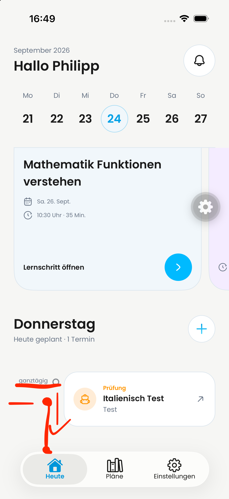
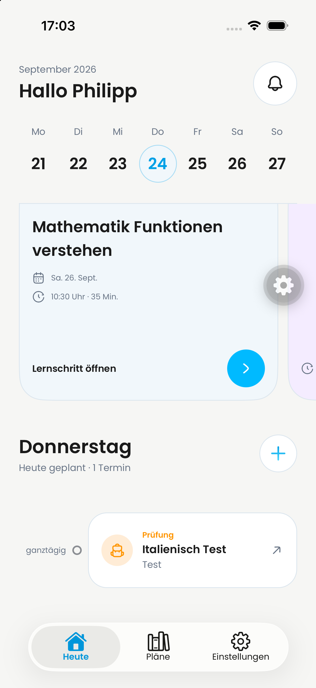
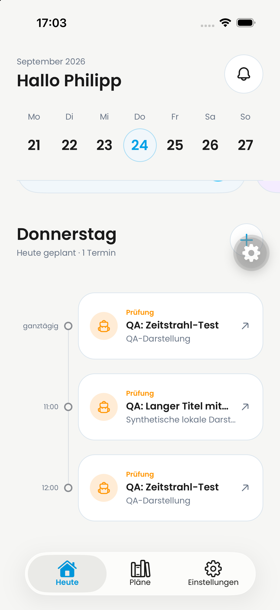
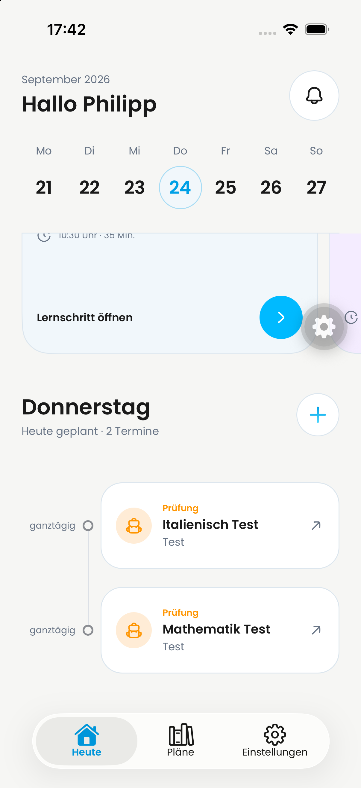

# DAY-471 — Agenda timeline alignment

[Linear issue](https://linear.app/dayova/issue/DAY-471)

## Decision brief

- Job: associate each agenda entry with its time and position in the day.
- Hierarchy: event card, corresponding time/point, quiet connecting rail.
- Primary action: existing card navigation; unchanged.
- Friction: top-aligned time/point visually separate from their card.
- Decision: center label and marker in the card-height row. Equal flex segments
  above/below the marker connect to a separate 20-point inter-row rail. First
  and last markers bound the line; a single item has no dangling line.

The existing Dayova typography, theme tokens, text scaling, status colors and
touch targets remain unchanged. Row height is content-driven; no measured or
fixed card height and no new dependency are introduced.

## Native evidence

| Before (user-provided iPhone) | After (same QA account, iPhone) |
| --- | --- |
|  |  |

iPhone QA simulator, iOS 26.4, Light mode, default text size. Single-item image
uses the real existing agenda. Three-item image uses a temporary **local
presentation fixture**: clone the first agenda item three times with distinct
render keys, label the items QA, and set displayed startMinutes to null, 660,
720. No backend records were created/changed. The header still says one item
because it reflects the real data, not this presentation fixture. Fixture code
was removed before final validation and commit; the simulator again shows real
entries. This demonstrates marker/label alignment and continuous connector
segments, not three real saved appointments or creation-flow acceptance.

The long fixture title is ellipsized by the unchanged event card, so this is
not proof of unequal-height cards or larger accessibility text. Android was at
the unauthenticated welcome screen; Android, iPad, Dark mode, enlarged text and
mixed school/learning-session card heights were not visually accepted here.

## Validation and review

### Additional reporter evidence — 24 September 2026, 17:42

Philipp provided this additional screenshot and confirmed the corrected timeline
formatting. Both all-day labels and circles are centered against their respective
exam cards. A continuous vertical connector spans the gap, bounded by the first
and last circles. Unlike the earlier three-item fixture, this is the reporter's
two-entry app view. Exact build SHA was not supplied with this image. It adds
iPhone Light-mode visual evidence, not Android/iPad/Dark/large-text coverage or
proof of production deployment.

- Changed-file Biome: pass.
- TypeScript noEmit: pass.
- Dashboard Jest: 4 suites / 17 tests pass.
- Dashboard Vitest: 3 files / 19 tests pass.
- Existing mocked tests do not verify native geometry; the screenshots above
  provide the tested layout evidence. No new class-string-only test is presented
  as geometric proof.
- Self-review: symmetric rail segments place the circle at half the row height;
  inter-row spacing is outside that height and bridged at the same x coordinate.
  Empty-day behavior, first/last conditions, card actions and colors preserved.

Stacked on popup follow-up #729 at b931720f. This preserves the combined QA
scope and excludes podcasts #717. No production OTA, backend deployment or
merge is part of this follow-up. Remaining platform acceptance stays explicit.
