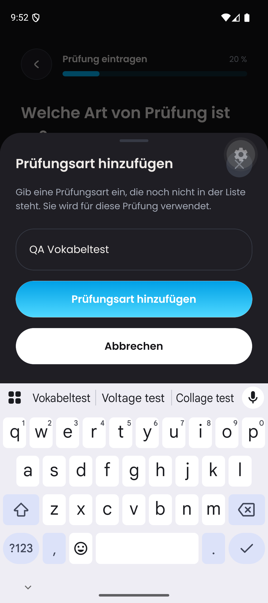
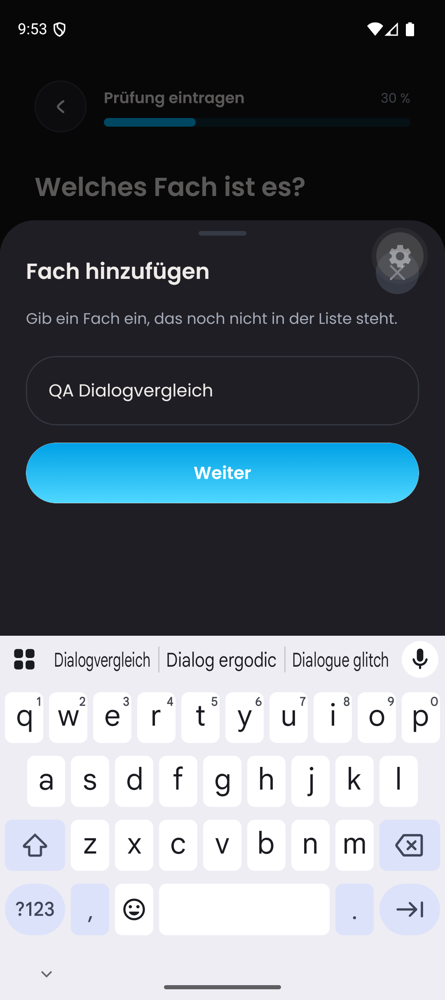

# DAY-187 keyboard regression

## Current integration status — 26 September 2026

Commit `53a3638d` integrates `main` at `165e1da1` and resolves the PR's merge conflicts. Main's dynamic sheet sizing, footer handling, accessibility behavior and navigation guards are retained; the keyboard-aware input provider and top safe-area inset are retained from this PR. Obsolete fixed-size props were removed from the subject and exam-type dialogs.

Validation on this integration: 907 Vitest tests and 306 Jest tests (71 suites) passed; TypeScript, targeted ESLint and diff checks passed. The screenshots below document the earlier explicitly identified source, **not** a native replay of `53a3638d`. A native replay of the merged dynamic-sizing implementation remains required before declaring device acceptance complete.

## Historical native verification

Base: PR #655, `6dbd96107f8a804e6764b3581d57adbcc03f9a8f`.
Environment: iOS 26.4 simulator `47731F12-CE91-4857-8F3A-799040A0DCA3`, existing development client `de.dayova.app-dev`, light appearance, dedicated Metro port 8091.

## Cause and change

Ordinary React Native inputs did not register their focus with Gorhom. The shared sheet now supplies the keyboard-aware input primitive through context while retaining the shared field styling and normal inputs outside sheets. The component identities are module-level constants; the narrowly documented compiler-lint exception does not introduce components during render.

Both creation dialogs use the existing medium scrollable size: content-height sizing did not account for the complete scrollable dialog and left the cancel action below the visible area.

## Observed regression

On the unmodified base, the exam-type input bounds were `[45,754][357,778]`, below the keyboard top (approximately 535 points). After keyboard registration, the same input was `[45,419][357,443]`. Native accessibility `assertVisible` alone incorrectly passed the original broken layout, so screenshots and geometry are required as well.

Original screenshots are unedited. This is simulator evidence, not physical-device acceptance. Full upload/AI QA is separate; a minimal Vertex connectivity probe passed after the owner authorized continued use of the existing QA credential. The credential exposure remains unresolved.

## Final verification

- Maestro `dialog-comparison.yaml`: passed on the changed source with a freshly restarted Metro bundle. Exam dialog: input, scroll to Cancel, dismissal, enabled Continue, advance to subject selection. Subject dialog: input, close via X, dismissal, enabled Continue. No exam or permanent subject was saved. The initial subject input stage intentionally has no Cancel text button, so the test uses its close control.
- Full Jest suite after keyboard integration: 286 tests / 67 suites passed. Following the final dialog-size and safe-area adjustments: 18 focused tests passed again.
- TypeScript, targeted ESLint/Biome, and `git diff --check`: passed.
- No physical-device notification, enlarged-text or AI-flow acceptance is claimed.
- The final source uses `topInset` to preserve the status-bar safe area when the keyboard expands the sheet.

## Android verification — 25 September 2026

Source: `2fc14c8fa7a23e92bbeb152046c7c4fde0da564b`, dedicated Metro 8091, existing `com.dayova.dev` client, Android 16 / API 36 emulator, dark appearance, existing QA account. No backend deployment.

- Standard Gboard was displayed after disabling emulator stylus handwriting temporarily. Both fields and the exam Cancel action are above the keyboard in the original screenshots below.
- Exam: typed synthetic text, cancelled, retained enabled Continue, advanced to subject selection.
- Subject: typed synthetic text. The first close attempt hit the overlapping development-menu launcher, so the full run's final assertion failed. After dismissing that launcher, a separate close replay passed: dialog absent and Continue enabled. This is a qualified replay, not an uninterrupted full-run pass.
- Earlier runs with only a narrow handwriting toolbar passed functional assertions but are not evidence of full-keyboard geometry.
- No custom subject or exam was saved by these dialog checks. Physical devices, light appearance and enlarged text are not covered by this Android run.

| Exam type, standard keyboard | Subject, standard keyboard |
| --- | --- |
|  |  |

The PNG originals are unedited and open at full resolution when clicked. `android-dialog-comparison.yaml` records the main test flow.
