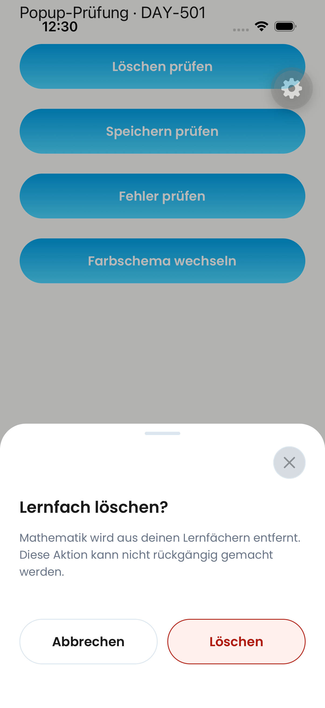
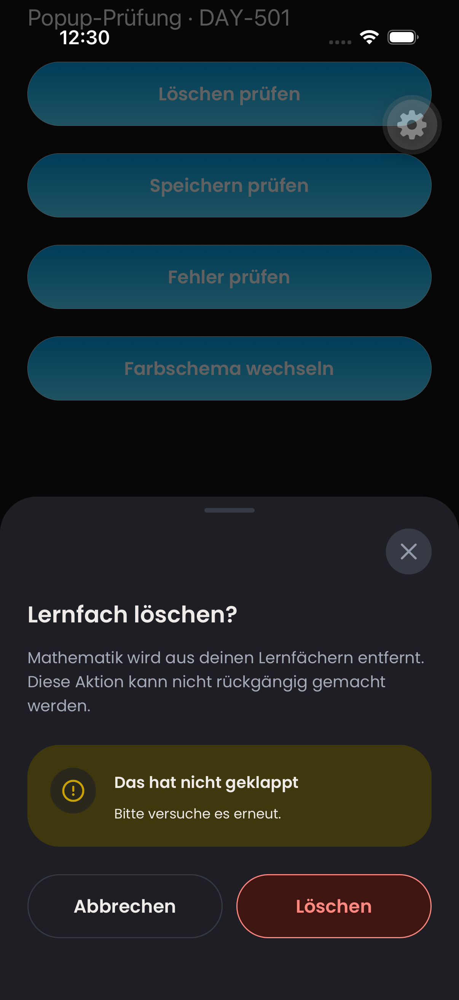
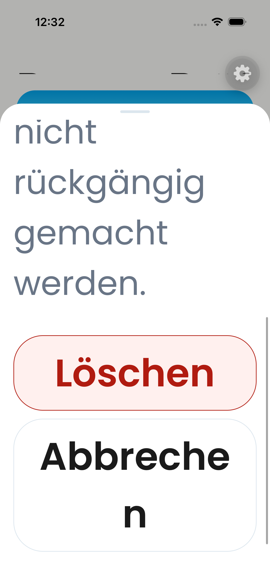
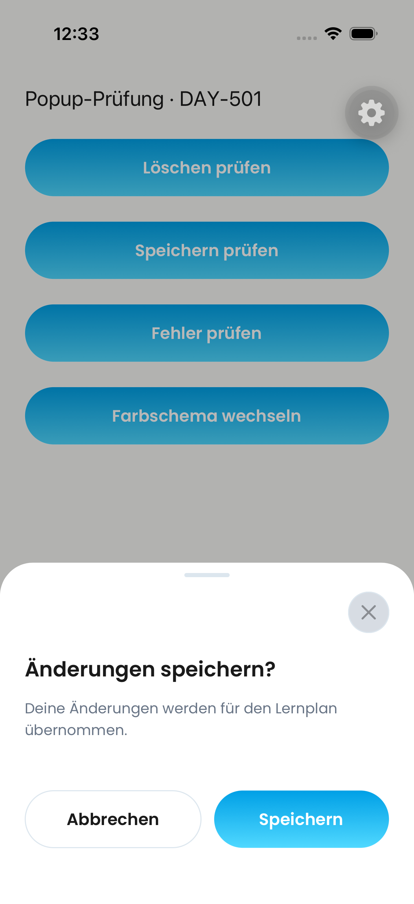

# DAY-501 — General popup and destructive-action rule

The new branch generalizes #727 on main `1fadb77b`, using the existing personal-subject and learning-time destructive/cancel appearance. The shared rule lives in [design-system context](../contexts/design-system/CONTEXT.md#general-popup-and-destructive-action-rule) and [sheet guidance](../bottom-sheets.md).

## Scope audit

`DayovaSheetFrame` is the only production `BottomSheetModal` renderer. A source audit found 27 production files using that frame or its `ActionSheet`, `SelectSheet`, and `ConfirmationSheet` wrappers. Coverage includes creation/source selection, subjects, learning times, learning plans/materials, timetable, entry editing, profile/account, subscription management, notifications, analytics, privacy/AI consent, support, release notes, onboarding selection, and date/time pickers. The common frame change reaches all these callers; this is not a claim that every individual route was visually exercised.

Text delete actions now share semantic danger tokens, including entry deletion, session removal, profile account deletion and subscription-management account deletion. Existing subject/time outlined variants remain compatible. Compact swipe-trash rails and inline remove controls remain compact; native OS chrome remains platform-owned. No deletion, upload, auth or backend logic changed.

## Validation

- Complete UI suite: 88 suites, 450 tests passed.
- TypeScript `tsc --noEmit`: passed.
- ESLint for changed TypeScript files and Biome checks: passed.
- Theme CSS and selection-contrast suites: 8 tests passed.
- Independent Standards and Spec reviews: initial documentation/spacing findings corrected in `607e9ba3`; both rechecks report no remaining findings.
- Native screenshots: existing iOS 26.4 iPhone simulator, actual shared components rendered in a temporary isolated gallery with no backend mutations. The gallery is not shipped. Normal delete/cancel, primary/cancel, and dark error states were exercised; cancel dismissal succeeded. These are component render proofs, not end-to-end account or data-deletion tests.
- Android runtime inspection was unavailable in this environment; no Android visual certification is claimed. Screen-reader focus/keyboard/dismissal coverage is automated, not a live VoiceOver certification.

## Native evidence

### Delete / cancel — light

### Error — dark

### Maximum Dynamic Type — reachable actions

At `accessibility-extra-extra-extra-large`, the description scrolls and actions stack. All action text remains present (including a wrapped Cancel label); Maestro scrolled to the actions and successfully dismissed through Cancel. The simulator was restored to its original `large` content size afterward.

### Primary action remains primary

## #729 compatibility and integration audit — 7 October 2026

Compared the live incremental diff of #729 (base #727) and its two historical
consumer patches at `ed712854` against current main `1fadb77b` and #841.
Main has not moved since the #841 implementation. No additional product-code
change is needed: #841 completes the remaining shared integration.

| Requirement from #729 | Current implementation / destination |
| --- | --- |
| Shared bordered card-surface Cancel with normal theme text | Already on main in `button.tsx`; #841 applies it to all `ConfirmationSheet` and embedded confirmation actions. |
| Light danger `#B01B10` on `#FFF0EE`, unchanged dark palette | Already on main in `design-system.ts` / `global.css`; #841 reuses these tokens. |
| At least 4.5:1 danger text contrast at rest and 80% opacity over surface/background, both themes | Already covered by main’s `theme-css.test.ts`; rerun with #841. |
| Shared icon-free outlined destructive text buttons | #841 makes the default destructive variant match the existing outlined subject/time variant. |
| Deferred personal-subject swipe delete and subject-picker Cancel patch | Already active on main in `personal-subjects.tsx` and `subject-picker.tsx`; uses shared outlined delete / cancel. No old patch replay needed. |
| Deferred weekly-learning-time swipe patch | Already active on main in `weekly-learning-times.tsx`; shared outlined text delete and current disabled guard retained. |
| Button appearance regression checks | Covered by #841’s `subject-action-appearance.ui.test.tsx`, including shared confirmation actions, primary preservation and busy/error behavior. |

The 800-series integration point is **#841 for both #727 and #729**. It is based
on main, not on the historical stack/QA branch. Do not merge the old stack on top
of #841: compare this coverage before retiring it. Neither old PR is closed by
this audit. Existing native #841 screenshots remain applicable because this
follow-up changes documentation only; it does not claim new device evidence.
Targeted rerun: 26 UI tests across three suites and 8 theme/contrast tests passed.
