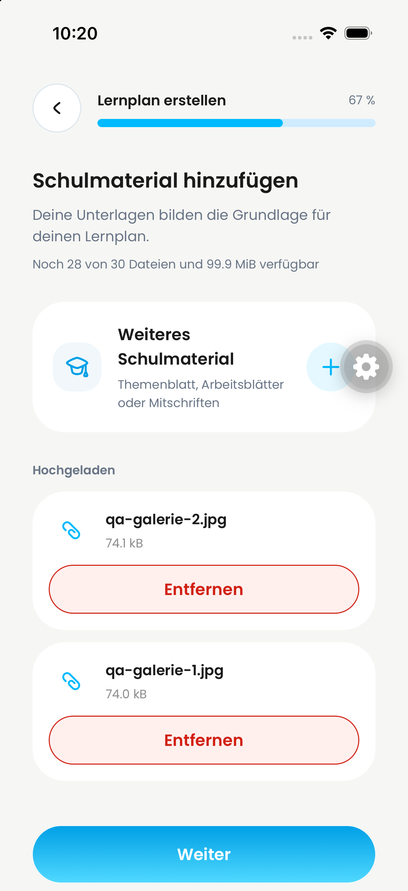
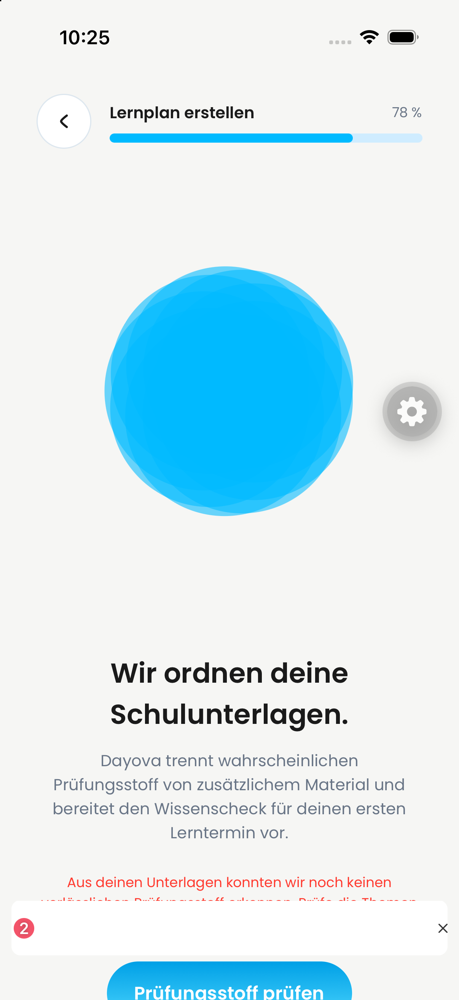
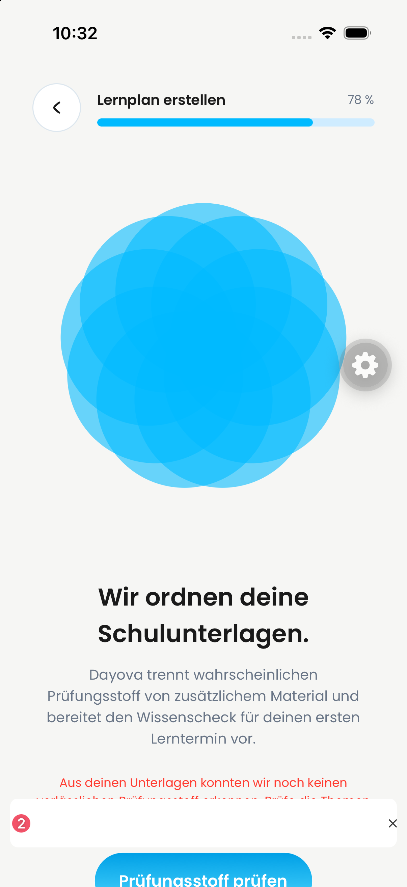

# Gallery-to-diagnostic QA — 2026-09-25

## Scope and observed defect

- iPhone simulator, iOS 26.4, development client build 1.
- Shared combined app source `ecf4675c`, Metro 8088; podcast #717 excluded.
- QA backend only: `trustworthy-skunk-257`. No production release.
- User explicitly approved uploading and processing two synthetic linear-function worksheets.
- Native gallery multi-selection and upload succeeded: `qa-galerie-1.jpg` and `qa-galerie-2.jpg`.
- Two diagnostic attempts failed. Correcting the topic description to match the worksheets did not resolve the failure.
- Trace `a5d8f33054db7917` reported structured-output validation errors at
  `topics[1].keywords[1]` and `topics[2].keywords[1]`: minimum string length 2.
  The material was recognized as linear functions; the generic material-recovery message was not proof of unreadable images.

## Fix and validation

Allow non-empty, trimmed one-character subject keywords, including mathematical symbols.
The regression fixture uses the real diagnostic schema, not a replacement mock.
Before the fix: 5 failures (four valid symbols rejected; whitespace incorrectly accepted).
After the fix: 35 tests across output/content/scheduling passed; TypeScript and Biome passed.
The fix was deployed to the development QA backend for native retesting.

## Native retest: another blocker remains

The same two uploaded worksheets were retried after deployment. Request
`aa73d6787d6cff5d` no longer reported keyword-length violations, but failed at
`topics[5].id`: the generated identifier did not match the required ASCII slug
pattern. The app again displayed the generic material-recovery message.
**End-to-end acceptance remains failed.** This patch deliberately does not weaken
the topic-ID contract or claim successful plan generation. Next: cover malformed
structured output with a bounded recovery test and rerun the native pipeline.

This does **not** yet certify the full #651/#742 flow, Android AI processing,
fresh-account onboarding, physical notification delivery, or #656's 25 MiB boundary.

## Original PNG evidence

Clickable previews are intentionally limited to 180 pixels; full-resolution originals are preserved.

| Gallery upload succeeded | Before: analysis blocked |
| --- | --- |
|  |  |

These are still images, not evidence of unrecorded temporal behavior or isolated PR builds.

After the keyword fix, still blocked by the separate topic-ID error:

