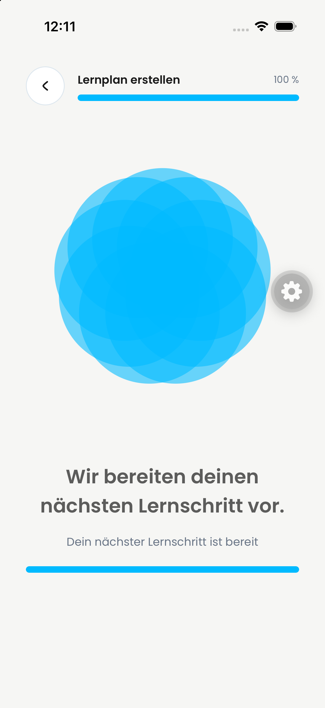
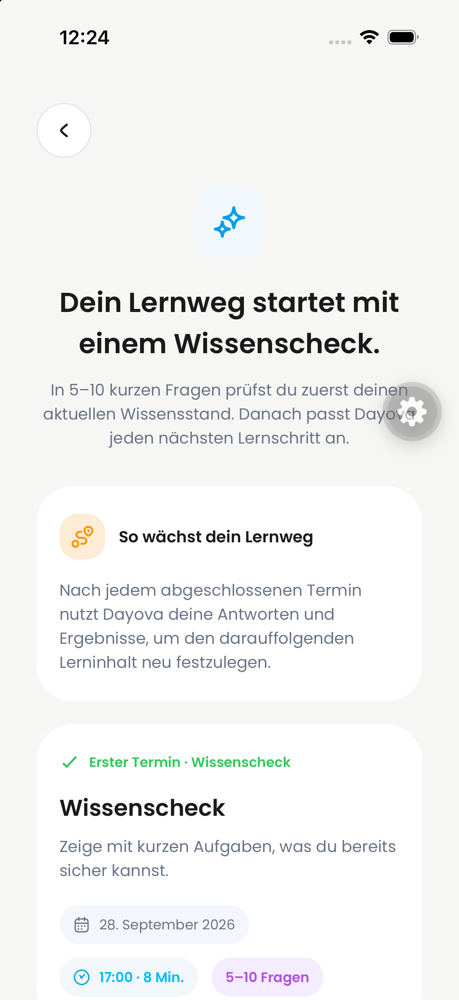
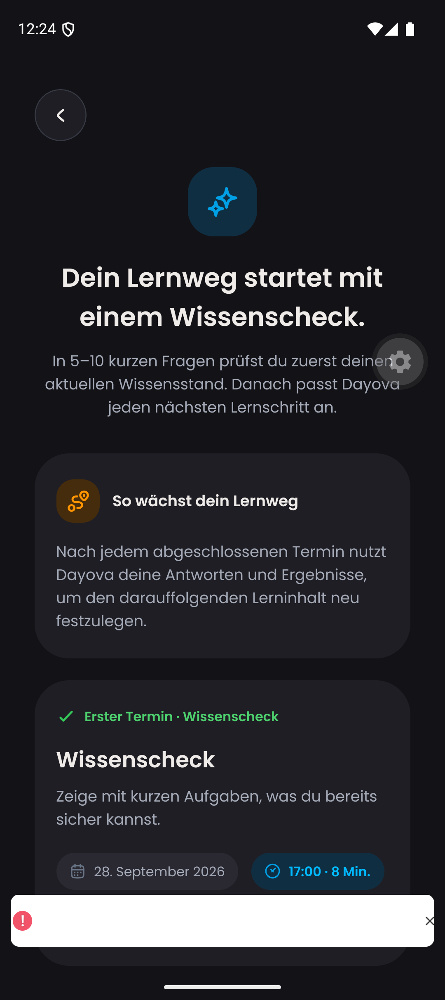

# Generated-plan navigation — 25 September 2026

## Scope and provenance

Shared QA baseline: `bc2fb674` / application baseline `ecf4675c`, preserving
the #744 scope and excluding podcasts #717. Backend: QA
`trustworthy-skunk-257`, existing #745 deployment. No production changes.

iPhone: Dayova Jakob Review iPhone, iOS 26.4, `de.dayova.app-dev`, light mode.
Android: Dayova Pixel 9, Android 16/API 36, `com.dayova.dev`, dark mode.
Both use Metro 8088. Screenshots are original PNGs with 180px previews.

## Reproduction and result

After confirming the already analysed synthetic mathematics worksheets, the
plan reached backend status `generated`, but the creation screen stayed at 100%
with “Dein nächster Lernschritt ist bereit”. The Maestro assertion that the
preparation screen was absent failed before correction.

The native back-removal guard was still active during the transition out of
the creation stack. Releasing it when the plan is generated allows the review
screen to open. A separate navigation prerequisite defect is also covered:
already generated plans must not wait for learning-time rows/loading, and must
not initialize new defaults. New generation retains its existing prerequisite.

Correction to the initial investigation: the empty `learningTimes` table was
not the table used by the application. The actual table is `userLearningTimes`
and contains confirmed rows. Missing times were **not** established as the
cause of this native reproduction.

After the guard correction, the same existing plan's generation route was opened
on both devices. Both reached “Dein Lernweg startet mit einem Wissenscheck”.
The previously failing iPhone Maestro assertion passed. No plan was regenerated
for this replay. Captured about 12:24 Europe/Berlin on 25 September.

| iPhone before | iPhone after | Android after |
| --- | --- | --- |
|  |  |  |

## Validation and limits

- Component regression covers completed plans with empty/loading learning times
  and unfinished plans waiting for times; native guard tests also run.
- Two routing assertions were red before the first fix; the native replay
  remained red until the completed-plan guard was released.
- Android displayed a development warning during startup: React state update on
  a component that has not mounted. It is visible in the screenshot and remains
  unresolved; navigation success is not a clean full Android acceptance.
- No completed Wissenscheck, post-diagnostic reminder, fresh-account defaults,
  adaptive scheduling acceptance, or PDF boundary acceptance is claimed here.
- These are still images plus test assertions, not video evidence.

## Active simulator runtime

Metro 8088 currently runs from `/private/tmp/dayova-generated-plan-navigation`
on branch `codex/generated-plan-navigation-20260925`, not an isolated old PR.
It includes the entire shared QA baseline plus this navigation correction.
