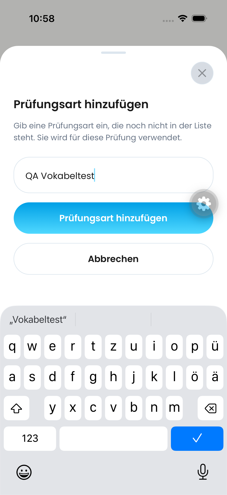
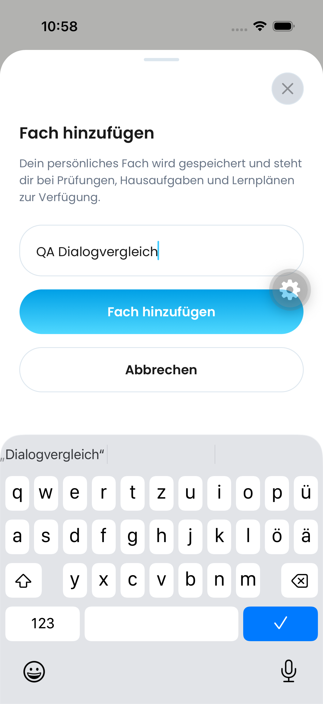
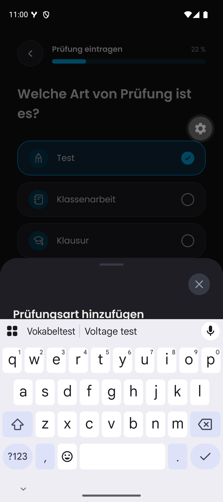
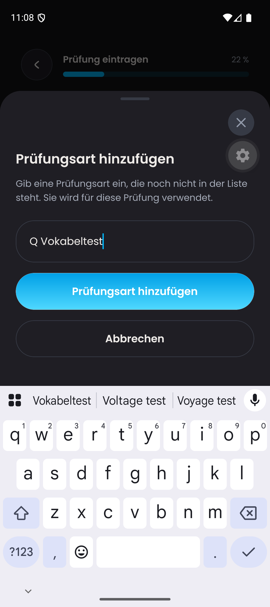
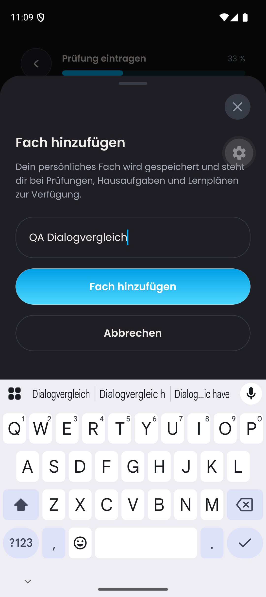
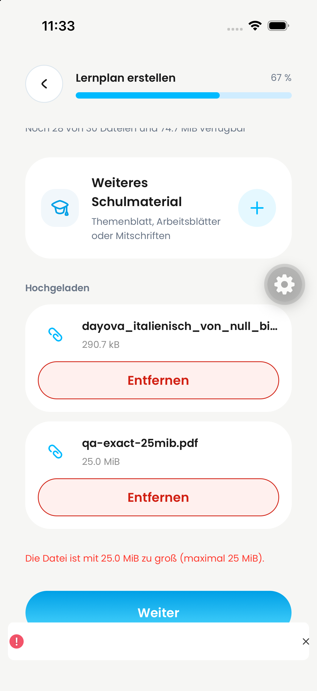
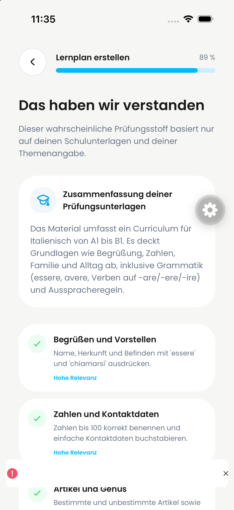

# Combined simulator integration — 26 September 2026

## Provenance and scope

- Baseline: `76f5bd4bd7f0b98f1298de0d6ec6341161f16986` (PR #747, existing combined simulator scope).
- Integrated PR #655 at `4d3a251062f446bf54524a2daade484638f5c82b`, including main `165e1da1`, in `70aa222c`.
- Integrated PR #758 at `d0ba79ac`, including the PDF and generated-plan fixes, in `ea444fd49c2ab700d1352557f846e207209b30da`.
- No podcast feature was added. Existing combined UI changes, cancel styling and subject-input behavior are retained.
- Both existing development clients use Metro `http://127.0.0.1:8092`; Android forwards port 8092 with adb reverse. Node runs with `--dns-result-order=ipv4first` so localhost binds IPv4.
- Backend: **dev `trustworthy-skunk-257`**, successfully deployed at 10:50 CEST. Production was not deployed. `NOTION_CRM_MODE` is unset and defaults to off; no CRM live delivery was enabled.

## Integration validation

- Before merging the later PDF/adaptive commits: 1,077 Vitest tests / 150 files and 414 Jest tests / 89 suites passed.
- After that merge: TypeScript and full ESLint passed; 39 focused adaptive/PDF tests / 6 files passed.
- CRM cleanup tests now exercise the internal data-deletion stage from #661 rather than the removed public batch entry point. This does not bypass or claim verification of external account revocation.

## Native dialog replay

Source `ea444fd`, iOS 26.4 simulator `47731F12-CE91-4857-8F3A-799040A0DCA3`, existing `de.dayova.app-dev` client, light appearance, QA account.

The iOS Maestro flow passed: select Test, open exam-type dialog, type synthetic text, cancel, retain enabled Continue, advance to subject, select Mathematics, open subject dialog, type synthetic text, close and retain enabled Continue. No permanent subject or exam was saved. Both screenshots were visually inspected: input and actions are above the full keyboard. The development-tool overlay is visible; originals are unedited.

| iOS exam type | iOS subject |
| --- | --- |
|  |  |

Android API 36, existing `com.dayova.dev` client, dark appearance: the initial functional flow passed, but displayed a narrow handwriting toolbar. Those initial captures are not full-keyboard geometry evidence. A standard-keyboard replay is recorded separately below when complete.

### Android full-keyboard regression and repair

With the full Gboard keyboard enabled, the same flow failed repeatedly: the input and Cancel action were covered. Restarting the client and substituting the explicit sheet input did not repair it; that input substitution was reverted. Gorhom's Android `adjustResize` branch skips its interactive keyboard offset. Using `adjustPan` restores that offset in this edge-to-edge client. The unchanged full Maestro flow then passed at 11:08–11:09 CEST, including cancellation and preserved selection for both dialogs. The component regression test pins the configuration; only the native replay establishes geometry.

The captures below compare `ea444fd` before the fix with that source plus the one-setting keyboard fix. They are not an isolated replay of PR #655. The keyboard setting `stylus_handwriting_enabled` was temporarily set to `0` to expose the full keyboard.

| Android before | Android exam type after | Android subject after |
| --- | --- | --- |
|  |  |  |

29 focused UI tests passed after the repair (sheet frame, exam flow, subject picker).

## iPhone PDF boundary replay — 11:29–11:35 CEST

Combined frontend `e0b84149`, same QA backend and existing grade-11 account. A new, explicitly QA-labelled draft was created natively (ID `k175q3bvcztjts1kfytsavycgh8f4cy6`). Existing accepted plans/progress were not reset. The draft uses the Mathematics preset with an explicit Italian PDF-import test topic; this checks upload mechanics, not subject/content consistency.

- Native Files picker selected the user's original PDF (290,689 bytes) and the metadata-padded exact-limit PDF (26,214,400 bytes). Both were registered and reached `ready`.
- A separate native selection of 26,214,401 bytes was rejected with the inline maximum-size error. A read-only account-scoped backend query still returned only the two accepted documents; neither was removed or reset.
- The exact-limit fixture contains the same 52-page Italian content with metadata padding, not 25 MiB of lesson text.
- Native Continue produced the visible Italian A1–B1 material summary and recognized topics. This demonstrates the upload-to-AI-analysis path. Plan/diagnostic completion is not implied by the analysis screenshot.
- Confirming the scope then generated the first diagnostic (eight minutes, `notStarted`, content `ready`) and a provisional next step. The diagnostic was not answered in this PDF-only replay.
- The white warning overlay is development LogBox from the deliberately rejected oversized file, not a blank application validation message. The actual red inline validation message is visible below the files.
- An initial script used the visual upload heading rather than the accessible action label; those failed locator attempts are not product failures. The topic-step keyboard partially obscured Continue; the native flow eventually advanced after scrolling/tapping, so a clean full-keyboard regression claim for that screen is not made.
- Android's temporary handwriting setting was restored to its original unset value after the dialog test.

| iPhone size rejection, valid files retained | iPhone AI analysis |
| --- | --- |
|  |  |

## Explicit limits

This is combined-build evidence, not an isolated replay of every constituent PR head. Earlier aborted attempts opened the development-client home or an unintended homework route; they are not counted as passes. Fresh before/after recordings and the distinct product-quality review are not yet available for this integration, so it remains Draft. Only-today adjustments and real notification cancellation/rescheduling are separate remaining acceptance cases; these replays do not close them.
