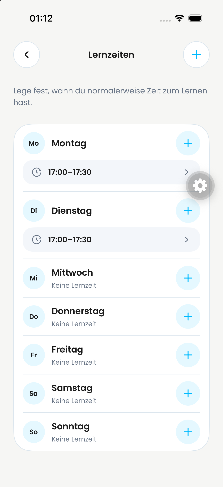
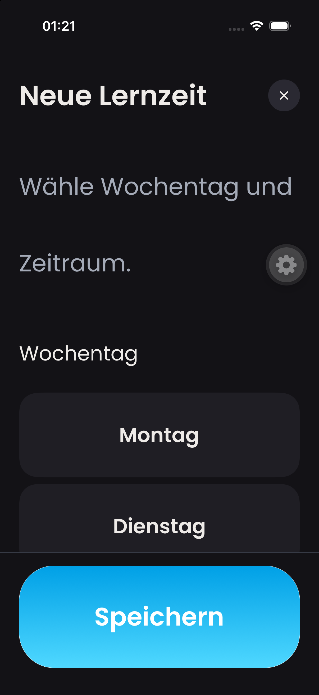

# Lernzeiten in Einstellungen – UI-Review

## Aufgabe und Entscheidung

Schüler sollen ihre regelmäßigen verfügbaren Zeitfenster schnell überblicken und gezielt einen Tag bearbeiten können. Die bisher sieben großen Einzelkarten sind dafür visuell zu schwer. Die Woche erscheint als eine zusammenhängende Liste mit Trennlinien; jede Zeile behält ihre eigene Hinzufügen-Aktion und vorhandene Zeitfenster bleiben direkt bearbeitbar.

- Ohne Lernzeiten erscheint eine ruhige Startkarte mit genau einer Aktion „Lernzeit hinzufügen“ statt sieben leeren Wochentagen und einer zweiten Kopf-Aktion.
- Bei vorhandenen Lernzeiten bleibt das Plus im Seitenkopf; Wochentags-Plus und Bearbeiten-Pfeil sind weiterhin taggenau.
- Der Editor nennt nur die Entscheidung „Wochentag und Zeitraum“. Bei großer Schrift werden Tagesauswahl und Zeitfelder gestapelt; die Schaltfläche bleibt vollständig lesbar. Die ausgewählte Option verwendet den semantischen Primär-Kontrast.
- Bestehende Zeitwahl, Validierung, Speichern, Löschen und Rücknavigation bleiben unverändert.

## Sichtbare Zustände

Laden, leerer und gefüllter Wochenplan sowie Editor für Neu/Bearbeiten. Der leere Zustand und die Tagesaktionen sind in UI-Tests geprüft. Die lokale Simulatorprüfung umfasst die gefüllte Woche im Light Mode sowie den Editor in Light/Dark und mit iOS-Accessibility-Schriftgröße. Für die Screenshots wurden keine Lernzeiten gespeichert oder gelöscht.

| Wochenübersicht, Light Mode | Editor, Dark Mode und große Schrift |
| --- | --- |
|  |  |

## Umfang und Review-Grenze

Dieser UI-PR basiert direkt auf `main` und ändert weder Convex noch die Planungslogik. Die Behandlung optionaler/default Lernzeiten wird getrennt entschieden; der frühere Funktions-PR #651 wurde ungemergt geschlossen. Jakob sollte insbesondere Dichte der Wochenübersicht, die leere Startkarte, Tagesaktionen und Lesbarkeit bei großer Schrift prüfen. Die Screenshots zeigen nur lokale iOS-Zustände; Android bleibt als Geräteabnahme offen.
