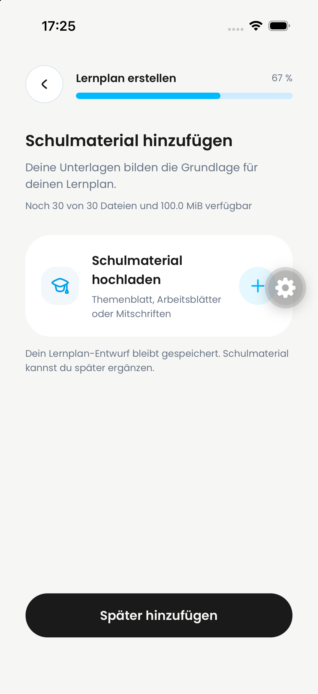
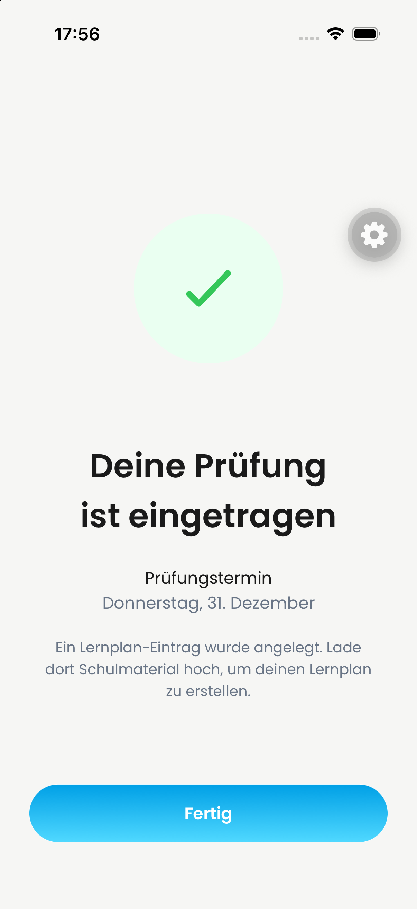
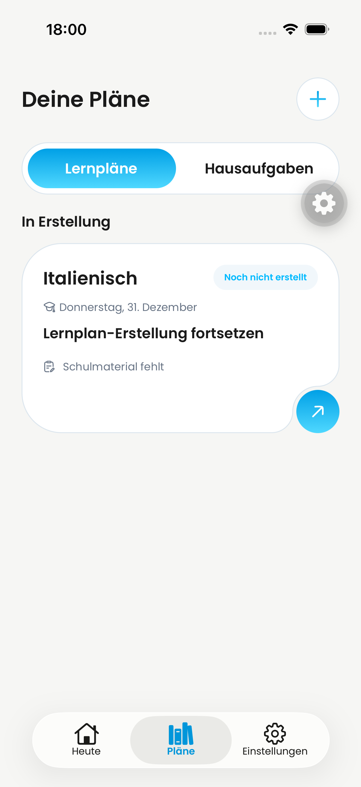

# DAY-472 — Material später hinzufügen

Issue: https://linear.app/dayova/issue/DAY-472/spater-hinzufugen-verlasst-den-materialschritt-nicht

## Reproduction and fix

On the combined QA base `d14454a20724a22bdd077d5d4c494a586312916a`, tapping the enabled “Später hinzufügen” button left the material screen visible. The native Maestro reproduction failed at `notVisible: Schulmaterial hinzufügen` (local run `2026-09-24_172619`). A temporary handler probe confirmed the click reached the new-exam completion handler; that probe was removed.

The explicit completion now commits a narrowly scoped route-removal permission before dispatching navigation. Validation of the saved plan and topics still runs first. Ordinary Back/swipe protection is not disabled. New exams retain the success destination; resumed drafts retain the Plans destination.

## Verification

- iPhone simulator, iOS 26.4, development client `de.dayova.app-dev`, QA backend: the original material-button reproduction passed (`2026-09-24_175527`). The actual resulting screen was “Deine Prüfung ist eingetragen”.
- After “Fertig”, Plans still showed the saved draft with “Schulmaterial fehlt”. No material upload or AI generation is claimed by this test.
- Resumed draft: reopened the saved draft, confirmed its topics, reached material, tapped “Später hinzufügen”, and asserted “Deine Pläne” (`2026-09-24_180021`, passed). The visible Continue button was tapped by coordinates because the text selector was unreliable in the native stack.
- 18 affected Jest suites / 74 tests passed, including assertions that route-removal permission is committed before either destination is dispatched. These mocked navigation assertions supplement, not replace, the native test.
- TypeScript `--noEmit`, Biome on both changed source files, and `git diff --check` passed.
- No fresh Android device test or production deployment is claimed.

## Visual evidence

The before screenshot is the user's original report; a still image alone does not prove a failed tap. The red native test above supplies that behavioral evidence.

### Before: reported material screen

### After: native success destination after tapping “Später hinzufügen”

### After: resumed draft returns to Plans

