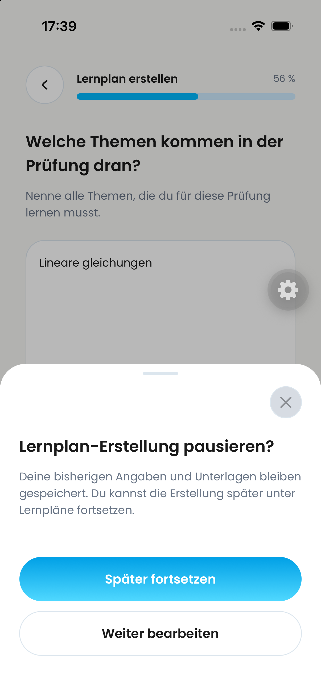
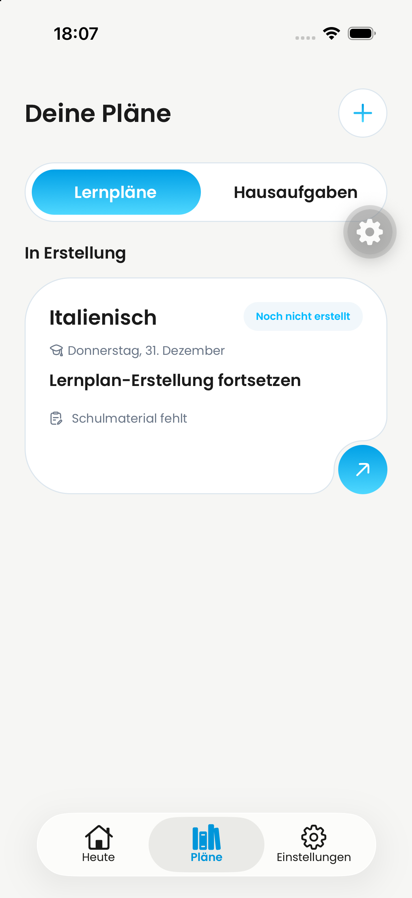

# DAY-473 — Später fortsetzen

Issue: https://linear.app/dayova/issue/DAY-473/spater-fortsetzen-im-lernplan-pausendialog-fuhrt-nicht-zuruck-zu-plane

## Cause and fix

The pause confirmation dispatched `dismissTo` while the native removal guard was still active. Confirming pause now commits an explicit `pause` exit intent before navigating. It shares the ordered exit mechanism from DAY-472, while retaining the different destination for a new exam's material-later action. Ordinary Back and cancel do not grant removal permission. No backend changes or deletion of drafts.

## Evidence

- Baseline `8e11e1bd`: native iPhone iOS 26.4 / `de.dayova.app-dev` test tapped Back, asserted and tapped “Später fortsetzen”, then failed to find “Deine Pläne” (Maestro run `2026-09-24_180422`).
- Same native test with fix: passed, including destination assertion (`2026-09-24_180647`). Saved draft remains visible in Plans.
- Reopening the draft passed (`2026-09-24_180933`). In `2026-09-24_181035`, “Weiter bearbeiten” closed the sheet and kept “Weiter” visible; the later re-open assertion did not complete successfully while the simulator content was being edited externally. Do not count that entire run as passed.
- Regression test added first: failed because removal permission was false at dispatch; passes after fix.
- 18 affected Jest suites / 75 tests, TypeScript noEmit, Biome, and diff whitespace checks passed.
- Source diff reviewed for destination preservation and unchanged cancel behavior. No global guard changes.
- No fresh Android test; no production release claimed.

The before image is the user's report, not temporal proof. The executed native assertions above establish the failure and recovery.

## Before

## After — returned to Plans, draft retained

